.. vim: syntax=rst

使用STM32CubeMX新建工程
========================

STM32Cube是一项意法半导体的原创活动, 通过减少开发工作、时间和成本, 使开发者的开发工作更轻松。STM32Cube 是一个全面的软件平台，
包括了ST产品的每个系列。(如，STM32CubeH7是针对STM32H7系列)。平台包括了STM32Cube硬件抽象层和一套的中间件组件(RTOS，USB，FS，TCP/IP，Graphics，等等)。

软件安装
~~~~~~~~~~~~

必备软件：Java（V1.7及以上版本）和STM32CubeMX（版本4.22.1）

Java下载地址：\ `www.java.com/zh_CN/ <https://www.java.com/zh_CN/>`__

STM32CubeMX下载地址：\ http://www.st.com/content/st_com/en/products/development-tools/software-development-tools/stm32-software-development-tools/stm32-configurators-and-code-generators/stm32cubemx.html

安装Java软件
^^^^^^^^^^^^^^^^^^^^^^^^

双击安装包“JavaSetup8u151.exe”，具体操作步骤如下：

**Java安装步骤1**

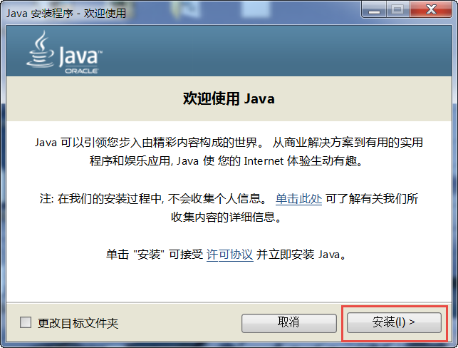

**Java安装步骤2**

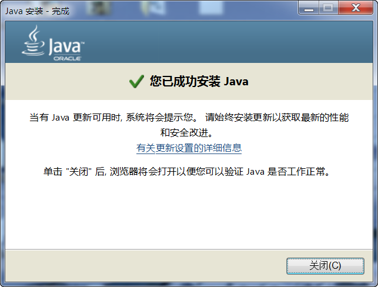

**Java验证成功**

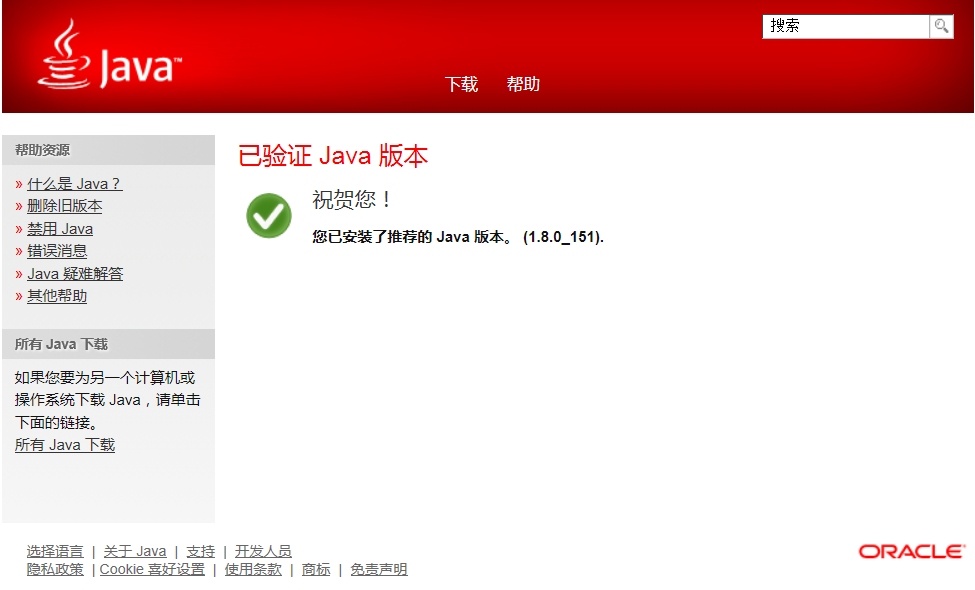

在本地新建好文件夹后，把准备好的库文件添加到相应的文件夹下：

安装STM32CubeMX软件
^^^^^^^^^^^^^^^^^^^^^^^^^^

双击安装包“SetupSTM32CubeMX-4.22.1.exe”，具体操作步骤如下：

**STM32CubeMX启动安装**

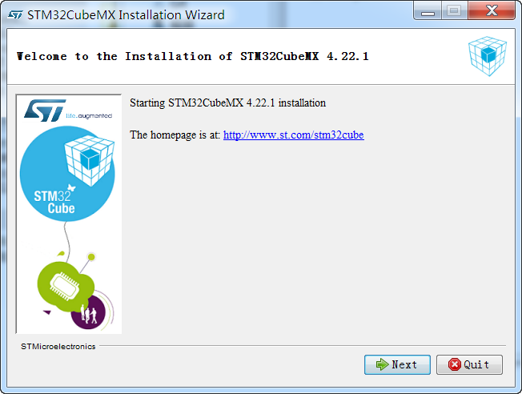

**STM32CubeMX接受本许可协议的条款**

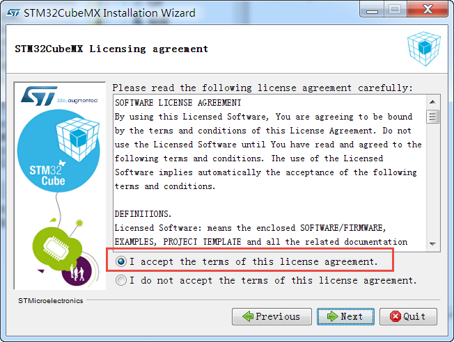

**STM32CubeMX指定安装路径**

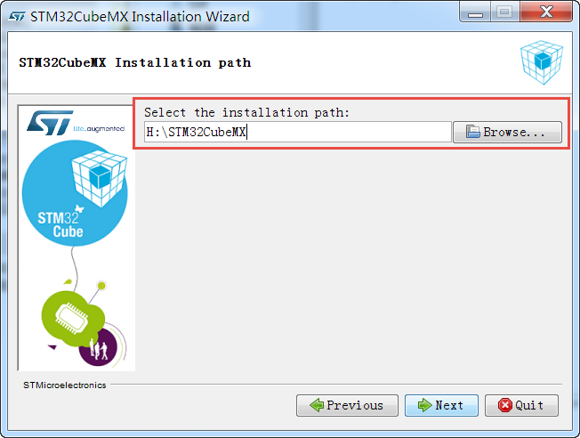

**STM32CubeMX创建快捷方式**

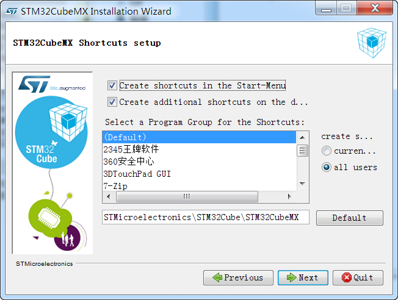

**STM32CubeMX完成安装**

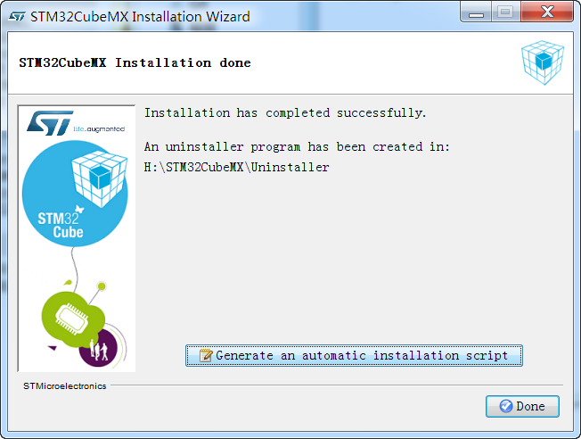

新建工程
~~~~~~~~~~~~

新建工程
^^^^^^^^^^^^

打开STM32CubeMX，软件会更新一些组件，等待安装完成即可。

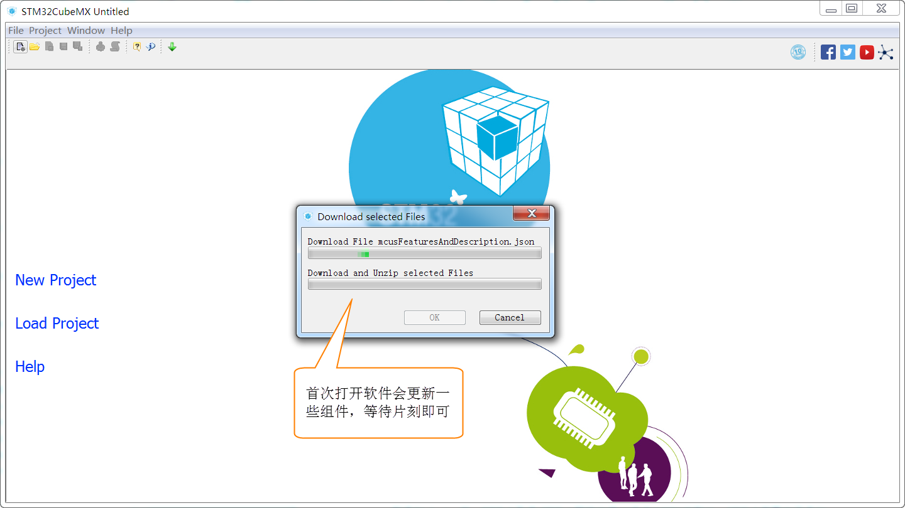

选择CPU型号
'''''''''''''''''''

这个根据你开发板使用的CPU具体的型号来选择， H743v PRO版选STM32H743XI型号。直接在搜索框输入型号STM32H743XI，最终确认STM32H743XIHx为我们实际使用型号。

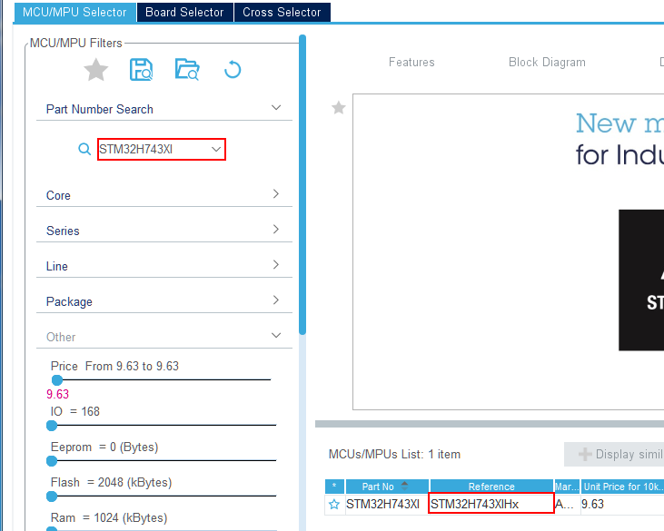

确认时钟源
'''''''''''''

进入工程后打开RCC选项，选择Crystal/Ceramic Resonator，即使用外部晶振作为HSE的时钟源。

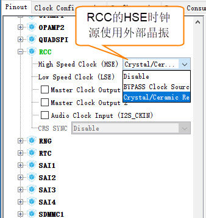

配置IO口
'''''''''''''

这个工程简单控制一个LED周期闪烁，我们只需要配置一个IO即可，这里选定控制红色LED的引脚PH10，通过搜索框搜索可以定位IO口的引脚位置，图中会闪烁显示，配置PH10的属性为GPIO_Output。

**查找IO口**

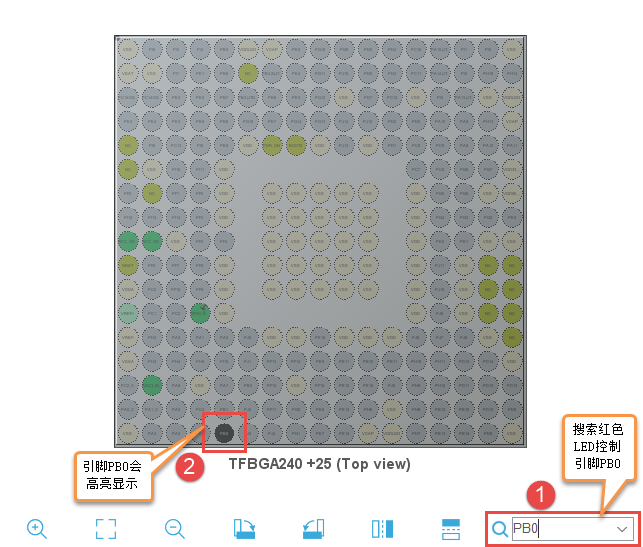

**配置IO口属性**

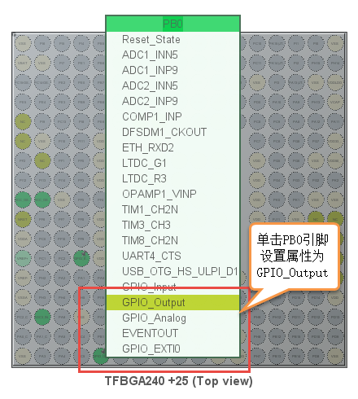

配置系统时钟
''''''''''''''''''

开发板的外部晶振为25MHz，我们填入25；通道选择HSE；DIVM1选择为/5；倍频系数N选择为x192；系统时钟选择PLLCLK；
系统时钟设定为480Mz；AHB1、AHB2、AHB3和AHB4分频系数选择为/2即HCLK2为240MHz；APB1、APB2、APB3和APB4分频系数选择为/2，为 120MHz。

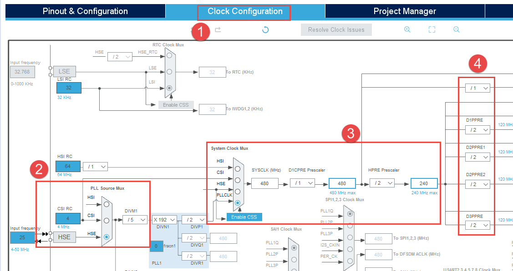

进一步配置IO的具体属性
''''''''''''''''''''''''''''''''''''

点击Configuration，进入系统详细配置，选着GPIO，配置PH10的默认电平，开漏输出，无上下拉，低速模式。引脚标签为LED_R。

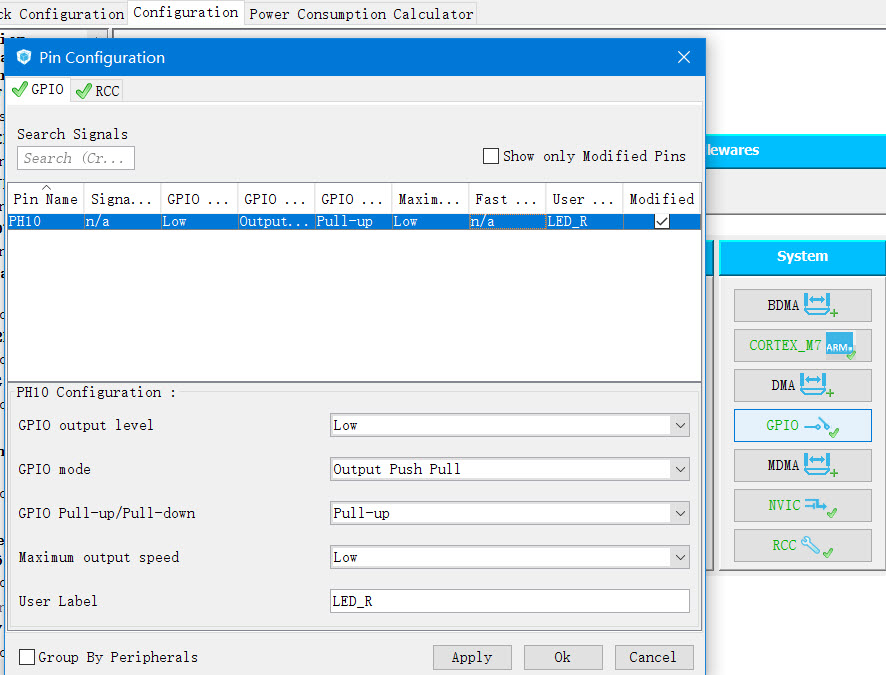

配置工程属性
''''''''''''''''''

配置工程的名称，路径，使用的IDE工具，堆栈大小。

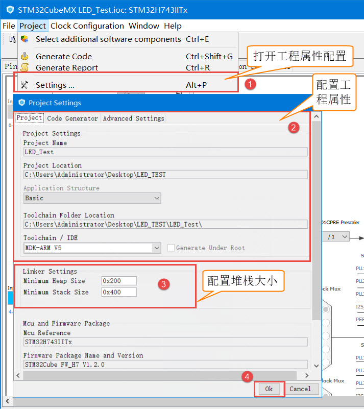

生成代码
''''''''''''

在设定的路径成功生成代码，选择打开工程。

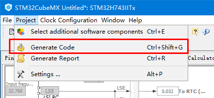

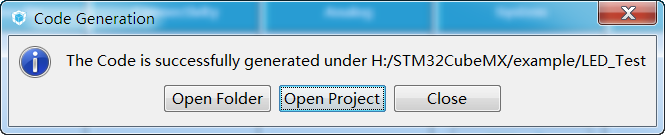

添加用户测试代码
''''''''''''''''''''''''

打开工程后在main函数中的主循环插入用户代码，目的是让红色LED周期闪烁。

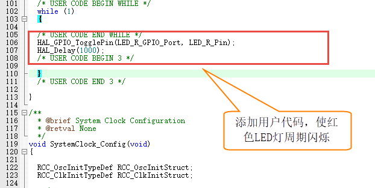

配置下载调试工具
''''''''''''''''''''''''

配置下载工具为CMSIS-DAP，程序下载完后复位并运行。

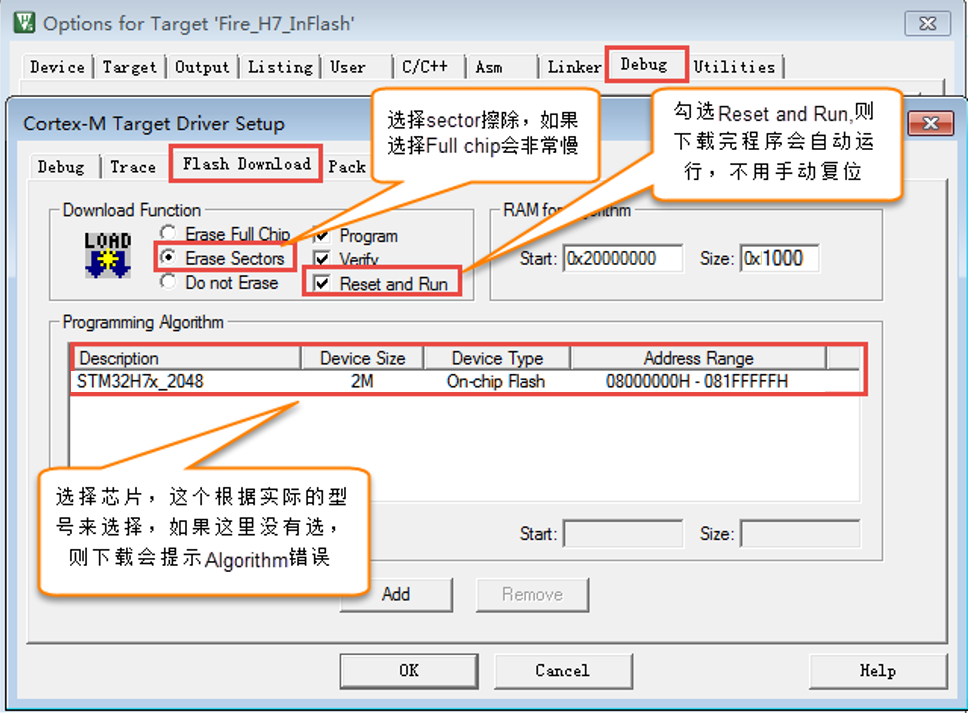

下载验证
~~~~~~~~~~~~

把编译好的程序下载到开发板并复位，可看到板子上的红色灯会周期闪烁。

