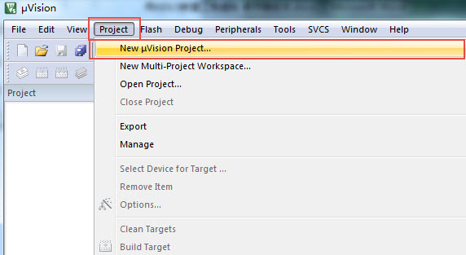
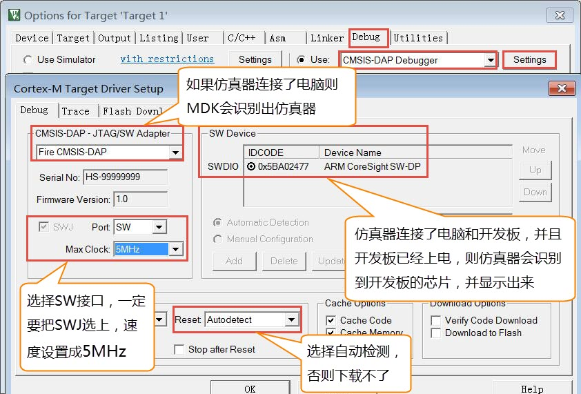

.. vim: syntax=rst

新建工程—库函数版
======================

了解STM32的HAL库文件之后，我们就可以使用它来建立工程了，因为用库新建工程的步骤较多，我们一般是使用库建立一个空的工程，
作为工程模板。以后直接复制一份工程模板，在它之上进行开发。

新建工程
~~~~~~~~~~~~

版本说明：MDK5.23 (MDK即KEIL软件)

版本号可从MDK软件的“Help-->About uVision”选项中查询到。

新建本地工程文件夹
^^^^^^^^^^^^^^^^^^^^^^^^^

为了工程目录更加清晰，我们在本地电脑上新建一个“工程模板”文件夹，在它之下再新建6个文件夹，具体如下：

在本地新建好文件夹后，把准备好的库文件添加到相应的文件夹下：

新建工程
^^^^^^^^^^^

打开KEIL5，新建一个工程，工程名根据喜好命名，我这里取LED-LIB，保存在Project\RVMDK（uv5）文件夹下。

选择CPU型号
'''''''''''''''''''

这个根据你开发板使用的CPU具体的型号来选择，M7挑战者选STM32H743XIH6型号。如果这里没有出现你想要的CPU型号，或者一个型号都没有，
那么肯定是你的KEIL5没有添加device库，KEIL5不像KEIL4那样自带了很多MCU的型号，KEIL5需要自己添加，关于如何添加请参考《如何安装KEIL5》这一章。

在线添加库文件
'''''''''''''''''''

等下我们手动添加库文件，这里我们点击关掉。

添加组文件夹
''''''''''''''''''

在新建的工程中添加5个组文件夹，用来存放各种不同的文件，文件从本地建好的工程文件夹下获取，双击组文件夹就会出现添加文件的路径，然后选择文件即可。

添加文件
''''''''''''

先把上面提到的文件从STHAL库中复制到工程模版对应文件夹的目录下，然后在新建的工程中添加这些文件，双击组文件夹就会出现添加文件的路径，然后选择文件即可。

设置文件是否加入编译
''''''''''''''''''''''''''''''

STM32H743外设比较丰富，它的库文件比较庞大，在添加外设文件时，为了减少编译时间。
我们把外设库的所有文件都添加进工程，使用下面的方法把暂时没有用到的库文件，设置为不加入编译，
这样就不会对特定文件进行编译。这种设置在开发时也很常用，暂时不把文件加进编译，方便调试，加快开发进度。

配置魔术棒选项卡
''''''''''''''''''''''''

这一步的配置工作很重要，很多人串口用不了printf函数，编译有问题，下载有问题，都是这个步骤的配置出了错。

(1) Target中选中微库“ Use MicroLib”，为的是在日后编写串口驱动的时候可以使用printf函数。而且有些应用中如果用了STM32的浮点运算单元FPU，
一定要同时开微库，不然有时会出现各种奇怪的现象。FPU的开关选项在微库配置选项下方的“Use double Precision”中，默认是开的。

(2) 在Output选项卡中把输出文件夹定位到我们工程目录下的“output”文件夹，
如果想在编译的过程中生成hex文件，那么那Create HEX File选项勾上。

(3)
在Listing选项卡中把输出文件夹定位到我们工程目录下的“Listing”文件夹。

.. image:: media/image13.png
    :align: center
    :name: 配置Listing选项卡
    :alt: 配置 Listing 选项卡

(4)
在C/C++选项卡中添加处理宏及编译器编译的时候查找的头文件路径。

在这个选项中添加宏，就相当于我们在文件中使用“#define”语句定义宏一样。在编译器中添加宏的好处就是，只要用了这个模版，就不用源文件中修改代码。

-  STM32H743xx宏：为了告诉STM32HAL库，我们使用的芯片是STM32H743型号，使STM32HAL库根据我们选定的芯片型号来配置。

-  USE_STDPERIPH_DRIVER宏：为了让stm32h7xx.h包含stm32h7xx_conf.h这个头文件。

“Include Paths ”这里添加的是头文件的路径，如果编译的时候提示说找不到头文件，一般就是这里配置出了问题。你把头文件放到了哪个文件夹，
就把该文件夹添加到这里即可。(请使用图中的方法用文件浏览器去添加路径，不要直接手打路径，容易出错)

下载器配置
'''''''''''''

本书使用的仿真器是Fire-Debugger，可下载和仿真程序。Fire-Debugger支持XP/WIN7/WIN8/WIN10这几个操作系统，无需安装驱动，免驱，使用非常方便，具体配置见如下图。

**Debug选项配置**

.. image:: media/image15.png
    :align: center
    :name: Debug中选择 CMSIS-DAP Debugger
    :alt: Debug中选择 CMSIS-DAP Debugger

**Utilities选项配置**

.. image:: media/image16.png
    :align: center
    :name: Utilities选择 Use Debug Driver
    :alt: Utilities选择 Use Debug Driver

**Debug Settings选项配置**

选择CPU型号
'''''''''''''''''''

这一步的配置也不是配置一次之后完事，常常会因为各种原因需要重新选择，
当你下载的时候，提示说找不到Device的时候，请确保该配置是否正确。
有时候下载程序之后，不会自动运行，要手动复位的时候，
也回来看看这里的“Reset and Run”配置是否失效。
H743 Pro用的STM32的内部FLASH大小是2M，所以这里选择2M的容量，
如果使用的是其他型号和FLASH大小的，要根据实际情况选择。

下载程序
~~~~~~~~

如果前面步骤都成功了，接下来就可以把编译好的程序下载到开发板上运行。下载程序不需要其他额外的软件，直接点击KEIL中的LOAD按钮即可。

.. image:: media/image19.png
    :align: center
    :name: 下载程序
    :alt: 下载程序

程序下载后，Build Output选项卡如果打印出 Application running…则表示程序下载成功。如果没有出现实验现象，
按复位键试试。当然，这只是一个工程模版，我们还没写程序，开发板不会有任何现象。

至此，一个基于固件库的新的工程模版新建完毕。
