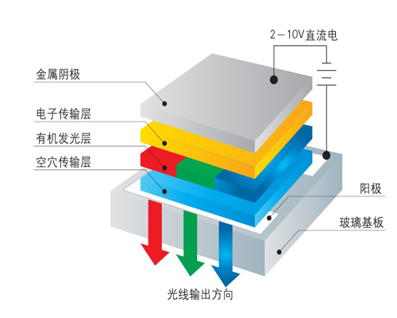

LCD—液晶显示
------------

本章参考资料：《STM32H7XX-中文参考手册》、《STM32H7xx数据手册》、库帮助文档《stm32h7xx_dsp_stdperiph_lib_um.chm》。

关于开发板配套的液晶屏控制器参数可查阅《ILI9806G-Data Sheet.pdf》资料获知。

本章讲解的内容涉及对FSMC的控制，若您不了解FSMC外设，请先学习前面的《FSMC—扩展外部SRAM》章节。

显示器简介
~~~~~~~~~~

显示器属于计算机的I/O设备，即输入输出设备。它是一种将特定电子信息输出到屏幕上再反射到人眼的显示工具。常见的有CRT显示器、液晶显示器、LED点阵显示器及OLED显示器。

液晶显示器
^^^^^^^^^^

液晶显示器，简称LCD(Liquid Crystal
Display)，相对于上一代CRT显示器(阴极射线管显示器)，LCD显示器具有功耗低、体积小、承载的信息量大及不伤眼的优点，因而它成为了现在的主流电子显示设备，其中包括电视、电脑显示器、手机屏幕及各种嵌入式设备的显示器。图
26‑1是液晶电视与CRT电视的外观对比，很明显液晶电视更薄，“时尚”是液晶电视给人的第一印象，而CRT
电视则感觉很“笨重”。

.. image:: media/image2.jpeg
   :align: center
   :alt: 图 26‑1 液晶电视及CRT电视
   :name: 图26_1

图 26‑1 液晶电视及CRT电视

液晶是一种介于固体和液体之间的特殊物质，它是一种有机化合物，常态下呈液态，但是它的分子排列却和固体晶体一样非常规则，
因此取名液晶。如果给液晶施加电场，会改变它的分子排列，从而改变光线的传播方向，配合偏振光片，它
就具有控制光线透过率的作用，再配合彩色滤光片，改变加给液晶电压大小，就能改变某一颜色透光量的多
少，图26_2_ 中的就是绿色显示结构。利用这种原理，做出可控红、绿、蓝光输出强度的显示结构，把三种显示结构组
成一个显示单位，通过控制红绿蓝的强度，可以使该单位混合输出不同的色彩，这样的一个显示单位被称为像素。

.. image:: media/image3.jpeg
   :align: center
   :alt: 图 26‑2 液晶屏的绿色显示结构
   :name: 图26_2

图 26‑2 液晶屏的绿色显示结构

注意液晶本身是不发光的，所以需要有一个背光灯提供光源，光线经过一系列处理过程才到输出，所以输出的光线强度是要比光源的强度低很多的，比较浪费能源(当然，比CRT显示器还是节能多了)。而且这些处理过程会导致显示方向比较窄，也就是它的视角较小，从侧面看屏幕会看不清它的显示内容。另外，输出的色彩变换时，液晶分子转动也需要消耗一定的时间，导致屏幕的响应速度低。

LED和OLED显示器
^^^^^^^^^^^^^^^

LED点阵显示器不存在以上液晶显示器的问题，LED点阵彩色显示器的单个像素点内包含红绿蓝三色LED灯，显示原理类似我们实验板上的LED彩灯，
通过控制红绿蓝颜色的强度进行混色，实现全彩颜色输出，多个像素点构成一个屏幕。由于每个像素点都是LED灯自发光的，
所以在户外白天也显示得非常清晰，但由于LED灯体积较大，导致屏幕的像素密度低，所以它一般只适合用于广场上的巨型显示器。
相对来说，单色的LED点阵显示器应用得更广泛，如公交车上的信息展示牌、店招等，见 图26_3_。

新一代的OLED显示器与LED点阵彩色显示器的原理类似，但由于它采用的像素单元是“有机发光二极管”(Organic
Light Emitting Diode)，所以像素密度比普通LED点阵显示器高得多，见
图26_4_。

OLED显示器不需要背光源、对比度高、轻薄、视角广及响应速度快等优点。待到生产工艺更加成熟时，必将取代现在液晶显示器的地位，
图26_5_。

显示器的基本参数
^^^^^^^^^^^^^^^^

不管是哪一种显示器，都有一定的参数用于描述它们的特性，各个参数介绍如下：

(1) 像素

..

   像素是组成图像的最基本单元要素，显示器的像素指它成像最小的点，即前面讲解液晶原理中提到的一个显示单元。

(1) 分辨率

..

   一些嵌入式设备的显示器常常以“行像素值x列像素值”表示屏幕的分辨率。如分辨率800x480表示该显示器的每一行有800个像素点，每一列有480个像素点，也可理解为有800列，480行。

(2) 色彩深度

..

   色彩深度指显示器的每个像素点能表示多少种颜色，一般用“位”(bit)来表示。如单色屏的每个像素点能表示亮或灭两种状态(即实际上能显示2种颜色)，用1个数据位就可以表示像素点的所有状态，所以它的色彩深度为1bit，其它常见的显示屏色深为16bit、24bit。

(3) 显示器尺寸

..

   显示器的大小一般以英寸表示，如5英寸、21英寸、24英寸等，这个长度是指屏幕对角线的长度，
   通过显示器的对角线长度及长宽比可确定显示器的实际长宽尺寸。

(4) 点距

..

   点距指两个相邻像素点之间的距离，它会影响画质的细腻度及观看距离，相同尺寸的屏幕，若分辨率越高，则点距越小，画质越细腻。如现在有些手机的屏幕分辨率比电脑显示器的还大，这是手机屏幕点距小的原因；LED点阵显示屏的点距一般都比较大，所以适合远距离观看。

液晶控制原理
~~~~~~~~~~~~

图26_6_ 是两种适合于STM32芯片使用的显示屏，我们以它为例讲解控制液晶屏的基本原理。

这个完整的显示屏由液晶显示面板、电容触摸面板以及PCB底板构成。图中的触摸面板带有触摸控制芯片，
该芯片处理触摸信号并通过引出的信号线与外部器件通讯，触摸面板中间是透明的，它贴在液晶面板上面，一起构成屏幕的主体，
触摸面板与液晶面板引出的排线连接到PCB底板上，根据实际需要，PCB底板上可能会带有“液晶控制器芯片”，
图中右侧的液晶屏PCB上带有RA8875液晶控制器。因为控制液晶面板需要比较多的资源，所以大部分低级微控制器都不能直接控制液晶面板，
需要额外配套一个专用液晶控制器来处理显示过程，外部微控制器只要把它希望显示的数据直接交给液晶控制器即可。
而不带液晶控制器的PCB底板 ，只有小部分的电源管理电路，液晶面板的信号线与外部微控制器相连，直接控制。
STM32F429系列的芯片不需要额外的液晶控制器，也就是说它把专用液晶控制器的功能集成到STM32F429芯片内部了，
可以理解为电脑的CPU集成显卡，它节约了额外的控制器成本。而STM32F407系列的芯片由于没有集成液晶控制器到芯片内部，
所以它只能驱动自带控制器的屏幕，可以理解为电脑的外置显卡。

总的来说，这两类屏幕的控制框图如 图26_7_ 所示。

液晶面板的控制信号
^^^^^^^^^^^^^^^^^^

本章我们主要讲解如何控制液晶面板，液晶面板的控制信号线即
图26_6_ 中液晶面板引出的FPC排线，其说明见表
26‑1，液晶面板通过这些信号线与液晶控制器通讯，使用这种通讯信号的被称为RGB接口(RGB
Interface)。

   表 26‑1 液晶面板的信号线

======== ================
信号名称 说明
R[7:0]   红色数据
G[7:0]   绿色数据
B[7:0]   蓝色数据
CLK      像素同步时钟信号
HSYNC    水平同步信号
VSYNC    垂直同步信号
DE       数据使能信号
======== ================

(1) RGB信号线

..

   RGB信号线各有8根，分别用于表示液晶屏一个像素点的红、绿、蓝颜色分量。使用红绿蓝颜色分量来表示颜色是一种通用的做法，打开Windows系统自带的画板调色工具，可看到颜色的红绿蓝分量值，见
   图26_8_。常见的颜色表示会在“RGB”后面附带各个颜色分量值的数据位数，如RGB565表示红绿蓝
   的数据线数分别为5、6、5根，一共为16个数据位，可表示2\ :sup:`16`\ 种颜色；而这个液晶屏的种
   颜色分量的数据线都有8根，所以它支持RGB888格式，一共24位数据线，可表示的颜色为2\ :sup:`24`\ 种。

.. image:: media/image9.png
   :align: center
   :alt: 图 26‑8 颜色表示法
   :name: 图26_8

(2) 同步时钟信号CLK

..

   液晶屏与外部使用同步通讯方式，以CLK信号作为同步时钟，在同步时钟的驱动下，每个时钟传输一个像素点数据。

(3) 水平同步信号HSYNC

..

   水平同步信号HSYNC(Horizontal
   Sync)用于表示液晶屏一行像素数据的传输结束，每传输完成液晶屏的一行像素数据时，HSYNC会发生电平跳变，如分辨率为800x480的显示屏(800列，480行)，传输一帧的图像HSYNC的电平会跳变480次。

(4) 垂直同步信号VSYNC

..

   垂直同步信号VSYNC(Vertical
   Sync)用于表示液晶屏一帧像素数据的传输结束，每传输完成一帧像素数据时，VSYNC会发生电平跳变。其中“帧”是图像的单位，一幅图像称为一帧，在液晶屏中，一帧指一个完整屏液晶像素点。人们常常用“帧/秒”来表示液晶屏的刷新特性，即液晶屏每秒可以显示多少帧图像，如液晶屏以60帧/秒的速率运行时，VSYNC每秒钟电平会跳变60次。

(5) 数据使能信号DE

..

   数据使能信号DE(Data
   Enable)用于表示数据的有效性，当DE信号线为高电平时，RGB信号线表示的数据有效。

液晶数据传输时序
^^^^^^^^^^^^^^^^

通过上述信号线向液晶屏传输像素数据时，各信号线的时序见
图26_9_。图中表示的是向液晶屏传输一帧图像数据的时序，中间省略了多行及多个像素点。

.. image:: media/image10.jpeg
   :align: center
   :alt: 图 26‑9 液晶时序图
   :name: 图26_9

液晶屏显示的图像可看作一个矩形，结合 图26_10_ 来理解。液晶屏有一个显示指针，它指向
将要显示的像素。显示指针的扫描方向方向从左到右、从上到下，一个像素点一个像素点地描
绘图形。这些像素点的数据通过RGB数据线传输至液晶屏，它们在同步时钟CLK的驱动下一个一个
地传输到液晶屏中，交给显示指针，传输完成一行时，水平同步信号HSYNC电平跳变一次，而传输完一帧时VSYNC电平跳变一次。

但是，液晶显示指针在行与行之间，帧与帧之间切换时需要延时，而且HSYNC及VSYNC信号本身也有宽度，这些时间参数说明见表
26‑2。

   表 26‑2 液晶通讯中的时间参数

============================ =============================================================
时间参数                     参数说明
VBP (vertical back porch)    表示在一帧图像开始时，垂直同步信号以后的无效的行数
VFP (vertical front porch)   表示在一帧图像结束后，垂直同步信号以前的无效的行数
HBP (horizontal back porch)  表示从水平同步信号开始到一行的有效数据开始之间的CLK的个数
HFP (horizontal front porth) 表示一行的有效数据结束到下一个水平同步信号开始之间的CLK的个数
VSW (vertical sync width)    表示垂直同步信号的宽度，单位为行
HSW (horizontal sync width)  表示水平同步信号的宽度，单位为同步时钟CLK的个数
============================ =============================================================

在这些时间参数控制的区域，数据使能信号线“DE”都为低电平，RGB数据线的信号无效，当“DE”为高电平时，表示的数据有效，传输的数据会直接影响液晶屏的显示区域。

显存
^^^^

液晶屏中的每个像素点都是数据，在实际应用中需要把每个像素点的数据缓存起来，再传输给液晶屏，一般会使用SRAM或SDRAM性质的存储器，而这些专门用于存储显示数据的存储器，则被称为显存。显存一般至少要能存储液晶屏的一帧显示数据，如分辨率为800x480的液晶屏，使用RGB888格式显示，它的一帧显示数据大小为：3x800x480=1152000字节；若使用RGB565格式显示，一帧显示数据大小为：2x800x480=768000字节。

一般来说，外置的液晶控制器会自带显存，而像STM32F429等集成液晶控制器的芯片可使用内部SRAM或外扩SDRAM用于显存空间。

野火4.5寸液晶屏简介
~~~~~~~~~~~~~~~~~~~

4.5寸电容触摸屏实物
^^^^^^^^^^^^^^^^^^^

上面讲解的屏幕其液晶控制器与液晶屏是完全分离的，且具有带控制器和不带控制器的版本，易于理解，
下面我们再来分析实验板标配的分辨率为854*480的4.5寸电阻触摸液晶屏。 图26_11_。

.. image:: media/image12.png
   :align: center
   :alt: 图 26‑11 实验板标配的3.2寸电阻触摸屏
   :name: 图26_11

图 26‑11 实验板标配的电容触摸屏

图中的标号3部分是液晶屏幕的整体，通过引出的排针或FPC排线接入到实验板上可对它进行控制，它分为标号1的液晶触摸面板和标号3的PCB底板两部分。

标号1处的液晶触摸面板由液晶屏和触摸面板组成，触摸面板和液晶面板是两个独立的部件，生产厂商把这两个部件帖在了一起，形成整体。

触摸面板引出的信号线引入到GT5688芯片，该芯片会对触摸信号进行采集并简化信号输出给外部控制器。

触摸面板的下方即为液晶面板，在它的内部包含了一个型号为ILI9806G的液晶控制器芯片(由于集成度高，所以图中无法看见)，该液晶控制器使用8080接口与单片机通讯，图中液晶面板引出的FPC信号线即8080接口(RGB接口已在内部直接与ILI9806G相连)，且控制器中包含有显存，单片机把要显示的数据通过引出的8080接口发送到液晶控制器，这些数据会被存储到它内部的显存中，然后液晶控制器不断把显存的内容刷新到液晶面板，显示内容。

标号2处的是PCB底板，它主要包含了液晶屏的电源控制电路，另外，PCB底板与液晶触摸面板通过FPC排线座连接，然后引出到排针，方便与实验板的排母连接，也可以使用FPC接口与核心板连接。

ILI9806G液晶控制器简介
^^^^^^^^^^^^^^^^^^^^^^^

本液晶屏内部包含有一个液晶控制芯片ILI9806G，它的内部结构非常复杂，见图
26‑12。该芯片最主核心部分是位于中间的GRAM(Graphics
RAM)，它就是\ *显存*\ 。GRAM中每个存储单元都对应着液晶面板的一个像素点。它
右侧的各种模块共同作用把GRAM存储单元的数据转化成液晶面板的控制信号，使像素点呈
现特定的颜色，而像素点组合起来则成为一幅完整的图像。

框图的左上角为ILI9806G的主要控制信号线和配置引脚，根据其不同状态设置可以使芯片工作在不同的模式，如每个像素点的位数是8、16还是18位；可配置使用SPI接口、8080接口还是RGB接口与MCU进行通讯。MCU通过SPI、8080接口或RGB接口与ILI9806G进行通讯，从而访问它的控制寄存器(CR)、地址计数器(AC)、及GRAM。

在GRAM的左侧还有一个LED控制器(LED
Controller)。LCD为非发光性的显示装置，它需要借助背光源才能达到显示功能，LED控制器就是用来控制液晶屏中的LED背光源。

.. image:: media/image13.png
   :align: center
   :alt: 图 26‑12 ILI9806G控制器内部框图
   :name: 图26_12

图 26‑12 ILI9806G控制器内部框图

液晶屏的信号线及8080时序
^^^^^^^^^^^^^^^^^^^^^^^^

ILI9806G控制器根据自身的IM[3:0]信号线电平决定它与MCU的通讯方式，它本身支持SPI及8080通讯方式，
本示例中液晶屏的ILI9806G控制器在出厂前就已经按固定配置好(内部已连接硬件电路)，它被配置为通过8080接口通讯，
使用16根数据线的RGB565格式，且背光LED引脚不与ILI9806G相连，而是直接引出到排针供外部控制器控制。
内部硬件电路连接完，剩下的其它信号线被引出到FPC排线，最后该排线由PCB底板引出到排针，
排针再与实验板上的STM32芯片连接，引出的排针信号线见 图26_13_。

图 26‑13 液晶屏引出的信号线

这些信号线的说明见表 26‑3。

表 26‑3 液晶屏引出的信号线说明

============ ===================== ================================================================================================
信号线       ILI9806G对应的信号线   说明
LCD_DB[15:0] D[15:0]               数据信号
LCD_RD       RDX                   读数据信号，低电平有效
LCD_RS       D/CX                  数据/命令信号，高电平时，D[15:0]表示的是数据(RGB像素数据或命令数据)，低电平时D[15:0]表示控制命令
LCD_RESET    RESX                  复位信号，低电平有效
LCD_WR       WRX                   写数据信号，低电平有效
LCD_CS       CSX                   片选信号，低电平有效
LCD_BK       -                     背光信号，低电平点亮
GPIO23       -                     空引脚，不需要连接
RST	        与触摸IC相连	          触摸IC的复位引脚
INT	        与触摸IC相连	          触摸IC的中断信号引脚
SCL	        与触摸IC相连	          触摸IC的IIC总线的时钟信号
SDA	        与触摸IC相连	          触摸IC的IIC总线的数据信号
============ ===================== ================================================================================================

这些信号线即8080通讯接口，带X的表示低电平有效，STM32通过该接口与ILI9806G芯片进行通讯，实现对液晶屏的控制。
通讯的内容主要包括命令和显存数据，显存数据即各个像素点的RGB565内容；命令是指对ILI9806G的控制指令，
MCU可通过8080接口发送命令编码控制ILI9806G的工作方式，例如复位指令、设置光标指令、睡眠模式指令等等，
具体的指令在《ILI9806G-Data Sheet.pdf》数据手册均有详细说明。写命令时序图见 图26_14_。

图 26‑14 使用8080接口写命令时序

由图可知，写命令时序由片选信号CSX拉低开始，对数据/命令选择信号线D/CX也置低电平表示写入的是命令地址(可理解为命令编码，
如软件复位命令：0x01)，以写信号WRX为低，读信号RDX为高表示数据传输方向为写入，同时，在数据线D[23:0](或D[15:0])输出命令地址，
在第二个传输阶段传送的是命令的参数，所以D/CX要置高电平，表示写入的是命令数据，命令数据是某些指令带有的参数，
如复位指令编码为0x01，它后面可以带一个参数，该参数表示多少秒后复位(实际的复位命令不含参数，此处只是为了讲解指令编码与参数的区别)。

当需要把像素数据写入GRAM时，过程很类似，把片选信号CSX拉低后，再把数据/命令选择信号线D/CX置为高电平，这时由D[23:0]传输的数据则会被ILI9806G保存至它的GRAM中。

使用STM32的FSMC模拟8080接口时序
~~~~~~~~~~~~~~~~~~~~~~~~~~~~~~~

ILI9806G的8080通讯接口时序可以由STM32使用普通I/O接口进行模拟，但这样效率太低，STM32提供了一种特别的控制方法——使用FSMC接口实现8080时序。

FSMC简介
^^^^^^^^

在前面的《FSMC—扩展外部SRAM》章节中了解到STM32的FSMC外设可以用于控制扩展的外部存储器，
而MCU对液晶屏的操作实际上就是把显示数据写入到显存中，与控制存储器非常类似，
且8080接口的通讯时序完全可以使用FSMC外设产生，因而非常适合使用FSMC控制液晶屏。

FSMC外设的结构见 图27_15_。

.. image:: media/image16.jpeg
   :align: center
   :alt: 图 27‑15 FSMC结构图
   :name: 图27_15

图 27‑15 FSMC结构图

控制LCD时，是使用FSMC的NOR\PSRAM模式的，且与前面使用FSMC控制SRAM的稍有不同，控制SRAM时使用的是模式A，
而控制LCD时使用的是与NOR FLASH一样的模式B，所以我们重点分析框图中NOR FLASH控制信号线部分。
控制NOR FLASH主要使用到下表的信号线：

表 27‑4 FSMC控制NOR FLASH的信号线

============ ========= ============================
FSMC信号名称 信号方向  功能
CLK          输出      时钟(同步突发模式使用)
A[25:0]      输出      地址总线
D[15:0]      输入/输出 双向数据总线
NE[x]        输出      片选，x = 1...4
NOE          输出      输出使能
NWE          输出      写使能
NWAIT        输入      NOR闪存要求FSMC等待的信号
NADV         输出      地址、数据线复用时作锁存信号
============ ========= ============================

在控制LCD时，使用的是类似异步、地址与数据线独立的NOR FLASH控制方式，
所以实际上CLK、NWAIT、NADV引脚并没有使用到。

其中比较特殊的FSMC_NE是用于控制存储器芯片的片选控制信号线，STM32具有FSMC_NE1/2/3/4号引脚，不同的引脚对应STM32内部不同的地址区域。例如，当STM32访问0x68000000-0x6BFFFFFF地址空间时，FSMC_NE3引脚会自动设置为低电平，由于它一般连接到外部存储器的片选引脚且低电平有效，所以外部存储器的片选被使能，而访问0x60000000-0x63FFFFFF地址时，FSMC_NE1会输出低电平。当使用不同的FSMC_NE引脚连接外部存储器时，STM32访问外部存储的地址不一样，从而达到控制多个外部存储器芯片的目的。各引脚对应的地址会在后面“FSMC的地址映射”小节讲解。

FSMC NOR/PSRAM中的模式B的写时序见图

.. image:: media/image16.png
   :align: center

根据STM32对寻址空间的地址映射，地址0x6000 0000 ~0x9FFF FFFF是映射到外部存储器的，
而其中的0x6000 0000 ~0x6FFF FFFF则是分配给NOR FLASH、PSRAM这类可直接寻址的器件。

当FSMC外设被配置成正常工作，并且外部接了NOR FLASH时，若向0x60000000地址写入数据如0xABCD，
FSMC会自动在各信号线上产生相应的电平信号，写入数据。FSMC会控制片选信号NE1选择相应的NOR 芯片，
然后使用地址线A[25:0]输出0x60000000，在NWE写使能信号线上发出低电平的写使能信号，
而要写入的数据信号0xABCD则从数据线D[15:0]输出，然后数据就被保存到NOR FLASH中了。

用FSMC模拟8080时序
^^^^^^^^^^^^^^^^^^^^^^^^

图 27‑20FSMC 模式B时序与8080时序对比（写过程）

见表 27‑5，对比FSMC NOR/PSRAM中的模式B时序与ILI9806G液晶控制器芯片使用的8080时序
可发现，这两个时序是十分相似的(除了FSMC的地址线A和8080的D/CX线，可以说是完全一样)，它们的信号线对比见表
27‑5。

表 27‑5 FSMC的NOR 与8080信号线对比

============== ======== ========== =============
FSMC-NOR信号线 功能     8080信号线 功能
NEx            片选信号 CSX        片选信号
NWR            写使能   WRX        写使能
NOE            读使能   RDX        读使能
D[15:0]        数据信号 D[15:0]    数据信号
A[25:0]        地址信号 D/CX       数据/命令选择
============== ======== ========== =============

对于FSMC和8080接口，前四种信号线都是完全一样的，仅仅是FSMC的地址信号线A[25:0]与8080的数据/命令选择线D/CX有区别。而对于D/CX线，它为高电平的时候表示数值，为低电平的时候表示命令，如果能使用FSMC的A地址线根据不同的情况产生对应的电平，那么就完全可以使用FSMC来产生8080接口需要的时序了。

为了模拟出8080时序，我们可以把FSMC的\ *A0地址线*\ (也可以使用其它A1/A2等地址线)与ILI9806G芯片8080接
口的*D/CX信号线连接*\ ，那么当A0为\ *高电平*\ 时(即D/CX为高电平)，数据线D[15:0]的信号会被ILI9806G理解
为\ *数值*\ ，若A0为\ *低电平*\ 时(即D/CX为低电平)，传输的信号则会被理解为\ *命令*\ 。

由于FSMC会自动产生地址信号，当使用FSMC向0x6xxx xxx1、0x6xxx xxx3、0x6xxx
xxx5…这些\ *奇数地址*\ 写入数据时，地址最低位的值均为1，所以它会控制地址
线A0(D/CX)输出\ *高电平*\ ，那么这时通过数据线传输的信号会被理解为\ *数值*\ ；若向0x6xxx
xxx0 、0x6xxx xxx2、0x6xxx
xxx4…这些\ *偶数地址*\ 写入数据时，地址最低位的值均为0，所以它会控制
地址线A0(D/CX)输出\ *低电平*\ ，因此这时通过数据线传输的信号会被理解为\ *命令*\ ，见表
27‑6。

表 27‑6 使用FSMC输出地址示例

=========== ============================ ============== ===================
地址        地址的二进制值(仅列出低四位) A0(D/CX)的电平 控制ILI9806G时的意义
0x6xxx xxx1 000\   1                     1 高电平         D数值
0x6xxx xxx3 001\   1                     1高电平          D数值
0x6xxx xxx5 010\   1                     1高电平          D数值
0x6xxx xxx0 000\   0                     0低电平          C命令
0x6xxx xxx2 001\   0                     0低电平          C命令
0x6xxx xxx4 010\   0                     0低电平          C命令
=========== ============================ ============== ===================

有了这个基础，只要配置好FSMC外设，然后在代码中利用指针变量，向不同的地址单元写入数据，就能够由FSMC模拟出的8080接口向ILI9806G写入控制命令或GRAM的数据了。

注意：在实际控制时，以上地址计算方式还不完整，还需要注意HADDR内部地址与FSMC地址信号线的转换，关于这部分内容在代码讲解时再详细举例说明。

NOR FLASH时序结构体
~~~~~~~~~~~~~~~~~~~

在讲解程序前，再来了解一下与FSMC NOR FLASH控制相关的结构体。

与控制SRAM时一样，控制FSMC使用NOR
FLASH存储器时主要是配置时序寄存器以及控制寄存器，利用HAL库的时序结构体以及初始化结构体可以很方便地写入参数。

NOR FLASH时序结构体的成员见 代码清单26_1_。

.. code-block:: c
   :caption: 代码清单 26_1 NOR FLASH时序结构体FSMC_NORSRAMTimingInitTypeDef
   :name: 代码清单26_1

   typedef struct

   {

      uint32_t AddressSetupTime; /* 地址建立时间，0-0xF个HCLK周期*/

      uint32_t AddressHoldTime; /* 地址保持时间，0-0xF个HCLK周期*/

      uint32_t DataSetupTime; /* 地址建立时间，0-0xF个HCLK周期*/

      uint32_t BusTurnAroundDuration; /* 总线转换周期,0-0xF个HCLK周期，在NOR FLASH */

      uint32_t CLKDivision; /*时钟分频因子,1-0xF，若控制异步存储器，本参数无效 */

      uint32_t DataLatency; /*数据延迟时间，若控制异步存储器，本参数无效 */

      uint32_t AccessMode; /*设置访问模式 */

   }FSMC_NORSRAMTimingInitTypeDef;

这个结构体与SRAM中的时序结构体完全一样，以下仅列出控制NOR FLASH时使用模式B用到的结构体成员说明：

(1) AddressSetupTime

..

   本成员设置地址建立时间，即FSMC读写时序图 26-16中的ADDSET值，它可以被设置为0-0xF个HCLK周期数，
   按STM32HAL库的默认配置，HCLK的时钟频率为168MHz，即一个HCLK周期为1/168微秒。

(2) DataSetupTime

..

   本成员设置数据建立时间，即FSMC读写时序图
   26‑16中的DATAST值，它可以被设置为0-0xF个HCLK周期数。

(3) AccessMode

本成员设置存储器访问模式，不同的模式下FSMC访问存储器地址时引脚输出的时序不一样，可选FSMC_ACCESS_MODE_A/B/C/D模式。控制异步NOR
FLASH时使用B模式。

这个FSMC_NORSRAM_TimingTypeDef时序结构体配置的延时参数，将作为下一节的FSMC
NOR FLASH初始化结构体的一个成员。

FSMC初始化结构体
~~~~~~~~~~~~~~~~

FSMC控制NOR FLASH相关的结构体，初始化结构体见 代码清单26_2_。

.. code-block:: c
 :caption:  代码清单 26_2 NOR FLASH初始化结构体FSMC_NORSRAMInitTypeDef
 :name: 代码清单26_2

   /*

   * @brief FSMC NOR/SRAM Init structure definition

   */

   typedef struct

   {

      uint32_t NSBank; /*设置要控制的Bank区域 */

      uint32_t DataAddressMux; /*设置地址总线与数据总线是否复用 */

      uint32_t MemoryType; /*设置存储器的类型 */

      uint32_t MemoryDataWidth; /*设置存储器的数据宽度*/

      uint32_t BurstAccessMode;/*设置是否支持突发访问模式，只支持同步类型的存储器 */

      uint32_t WaitSignalPolarity; /*设置等待信号的极性*/

      uint32_t WrapMode; /*设置是否支持对齐的突发模式 */

      uint32_t WaitSignalActive; /*配置等待信号在等待前有效还是等待期间有效*/

      uint32_t WriteOperation; /*设置是否写使能 */

      uint32_t WaitSignal; /*设置是否使能等待状态插入 */

      uint32_t ExtendedMode; /*设置是否使能扩展模式 */

      uint32_t WriteBurst; /*设置是否使能写突发操作*/

      uint32_t AsynchronousWait; /*设置是否使能等待信号*/

      uint32_t ContinuousClock; /*设置是否使能FMC时钟输出到外部存储设备*/

      uint32_t WriteFifo; /*设置是否使能FIFO*/

      uint32_t PageSize; /*指定页的大小*/

      /*当不使用扩展模式时，本参数用于配置读写时序，否则用于配置读时序*/

      FSMC_NORSRAM_TimingTypeDef * FSMC_ReadWriteTimingStruct;

      /*当使用扩展模式时，本参数用于配置写时序*/

      FSMC_NORSRAM_TimingTypeDef * FSMC_WriteTimingStruct;

   } FSMC_NORSRAM_InitTypeDef;

这部分内容与FSMC控制SRAM时完全一致，此处仅列出与NOR
FLASH模式B相关的一些结构体成员的说明：

(1) NSBank

..

   本成员用于选择FSMC映射的存储区域，它的可选参数以及相应的内核地址映射范围见下表 。

   表 26‑7 可以选择的存储器区域及区域对应的地址范围

=================== =====================
可以输入的宏        对应的地址区域
FSMC_Bank1_NORSRAM1 0x60000000-0x63FFFFFF
FSMC_Bank1_NORSRAM2 0x64000000-0x67FFFFFF
FSMC_Bank1_NORSRAM3 0x68000000-0x6BFFFFFF
FSMC_Bank1_NORSRAM4 0x6C000000-0x6FFFFFFF
=================== =====================

(2) MemoryType

..

   本成员用于设置要控制的存储器类型，它支持控制的存储器类型为SRAM、PSRAM以及NOR
   FLASH。

(3) MemoryDataWidth

..

   本成员用于设置要控制的存储器的数据宽度，可选择设置成8或16位。

(4) WriteOperation

..

   这个成员用于设置是否写使能，禁止写使能的话FSMC只能从存储器中读取数据，不能写入。

(5) ExtendedMode

本成员用于设置是否使用扩展模式，在非扩展模式下，对存储器读写的时序都只使用FSMC_BCR寄存器中的配；在扩展模式下，对存储器的读写时序可以分开配置，读时序使用FSMC_BCR寄存器，写时序使用FSMC_BWTR寄存器的配置。

FSMC—液晶显示实验
~~~~~~~~~~~~~~~~~

本小节讲解如何使用FSMC外设控制实验板配套的4.5寸ILI9806G液晶屏，见 图26_18_，该液晶屏的分辨率为854x480，支持RGB565格式。

学习本小节内容时，请打开配套的“FSMC—液晶显示英文”工程配合阅读。

硬件设计
^^^^^^^^

图 26‑18 液晶屏实物图

图 26‑18液晶屏背面的PCB电路对应 图26_19_、图26_20_、图26_21_ 中的
原理图，分别是屏幕PCB底板原理图、触摸部分原理图、液晶排针接口线序图。

图 26‑19 屏幕PCB底板原理图(截图于《4.5寸液晶原理图.pdf》)

屏幕的PCB底板引出的信号线会通过PCB底板上的FPC接口与液晶面板连接，这些信包括液晶控制相关的CS、RS等信号及DB0-DB15数据线
，其中RS引脚以高电平表示传输数据，低电平表示传输命令；另外还有引出LCD_K引脚用于控制屏幕的背光供电，
可以通过该引脚控制背光的强度，该引脚为低电平时打开背光。除液晶部分的FPC接口外，
PCB底板还有一个连接到电容触摸屏控制器的FPC接口，用于检测触摸信号。

图 26‑20 屏幕PCB底板的触摸部分原理图(截图于《4.5寸液晶原理图.pdf》)

触摸检测的主体是型号为GT5688的芯片，它接收触摸屏的信号进行处理，
把触摸信息使用I2C接口输出到STM32等控制器，在触摸屏章节将会详细讲解其检测原理。

图 26‑21 液晶屏接口(截图于《3.2寸液晶原理图.pdf》)

图26_22_ 表示的是PCB底板引出的排针线序，屏幕整体通过这些引出的排针与开发板或其它控制器连接。

图 26‑22 开发板与屏幕的连接的信号说明(截图于《指南者开发板原理图.pdf》)

图26_22_ 是野火F407开发板上的液晶排母接口原理图，它说明了配套的4.5寸屏幕接入到开发板上时的信号连接关系。
其中请着重关注图中液晶屏LCD_CS及LCD_RS(即DC引脚)与FSMC存储区选择引脚FSMC_NE及地址信号FSMC_A的编号，
它们会决定STM32要使用什么内存地址来控制与液晶屏的通讯。

以上原理图可查阅《4.5寸液晶原理图.pdf》及《F407开发板底板原理图》文档获知，若您使用的液晶屏或实验板不一样，请根据实际连接的引脚修改程序。

软件设计
^^^^^^^^

为了使工程更加有条理，我们把LCD控制相关的代码独立分开存储，方便以后移植。在“USART—串口通讯”工程的基础上新建“bsp_ili9806g_lcd.c”及“bsp_ili9806g_lcd.h”文件，这些文件也可根据您的喜好命名，它们不属于STM32HAL库的内容，是由我们自己根据应用需要编写的。

编程要点
''''''''

(1) 初始化通讯使用的目标引脚及端口时钟；

(2) 使能FSMC外设的时钟；

(3) 配置FSMC 为异步NOR FLASH模式以仿真8080时序；

(4) 建立机制使用FSMC向液晶屏发送命令及数据；

(5) 发送控制命令初始化液晶屏；

(6) 编写液晶屏的绘制像素点函数；

(7) 利用描点函数制作各种不同的液晶显示应用。

代码分析
''''''''

液晶LCD硬件相关宏定义
=======================

我们把FSMC控制液晶屏硬件相关的配置都以宏的形式定义到
“bsp_ILI9806G_lcd.h”文件中，见 代码清单26_3_。

.. code-block:: c
   :caption: 代码清单 26‑3 FSMC硬件配置相关的宏(省略了部分数据线)
   :name: 代码清单26_3

   //由片选引脚决定的NOR/SRAM块
   #define      FSMC_Bank1_NORSRAMx           FSMC_Bank1_NORSRAM3

   /************* ILI9806G 显示屏8080通讯引脚定义 ***************/
   /******控制信号线******/
   #define      FSMC_AF                        GPIO_AF_FSMC
   //片选，选择NOR/SRAM块
   #define      ILI9806G_CS_PORT               GPIOG
   #define      ILI9806G_CS_PIN                GPIO_PIN_10

   //DC引脚，使用FSMC的地址信号控制，本引脚决定了访问LCD时使用的地址
   //PF0为FSMC_A0
   #define      ILI9806G_DC_PORT               GPIOF
   #define      ILI9806G_DC_PIN                GPIO_PIN_0

   //写使能
   #define      ILI9806G_WR_PORT               GPIOD
   #define      ILI9806G_WR_PIN                GPIO_PIN_5

   //读使能
   #define      ILI9806G_RD_PORT               GPIOD
   #define      ILI9806G_RD_PIN                GPIO_PIN_4

   //复位引脚
   #define      ILI9806G_RST_PORT              GPIOF
   #define      ILI9806G_RST_PIN               GPIO_PIN_11

   //背光引脚
   #define      ILI9806G_BK_PORT               GPIOE
   #define      ILI9806G_BK_PIN                GPIO_PIN_5

   /********数据信号线***************/
   #define      ILI9806G_D0_PORT               GPIOD
   #define      ILI9806G_D0_PIN                GPIO_PIN_14
   /*******此处省略其它数据线********/

以上代码根据硬件的连接，把与FSMC与液晶屏通讯使用的引脚号、引脚源以及复用功能映射都以宏封装起来。其中请着重关注代码中液晶屏LCD_CS及LCD_RS(DC引脚)与FSMC存储区选择引脚FSMC_NE及地址信号FSMC_A的编号，它们会决定STM32要使用什么内存地址来控制与液晶屏的通讯。

初始化FSMC的 GPIO
=======================

利用上面的宏，编写FSMC的GPIO引脚初始化函数，见 代码清单26_4_。

.. code-block:: c
   :caption: 代码清单26‑4 FSMC的GPIO初始化函数(省略了部分数据线)
   :name: 代码清单26_4

   static void ILI9806G_GPIO_Config ( void )
   {
   	GPIO_InitTypeDef  GPIO_Initure;
       /* Enable GPIOs clock */
     __HAL_RCC_GPIOD_CLK_ENABLE();
     __HAL_RCC_GPIOE_CLK_ENABLE();
     __HAL_RCC_GPIOF_CLK_ENABLE();
     __HAL_RCC_GPIOG_CLK_ENABLE();
     __HAL_RCC_FSMC_CLK_ENABLE();			//使能FSMC时钟
       /* Common GPIO configuration */
     GPIO_Initure.Mode      = GPIO_MODE_OUTPUT_PP; //推挽输出
     GPIO_Initure.Pull      = GPIO_PULLUP;
     GPIO_Initure.Speed     = GPIO_SPEED_HIGH;
     
     GPIO_Initure.Pin=GPIO_PIN_5;
   	HAL_GPIO_Init(GPIOE,&GPIO_Initure);
    
     GPIO_Initure.Pin=GPIO_PIN_10;
   	HAL_GPIO_Init(GPIOG,&GPIO_Initure);
     
     //初始化PF11
   	GPIO_Initure.Pin=GPIO_PIN_11;
   	HAL_GPIO_Init(GPIOF,&GPIO_Initure);
     
     GPIO_Initure.Mode=GPIO_MODE_AF_PP; 
     GPIO_Initure.Alternate=GPIO_AF12_FSMC;	//复用为FSMC
     
   	//初始化PD0,1,4,5,8,9,10,14,15
   	GPIO_Initure.Pin=GPIO_PIN_0|GPIO_PIN_1|GPIO_PIN_4|GPIO_PIN_5|GPIO_PIN_8|\
   					         GPIO_PIN_9|GPIO_PIN_10|GPIO_PIN_14|GPIO_PIN_15; 
     HAL_GPIO_Init(GPIOD, &GPIO_Initure);
     
     	//初始化PE7,8,9,10,11,12,13,14,15
   	GPIO_Initure.Pin=GPIO_PIN_7|GPIO_PIN_8|GPIO_PIN_9|GPIO_PIN_10|GPIO_PIN_11|\
                        GPIO_PIN_12|GPIO_PIN_13|GPIO_PIN_14|GPIO_PIN_15;
   	HAL_GPIO_Init(GPIOE,&GPIO_Initure);
   	
   	//初始化PF9
   	GPIO_Initure.Pin=GPIO_PIN_0;
   	HAL_GPIO_Init(GPIOF,&GPIO_Initure);
     
   }

与控制SRAM中的GPIO初始化类似，对于FSMC引脚，全部直接初始化为复用推挽输出模式即可，而背光BK引脚及液晶复信RST信号则被初始化成普通的推挽输出模式，这两个液晶控制信号直接输出普通的电平控制即可。

配置FSMC的模式
=======================

接下来需要配置FSMC的工作模式，见 代码清单26_5_。

.. code-block:: c
   :caption:  代码清单 26‑5 配置FSMC的模式
   :name: 代码清单26_5

   static void ILI9806G_FSMC_Config ( void )
   {
      SRAM_Handler.Instance = FMC_NORSRAM_DEVICE;
      SRAM_Handler.Extended = FMC_NORSRAM_EXTENDED_DEVICE;
      __HAL_RCC_FSMC_CLK_ENABLE();
      /* SRAM device configuration */
      Timing.AddressSetupTime      = 0x04;
      Timing.AddressHoldTime       = 0x00;
      Timing.DataSetupTime         = 0x04;
      Timing.BusTurnAroundDuration = 0x00;
      Timing.CLKDivision           = 0x00;
      Timing.DataLatency           = 0x00;
      Timing.AccessMode            = FSMC_ACCESS_MODE_B;
      //使用NE3
      SRAM_Handler.Init.NSBank=FSMC_NORSRAM_BANK3;
      //地址/数据线不复用
      SRAM_Handler.Init.DataAddressMux=FSMC_DATA_ADDRESS_MUX_DISABLE;
      //NOR
      SRAM_Handler.Init.MemoryType= FSMC_MEMORY_TYPE_NOR;
      //16位数据宽度
      SRAM_Handler.Init.MemoryDataWidth=FSMC_NORSRAM_MEM_BUS_WIDTH_16;
      //是否使能突发访问,仅对同步突发存储器有效,此处未用到
      SRAM_Handler.Init.BurstAccessMode=FSMC_BURST_ACCESS_MODE_DISABLE;
      //等待信号的极性,仅在突发模式访问下有用
      SRAM_Handler.Init.WaitSignalPolarity=FSMC_WAIT_SIGNAL_POLARITY_LOW;
      //存储器是在等待周期之前的一个时钟周期还是等待周期期间使能NWAIT
      SRAM_Handler.Init.WaitSignalActive=FSMC_WAIT_TIMING_BEFORE_WS;
      //存储器写使能
      SRAM_Handler.Init.WriteOperation=FSMC_WRITE_OPERATION_ENABLE;
      //等待使能位,此处未用到
      SRAM_Handler.Init.WaitSignal=FSMC_WAIT_SIGNAL_DISABLE;
      //读写使用相同的时序
      SRAM_Handler.Init.ExtendedMode=FSMC_EXTENDED_MODE_DISABLE;
      //是否使能同步传输模式下的等待信号,此处未用到
      SRAM_Handler.Init.AsynchronousWait=FSMC_ASYNCHRONOUS_WAIT_DISABLE;
      //禁止突发写
      SRAM_Handler.Init.WriteBurst=FSMC_WRITE_BURST_DISABLE;
      SRAM_Handler.Init.ContinuousClock=FSMC_CONTINUOUS_CLOCK_SYNC_ASYNC;
      HAL_SRAM_Init(&SRAM_Handler,&Timing,&Timing);
   }

这个函数的主体是把FSMC配置成异步NOR
FLASH使用的模式B，使用该方式模拟8080时序控制液晶屏，执行流程如下：

(1) 初始化FSMC时钟
      函数开头使用__HAL_RCC_FSMC_CLK_ENABLE();使能FSMC外设的时钟。

(2) 时序结构体赋值
      接下来对时序结构体FSMC_NORSRAM_TimingInitTypeDef赋值。在这个时序结构体配置中，
      由于我们要使用异步NOR FLASH的方式模拟8080时序，
      所以选择FSMC为模式B，在该模式下配置FSMC的控制时序结构体中，实际上只有地址建立时间AddressSetupTime（即ADDSET的值）
      以及数据建立时间DataSetupTime（即DATAST的值）成员的配置值是有效的，其它异步NOR FLASH没使用到的成员值全配置为0即可。
      而且，这些成员值使用的单位为：1个HCLK的时钟周期，而HCLK的时钟频率为168MHz，
      对应每个时钟周期为1/168微秒。

   由 图26_23_ 及 图26_24_ 中的ILI9806G时序参数说明及要求可大致得知ILI9806G的写周期为最小t\ :sub:`wc`
   =
   66ns，而读周期最小为t\ :sub:`rdl`\ +t\ :sub:`rod`\ =45+20=65ns。
   （对于读周期表中有参数要一个要求为trcfm和trc分别为450ns及160ns，但经过测试并不需要遵照它们的指标要求）

图 26‑23 ILI9806G时序参数说明图(摘自ILI9806G数据手册)

图 26‑24 ILI9806G的时序参数要求(摘自ILI9806G数据手册)

在FSMC代码中使用结构体中的AddressSetupTime（即ADDSET的值）及DataSetupTime（即DATAST的值）成员控制FSMC的读写周期，见 图26_25_。

图 26‑25FSMC的读写时序

结合ILI9806G的时序要求和FSMC的配置图，代码中按照读写时序周期均要求至少30ns来计算，
配置结果为ADDSET = 1及DATST = 4，把时间单位1/168微秒(即1000/168纳秒)代入，因此读写周期的时间被配置为：

读周期：t\ :sub:`rc` =((ADDSET+1)+(DATST+1)+2) \*1000/168 =
((4+1)+(4+1)+2)\*1000/168 = 71ns

写周期：t\ :sub:`wc` =((ADDSET+1)+(DATST+1)) \*1000/168 =
((1+4)+(4+1))\*1000/168 = 60ns

所以把这两个参数值写入到FSMC后，它控制的读写周期都比ILI9806G的最低要求值大。（经测试，这两个参数值也可以适当减小，您可以亲自试一下）

把计算得的参数赋值到时序结构体中的AddressSetupTime（即ADDSET的值）DataSetupTime（即DATAST的值）中，
然后再把时序结构体作为指针赋值到下面的FSMC初始化结构体中，作为读写的时序参数，
最后再调用FSMC_NORSRAMInit函数即可把参数写入到相应的寄存器中。

(1) 配置FSMC初始化结构体

函数接下来对FSMC
SRAM的初始化结构体赋值。主要包括存储映射区域、存储器类型以及数据线宽度等，这些是根据外部电路设置的。

设置存储区域NSBank

-  设置存储区域NSBank

..

   NSBank成员设置FSMC的NOR FLASH存储区域映射选择为宏FSMC_Bank1_NORSRAMx (即FSMC_Bank1_NORSRAM3)，
   这是由于我们的SRAM硬件连接到FSMC_NE3和NOR/PSRAM相关引脚，
   所以对应到存储区域Bank1 SRAM3，对应的基地址为0X6800 0000；

-  存储器类型MemoryType

..

   由于使用异步NOR
   FLASH模式模拟8080时序，所以MemoryType成员要选择相应的FSMC_MEMORY_TYPE_NOR；

-  数据线宽度MemoryDataWidth

..

   根据硬件的数据线连接，数据线宽度被配置为16位宽FSMC_NORSRAM_MEM_BUS_WIDTH_16；

-  写使能WriteOperation

..

   WriteOperation用于设置写使能，只有使能了才能正常使用FSMC向外部存储器写入数据；

-  扩展模式以及读写时序

..

   在_ExtendedMode成员中可以配置是否使用扩展模式，当设置扩展模式时，读时序使用FSMC_ReadWriteTimingStruct中的配置，写时序使用FSMC_WriteTimingStruct中的配置，两种配置互相独立，可以赋值为不同的读写时序结构体。在本实例中不使用扩展模式，即读写时序使用相同的配置，都是赋值为前面的readWriteTiming结构体；

-  其它

..

   配置FSMC还涉及到其它的结构体成员，但这些结构体成员与异步NOR
   FLASH控制不相关，都被设置为Disable了；

赋值完成后调用库函数FSMC_NORSRAMInit把初始化结构体配置的各种参数写入到FSMC_BCR控制寄存器及FSMC_BTR时序寄存器中。
最后调用FSMC_NORSRAMCmd函数使能要控制的存储区域FSMC_Bank1_NORSRAM3。

计算控制液晶屏时使用的地址
==============================================

初始化完FSMC后，即可使用类似扩展外部SRAM中的读取方式：通过访问某个地址，由FSMC产生时序与外部存储器通讯，进行读写。

同样地，当访问特定地址时，FSMC会产生相应的模拟8080时序，控制地址线输出要访问的内存地址，使用数据信号线
接收或发送数据，其它片选信号NE、读使能信号NOE、写使能信号NWE辅助产生完整的时序，而由于控制液晶屏
的硬件连接中，使用如 图26_26_ 中的连接来模拟8080时序，所以FSMC产生的这些信号会被ILI9806G接收，并且使
用其中一根FSMC_Ax地址控制命令/数据选择引脚RS(即D/CX)，因此，需要重点理解下当STM32访问什么地址时，对
应的FSMC_Ax引脚会输出高电平表示传输的是数据，访问什么地址时，对应的FSMC_Ax引脚会输出低电平表示传输的
是命令。若理解了计算过程，以后就可以根据自己制作的硬件电路来计算访问地址了。

图 26‑26 FSMC与8080端口连接简图

计算地址的过程如下：

(1) 本工程中使用的是FSMC_NE3作为8080_CS片选信号，所以首先可以确认地址范围，
    当访问0X6800 0000 ~ 0X6BFF FFFF地址时，FSMC均会对外产生片选有效的访问时序；

(2) 本工程中使用FSMC_A0地址线作为命令/数据选择线RS信号，所以在以上地址范围内，再选择出使得FSMC_A0输出高电平的地址，
    即可控制表示数据，选择出使得FSMC_A0输出低电平的地址，即可控制表示命令。

-  要使FSMC_A0地址线为高电平，实质是输出地址信号的第0位为1即可，
   使用0X6800 0000~0X6BFF FFFF内的任意地址，作如下运算：

..

   设置地址的第0位为1：	0X6800 0000 \|=  (1<<0) = 0x6800 0001

-  要使FSMC_A0地址线为低电平，实质是输出地址信号的第0位为0即可，
   使用0X6800 0000~0X6BFF FFFF内的任意地址，作如下运算：

..

   设置地址的第0位为0：	0X6800 0000 &= ~ (1<<0) = 0x6800 0000

(3) 但是，以上方法计算的地址还不完全正确，根据《STM32参考手册》对FSMC访问NOR
    FLASH的说明，见 图26_27_，STM32内部访问地址时使用的是内部HADDR总线，它是需要
    转换到外部存储器的内部AHB地址线，它是字节地址(8位)，而存储器访问不都是按字节访
    问，因此接到存储器的地址线依存储器的数据宽度有所不同。

图 26‑27《STM32参考手册》中对HADDR与FSMC地址线的说明

在本工程中使用的是16位的数据访问方式，所以HADDR与FSMC_A的地址线连接关系会左移一位，如HADDR1与FSMC_A0对应、HADDR2与FSMC_A1对应。因此，当FSMC_A0地址线为1时，实际上内部地址的第1位为1，FSMC_A1地址线为1时，实际上内部地址的第2位为1。同样地，当希望FSMC_A0地址输出高电平或低电平时，需要重新调整计算公式：

-  要使FSMC_A0地址线为高电平，实质是访问内部HADDR地址的第(0+1)位为1即可，
   使用0X6800 0000~0X6BFF FFFF内的任意地址，作如下运算：

..

   使FSMC_A0地址线为高电平：0X6800 0000 \|=  (1<<(0+1)) = 0x6800 0002

-  要使FSMC_A0地址线为低电平，实质是访问内部HADDR地址的第(0+1)位为0即可，
   使用0X6800 0000~0X6BFF FFFF内的任意地址，作如下运算：

..

   使FSMC_A0地址线为低电平： 0X6800 0000 &= ~ (1<<(0+1)) = 0x6800 0000

根据最终的计算结果，总结如下：当STM32访问内部的0x6800 0002地址时，FSMC自动输出时序，
且使得与液晶屏的数据/命令选择线RS(即D/CX)相连的FSMC_A0输出高电平，使得液晶屏会把传输过程理解为数据传输；
类似地，当STM32访问内部的0X6800 0000地址时，FSMC自动输出时序，
且使得与液晶屏的数据/命令选择线RS(即D/CX)相连的FSMC_A0输出低电平，
使得液晶屏会把传输过程理解为命令传输。

在工程代码中，把以上计算结果封装成了宏，见 代码清单26_6_

.. code-block:: c
   :caption: 代码清单26_6使用FSMC访问数据及访问命令的地址（bsp_ILI9806G_lcd.h文件）
   :name: 代码清单26_6

   /*********************************************************
   ^26 =0X0400 0000 = 64MB,每个 BANK 有4*64MB = 256MB
   MB:FSMC_Bank1_NORSRAM1:0X6000 0000 ~ 0X63FF FFFF
   MB:FSMC_Bank1_NORSRAM2:0X6400 0000 ~ 0X67FF FFFF
   MB:FSMC_Bank1_NORSRAM3:0X6800 0000 ~ 0X6BFF FFFF
   MB:FSMC_Bank1_NORSRAM4:0X6C00 0000 ~ 0X6FFF FFFF

   选择BANK1-BORSRAM3 连接 TFT，地址范围为0X6800 0000 ~ 0X6BFF FFFF
   FSMC_A0 接LCD的DC(寄存器/数据选择)脚
   寄存器基地址 = 0X6C00 0000
   RAM基地址 = 0X6D00 0000 = 0X6C00 0000+2^0*2 = 0X6800 0000 + 0X2 = 0X6800 0002
   当选择不同的地址线时，地址要重新计算
   ******************************************************************/

   /********************* ILI9806G 显示屏的 FSMC 参数定义 **************/
   //FSMC_Bank1_NORSRAM用于LCD命令操作的地址
   #define      FSMC_Addr_ILI9806G_CMD         ( ( uint32_t ) 0x68000000 )

   //FSMC_Bank1_NORSRAM用于LCD数据操作的地址
   #define      FSMC_Addr_ILI9806G_DATA        ( ( uint32_t ) 0x68000002 )

利用这样的宏，再使用指针的形式访问其地址，即可控制FSMC产生相应的时序，工程代码中把发送命令
及发送数据的操作封装成了内联函数，方便后面调用，见 代码清单26_7_。

.. code-block:: c
   :caption: 代码清单 26‑7 向液晶屏发送命令及发送数据的操作
   :name: 代码清单26_7

   /**
   * @brief  向ILI9806G写入命令
   * @param  usCmd :要写入的命令（表寄存器地址）
   * @retval 无
   */
   __inline void ILI9806G_Write_Cmd ( uint16_t usCmd )
   {
      * ( __IO uint16_t * ) ( FSMC_Addr_ILI9806G_CMD ) = usCmd;

   }

   /**
   * @brief  向ILI9806G写入数据
   * @param  usData :要写入的数据
   * @retval 无
   */
   __inline void ILI9806G_Write_Data ( uint16_t usData )
   {
      * ( __IO uint16_t * ) ( FSMC_Addr_ILI9806G_DATA ) = usData;

   }

需要写操作时，只要把要发送的命令代码或数据作为参数输入到函数然后调用即可，对于液晶屏的读操作，把向指针赋值的过程改为读取指针内容即可。

向液晶屏写入初始化配置
=======================

利用上面的发送命令及数据操作，可以向液晶屏写入一些初始化配置，见 代码清单26_8_。

.. code-block:: c
   :caption: 代码清单26‑8 向液晶屏写入初始化配置
   :name: 代码清单26_8

   /**
   * @brief  初始化ILI9806G寄存器
   * @param  无
   * @retval 无
   */
   static void ILI9806G_REG_Config ( void )
   {
      /* EXTC Command Set enable register */
      DEBUG_DELAY  ();
      ILI9806G_Write_Cmd ( 0xFF  );
      ILI9806G_Write_Data ( 0xFF  );
      ILI9806G_Write_Data ( 0x98  );
      ILI9806G_Write_Data ( 0x06  );

      /* GIP 1(BCh)  */
      DEBUG_DELAY ();
      ILI9806G_Write_Cmd(0xBC);
      ILI9806G_Write_Data(0x01);
      ILI9806G_Write_Data(0x0E);
      ILI9806G_Write_Data(0x61);
      ILI9806G_Write_Data(0xFB);
      ILI9806G_Write_Data(0x10);
      ILI9806G_Write_Data(0x10);
      ILI9806G_Write_Data(0x0B);
      ILI9806G_Write_Data(0x0F);
      ILI9806G_Write_Data(0x2E);
      ILI9806G_Write_Data(0x73);
      ILI9806G_Write_Data(0xFF);
      /*以下省略大量配置内容*/
   }

以上列出的代码中省略了大量的配置内容，本质上它们都是使用ILI9806G_Write_Cmd发送代码，然后使用ILI9806G_Write_Data函数发送命令对应的参数对液晶屏进行配置。

这个初始化过程中发送的代码及参数主要是配置了液晶屏的上电过程、显示屏的伽玛参数、分辨率、像素格式等内容，
这些配置主要由液晶屏生产厂家提供，本教程后面只针对常用命令进行讲解，此处不作详细说明，
关于命令及参数可以查询《ILI9806G-Data Sheet》获知，在该文档中搜索命令代码即可方便定位到相应的说明。
例如，要查找代码中的0xCF命令说明，在文档中搜索“CFh”即可，见 图26_28_。

图 26‑28 在《ILI9806G数据手册》中CFh命令的部分说明

设置液晶显示窗口

根据液晶屏的要求，在发送显示数据前，需要先设置显示窗口确定后面发送的像素数据的显示区域，见 代码清单26_9_

.. code-block:: c
   :caption:  代码清单 26‑9 设置液晶显示窗口
   :name: 代码清单26_9

   /********** ILI9806 命令 ********************************/
   #define      CMD_SetCoordinateX           0x2A       //设置X坐标
   #define      CMD_SetCoordinateY           0x2B       //设置Y坐标

   /**
   * @brief  在ILI9806G显示器上开辟一个窗口
   * @param  usX ：在特定扫描方向下窗口的起点X坐标
   * @param  usY ：在特定扫描方向下窗口的起点Y坐标
   * @param  usWidth ：窗口的宽度
   * @param  usHeight ：窗口的高度
   * @retval 无
   */
   void ILI9806G_OpenWindow ( uint16_t usX, uint16_t usY,
   uint16_t usWidth, uint16_t usHeight )
   {
      ILI9806G_Write_Cmd ( CMD_SetCoordinateX );          /* 设置X坐标 */
      ILI9806G_Write_Data ( usX >> 8  );  /* 先高8位，然后低8位 */
      ILI9806G_Write_Data ( usX & 0xff  );  /* 设置起始点和结束点*/
      ILI9806G_Write_Data ( ( usX + usWidth - 1 ) >> 8  );
      ILI9806G_Write_Data ( ( usX + usWidth - 1 ) & 0xff  );

      ILI9806G_Write_Cmd ( CMD_SetCoordinateY );            /* 设置Y坐标*/
      ILI9806G_Write_Data ( usY >> 8  );
      ILI9806G_Write_Data ( usY & 0xff  );
      ILI9806G_Write_Data ( ( usY + usHeight - 1 ) >> 8 );
      ILI9806G_Write_Data ( ( usY + usHeight - 1) & 0xff );
   }

图 26‑29 设置显示窗口的X坐标(2Ah命令) （摘自《ILI9806G数据手册》）

图 26‑30 设置液晶显示窗口的Y坐标（2Bh命令）（摘自《ILI9806G数据手册》）

代码中定义的ILI9806G_OpenWindow函数实现了 图26_29_ 及 图26_30_ 中的0x2A和0x2B命令，它们分别用于设置显示窗口的起始及结束的X坐标和Y坐标，每个命令后包含4个8位的参数，这些参数组合后成起始坐标和结束坐标各1个用16位表示的值。
ILI9806G_OpenWindow把它的四个函数输入参数X、Y起始坐标，宽度、高度转化成命令参数的格式，写入到液晶屏中，从而设置出一个显示窗口。

发送像素数据
=======================

调用上面的ILI9806G_OpenWindow函数设置显示窗口后，再向液晶屏发送像素数据时，这些数据就会直接显示在它设定的窗口位置中。发送像素数据的
操作见 代码清单26_10_。

.. code-block:: c
   :caption: 代码清单 26_10 发送像素数据
   :name: 代码清单26_10

   #define      CMD_SetPixel                 0x2C       //填充像素

   /**
   * @brief  在ILI9806G显示器上以某一颜色填充像素点
   * @param  ulAmout_Point ：要填充颜色的像素点的总数目
   * @param  usColor ：颜色
   * @retval 无
   */
   static __inline void ILI9806G_FillColor ( uint32_t ulAmout_Point,
   uint16_t usColor )
   {
      uint32_t i = 0;

      /* memory write */
      ILI9806G_Write_Cmd ( CMD_SetPixel );

      for ( i = 0; i < ulAmout_Point; i ++ )
         ILI9806G_Write_Data ( usColor );
   }

图 26‑31 发送像素数据（2Ch命令）（摘自《ILI9806G数据手册》）

发送像素数据的命令非常简单，首先发送命令代码0x2C，然后后面紧跟着要传输的像素数据即可。按照本液晶屏的配置，像素点的格式为RGB565，所以像素数据就是要显示的RGB565格式的颜色值。

本ILI9806G_FillColor函数包含两个输入参数，分别用于设置要发送的像素数据个数ulAmout_Point及像素点的颜色值usColor，在代码实现中它调用ILI9806G_Write_Cmd发送一次命令代码，接着使用for循环调用ILI9806G_Write_Data写入ulAmout_Point个同样的颜色值。

这些颜色值会按顺序填充到前面使用ILI9806G_OpenWindow函数设置的显示窗口中，例如，若设置了一个usX=10，usY=30，usWidth=50，
usHeight=20的窗口，然后再连续填充50*20个颜色值为0XFFFF的像素数据，即可在(10,30)的起始坐标处显示一个宽50像素高20像素的白色矩形。

绘制单个像素点
=======================

利用前面的ILI9806G_OpenWindow和ILI9806G_FillColor函数，可以正式开始控制液晶屏绘制特定的图像，而所有图像都是由多个像素点组
成的，单个像素点的绘制函数见 代码清单26_11_。

.. code-block:: c
   :caption: 代码清单 26‑11 绘制单个像素点
   :name: 代码清单26_11

   static uint16_t CurrentTextColor   = BLACK;//前景色
   static uint16_t CurrentBackColor   = WHITE;//背景色

   /**
   * @brief  设定ILI9806G的光标坐标
   * @param  usX ：在特定扫描方向下光标的X坐标
   * @param  usY ：在特定扫描方向下光标的Y坐标
   * @retval 无
   */
   static void ILI9806G_SetCursor ( uint16_t usX, uint16_t usY )
   {
      ILI9806G_OpenWindow ( usX, usY, 1, 1 );
   }

   /**
   * @brief  对ILI9806G显示器的某一点以某种颜色进行填充
   * @param  usX ：在特定扫描方向下该点的X坐标
   * @param  usY ：在特定扫描方向下该点的Y坐标
   * @note 可使用LCD_SetBackColor、LCD_SetTextColor、LCD_SetColors函数设置颜色
   * @retval 无
   */
   void ILI9806G_SetPointPixel ( uint16_t usX, uint16_t usY )
   {
      if ( ( usX < LCD_X_LENGTH ) && ( usY < LCD_Y_LENGTH ) ) {
         ILI9806G_SetCursor ( usX, usY );

         ILI9806G_FillColor ( 1, CurrentTextColor );
      }
   }

ILI9806G_SetPointPixel函数直接调用了ILI9806G_SetCursor（实质上是ILI9806G_OpenWindow函数的封装）设置单个像素点的绘制窗口，然后调用ILI9806G_FillColor填充单个像素点，而像素点的颜色由全局变量CurrentTextColor表示。

利用这个ILI9806G_SetPointPixel函数，可以向液晶屏指定的XY坐标描绘单个像素点。

绘制矩形

类似地，使用ILI9806G_OpenWindow和ILI9806G_FillColor制作的绘制矩形操作见 代码清单26_12_。

.. code-block:: c
   :caption: 代码清单 26‑12 绘制矩形
   :name: 代码清单26_12

   /**
   * @brief  在 ILI9806G 显示器上画一个矩形
   * @param  usX_Start ：在特定扫描方向下矩形的起始点X坐标
   * @param  usY_Start ：在特定扫描方向下矩形的起始点Y坐标
   * @param  usWidth：矩形的宽度（单位：像素）
   * @param  usHeight：矩形的高度（单位：像素）
   * @param  ucFilled ：选择是否填充该矩形
   *   该参数为以下值之一：
   *     @arg 0 :空心矩形
   *     @arg 1 :实心矩形
   * @note 可使用LCD_SetBackColor、LCD_SetTextColor、LCD_SetColors函数设置颜色
   * @retval 无
   */
   void ILI9806G_DrawRectangle ( uint16_t usX_Start, uint16_t usY_Start,
                  uint16_t usWidth, uint16_t usHeight, uint8_t ucFilled )
   {
      if ( ucFilled ) {
         ILI9806G_OpenWindow ( usX_Start, usY_Start, usWidth, usHeight );
         ILI9806G_FillColor ( usWidth * usHeight ,CurrentTextColor);
      } else {
         ILI9806G_DrawLine ( usX_Start, usY_Start,
                              usX_Start + usWidth - 1, usY_Start );
         ILI9806G_DrawLine ( usX_Start, usY_Start + usHeight - 1,
                        usX_Start + usWidth - 1, usY_Start + usHeight - 1 );
         ILI9806G_DrawLine ( usX_Start, usY_Start, usX_Start,
                              usY_Start + usHeight - 1 );
         ILI9806G_DrawLine ( usX_Start + usWidth - 1, usY_Start,
                        usX_Start + usWidth - 1, usY_Start + usHeight - 1 );
      }
   }

ILI9806G_DrawRectangle函数分成两部分，它根据输入参数ucFilled是否为真值决定绘制的是实心矩形还是只有边框的矩形。绘制实心矩形时，直接使用ILI9806G_OpenWindow函数根据输入参数设置显示矩形窗口，然后根据实心矩形的像素点个数调用ILI9806G_FillColor即可完成绘制；而绘制空心矩形时，实质上是绘制四条边框线，它调用ILI9806G_DrawLine函数绘制，ILI9806G_DrawLine函数的输入参数是用于表示直接的两个坐标点(x1,y1)与(x2,y2)，该函数内部根据数据关系，使用这两个点确定一条直线，最后调用ILI9806G_SetPointPixel函数一点一点地绘制成完整的直线。

关于ILI9806G_DrawLine画线函数、ILI9806G_DrawCircle画圆函数等代码不再讲解，它们都是根据数学关系在特点的位置显示坐标点而已。另外关于工程中的显示字符串的原理将在下一个章节详细说明。

设置液晶的扫描方向
=======================

控制液晶屏时，还有一个非常重要的参数，就是设置液晶屏的扫描方向，见 代码清单26_13_。

.. code-block:: c
   :caption: 代码清单 26‑13 设置液晶的扫描方向
   :name: 代码清单26_13

   #define       ILI9806G_LESS_PIXEL        480     //液晶屏较短方向的像素宽度
   #define       ILI9806G_MORE_PIXEL      854     //液晶屏较长方向的像素宽度

   //根据液晶扫描方向而变化的XY像素宽度
   //调用ILI9806G_GramScan函数设置方向时会自动更改
   uint16_t LCD_X_LENGTH = ILI9806G_LESS_PIXEL;
   uint16_t LCD_Y_LENGTH = ILI9806G_MORE_PIXEL;

   //液晶屏扫描模式，本变量主要用于方便选择触摸屏的计算参数
   //参数可选值为0-7
   //调用ILI9806G_GramScan函数设置方向时会自动更改
   //LCD刚初始化完成时会使用本默认值
   uint8_t LCD_SCAN_MODE = 5;

   /**
   * @brief  设置ILI9806G的GRAM的扫描方向
   * @param  ucOption ：选择GRAM的扫描方向
   *     @arg 0-7 :参数可选值为0-7这八个方向
   *
   *  ！！！其中0、3、5、6 模式适合从左至右显示文字，
   *        不推荐使用其它模式显示文字 其它模式显示文字会有镜像效果
   *
   *  其中0、2、4、6 模式的X方向像素为240，Y方向像素为320
   *  其中1、3、5、7 模式下X方向像素为320，Y方向像素为240
   *
   *  其中 6 模式为大部分液晶例程的默认显示方向
   *  其中 3 模式为摄像头例程使用的方向
   *  其中 0 模式为BMP图片显示例程使用的方向
   *
   * @retval 无
   * @note  坐标图例：A表示向上，V表示向下，<表示向左，>表示向右
            X表示X轴，Y表示Y轴

   ------------------------------------------------------------
   模式0：        .   模式1：    . 模式2：      . 模式3：
            A   .         A   .   A         .   A
            |   .         |   .   |         .   |
            Y   .         X   .   Y         .   X
            0   .         1   .   2         .   3
      <--- X0 o   . <----Y1 o   .   o 2X--->  .   o 3Y--->
   ------------------------------------------------------------
   模式4：        . 模式5：      . 模式6：      . 模式7：
      <--- X4 o   . <--- Y5 o   .   o 6X--->  .   o 7Y--->
            4   .         5   .   6         .   7
            Y   .         X   .   Y         .   X
            |   .         |   .   |         .   |
            V   .         V   .   V         .   V
   ---------------------------------------------------------
                           LCD屏示例
                  |-----------------|
                  |     野火Logo    |
                  |                 |
                  |                 |
                  |                 |
                  |                 |
                  |                 |
                  |                 |
                  |                 |
                  |                 |
                  |-----------------|
                  屏幕正面（宽240，高320）

   *******************************************************/
   void ILI9806G_GramScan ( uint8_t ucOption )
   {
      //参数检查，只可输入0-7
      if (ucOption >7 )
            return;

      //根据模式更新LCD_SCAN_MODE的值，主要用于触摸屏选择计算参数
      LCD_SCAN_MODE = ucOption;

      //根据模式更新XY方向的像素宽度
      if (ucOption%2 == 0) {
         //0 2 4 6模式下X方向像素宽度为240，Y方向为320
         LCD_X_LENGTH = ILI9806G_LESS_PIXEL;
         LCD_Y_LENGTH =  ILI9806G_MORE_PIXEL;
      } else {
         //1 3 5 7模式下X方向像素宽度为320，Y方向为240
         LCD_X_LENGTH = ILI9806G_MORE_PIXEL;
         LCD_Y_LENGTH =  ILI9806G_LESS_PIXEL;
      }

      //0x36命令参数的高3位可用于设置GRAM扫描方向
      ILI9806G_Write_Cmd ( 0x36 );
      ILI9806G_Write_Data ( 0x08 |(ucOption<<5));//根据ucOption的值设置LCD参数，共0-7种模式
      ILI9806G_Write_Cmd ( CMD_SetCoordinateX );
      ILI9806G_Write_Data ( 0x00 );    /* x 起始坐标高8位 */
      ILI9806G_Write_Data ( 0x00 );    /* x 起始坐标低8位 */
      ILI9806G_Write_Data(((LCD_X_LENGTH-1)>>8)&0xFF );/* x 结束坐标高8位 */
      ILI9806G_Write_Data((LCD_X_LENGTH-1)&0xFF );    /* x 结束坐标低8位 */

      ILI9806G_Write_Cmd ( CMD_SetCoordinateY );
      ILI9806G_Write_Data ( 0x00 );    /* y 起始坐标高8位 */
      ILI9806G_Write_Data ( 0x00 );    /* y 起始坐标低8位 */
      ILI9806G_Write_Data(((LCD_Y_LENGTH-1)>>8)&0xFF );/*y 结束坐标高8位 */
      ILI9806G_Write_Data((LCD_Y_LENGTH-1)&0xFF );   /*y 结束坐标低8位 */

      /* write gram start */
      ILI9806G_Write_Cmd ( CMD_SetPixel );
   }

当设置了液晶显示窗口，再连续向液晶屏写入像素点时，它会一个点一个点地往液晶屏的X方向填充，填充完一行X方向的像素点后，向Y方向下移一行，X坐标回到起始位置，再往X方向一个点一个点地填充，如此循环直至填充完整个显示窗口。

而屏幕的坐标原点和XY方向都可以根据实际需要使用0X36命令来配置的，该命令的说明见 图26_32_。

图 26‑32 液晶扫描模式命令（摘自《ILI9806G数据手册》）

0X36命令参数中的MY、MX、MV这三个数据位用于配置扫描方向，因此一共有2\ :sup:`3`
=
8种模式。ILI9806G_GramScan函数就是根据输入的模式设置这三个数据位，并且根据相应的模式更改XY方向的分辨率LCD_X_LENGTH和LCD_Y_LENGTH，使得其它函数可以利用这两个全局变量获屏幕实际的XY方向分辨率信息；同时，函数内还设置了全局变量LCD_SCAN_MODE的值用于记录当前的屏幕扫描模式，这在后面计算触摸屏坐标的时候会使用到。设置完扫描方向后，代码中还调用设置液晶显示窗口的命令CMD_SetCoordinateX/Y（0X2A/0X2B命令）默认打开一个与屏幕大小一致的显示窗口，方便后续的显示操作。

调用ILI9806G_GramScan函数设置0-7模式时，各个模式的坐标原点及XY方向如 图26_33_ 所示。

图 26‑33 液晶屏的8种扫描模式

其中模式6最符合我们的阅读习惯，扫描方向与文字方向一致，都是从左到右，从上到下，所以本开发板中的大部分液晶程序都是默认使用模式6。

其实模式0、3、5、6的液晶扫描方向都与文字方向一致，比较适合显示文字，只要适当旋转屏幕即可，使得用屏幕四个边沿作为正面看去都有适合的文字显示模式。而其它模式由于扫描方向与文字方向不一致，要想实现同样的效果非常麻烦，也没有实现的必要。

液晶屏全局初始化
=======================

利用前面介绍的各种函数，我们把它封装成ILI9806G_Init函数，见 代码清单26_14_。

.. code-block:: c
   :caption: 代码清单 26‑14 液晶屏全局初始化函数
   :name: 代码清单26_14

   //液晶屏扫描模式，本变量主要用于方便选择触摸屏的计算参数
   //参数可选值为0-7
   //调用ILI9806G_GramScan函数设置方向时会自动更改
   //LCD刚初始化完成时会使用本默认值
   uint8_t LCD_SCAN_MODE = 6;

   /**
   * @brief  ILI9806G初始化函数，如果要用到lcd，一定要调用这个函数
   * @param  无
   * @retval 无
   */
   void ILI9806G_Init ( void )
   {
      ILI9806G_GPIO_Config ();
      ILI9806G_FSMC_Config ();

      ILI9806G_Rst ();
      ILI9806G_REG_Config ();

      //设置默认扫描方向，其中 6 模式为大部分液晶例程的默认显示方向
      ILI9806G_GramScan(LCD_SCAN_MODE);

      ILI9806G_Clear(0,0,LCD_X_LENGTH,LCD_Y_LENGTH);  /* 清屏，显示全黑 */
      ILI9806G_BackLed_Control ( ENABLE );      //点亮LCD背光灯
   }

本函数初始化GPIO、FSMC外设，然后开启液晶屏的背光，复位液晶屏，并且写入基本的液晶屏配置，最后调用ILI9806G_GramScan函数设置默认的液晶扫描方向。在需要使用液晶屏的时候，直接调用本函数即可完成初始化。

基本液晶显示例程的main函数
''''''''''''''''''''''''''

本章内容中配套了两个工程进行演示，它们的液晶驱动完全一样，仅是main函数里的应用层展示不同
效果时稍有区别，先讲解基本的《液晶显示》例程，其main函数内容见 代码清单26_15_。

.. code-block:: c
   :caption: 代码清单 26‑15 main函数
   :name: 代码清单26_15

   int main(void)
   {
      /* 系统时钟初始化成168MHz */
      SystemClock_Config();
      /* LED 端口初始化 */
      LED_GPIO_Config();
      /* 初始化串口 */
      DEBUG_USART_Config();
      ILI9806G_Init ();         //LCD 初始化
      printf("\r\n ********** 液晶屏英文显示程序*********** \r\n");
      printf("\r\n 本程序不支持中文，显示中文的程序请学习下一章 \r\n");
      //其中0、3、5、6 模式适合从左至右显示文字，
      //不推荐使用其它模式显示文字其它模式显示文字会有镜像效果
      //其中 6 模式为大部分液晶例程的默认显示方向
      ILI9806G_GramScan ( 6 );
      while ( 1 ) {
            LCD_Test();
      }
   }

程序中，调用了ILI9806G_Init函数初始化液晶屏，然后再初始化串口。（在实际测试中，若先初始化串口再初始化液晶屏，会导致错误，原因不明。所以在应用时，注意先初始化液晶屏再初始化串口）

初始化完成后，调用LCD_Test函数显示各种图形进行测试(如直线、矩形、圆形)，见 代码清单26_16_。
具体内容请直接在工程中阅读源码。LCD_Test中还调用了文字显示函数，关于文字显示的原理在下一章再详细说明。

.. code-block:: c
   :caption: 代码清单 26‑16 液晶效果演示测试
   :name: 代码清单26_16

   /*用于测试各种液晶的函数*/
   void LCD_Test(void)
   {
      /*演示显示变量*/
      static uint8_t testCNT = 0;
      char dispBuff[100];

      testCNT++;

      LCD_SetFont(&Font16x32);
      LCD_SetColors(RED,BLACK);

      ILI9806G_Clear(0,0,LCD_X_LENGTH,LCD_Y_LENGTH);  /* 清屏，显示全黑 */
      /********显示字符串示例*******/
      ILI9806G_DispStringLine_EN(LINE(0),"BH 4.5 inch LCD");
      ILI9806G_DispStringLine_EN(LINE(2),"resolution:480x854px");
      ILI9806G_DispStringLine_EN(LINE(3),"LCD driver:ILI9806G");
      ILI9806G_DispStringLine_EN(LINE(4),"Touch driver:GT5688");

      /********显示变量示例*******/
      LCD_SetTextColor(GREEN);

      /*使用cHAL库把变量转化成字符串*/
      sprintf(dispBuff,"Count : %d ",testCNT);
      ILI9806G_ClearLine(LINE(7));  /* 清除单行文字 */

      /*然后显示该字符串即可，其它变量也是这样处理*/
      ILI9806G_DispStringLine_EN(LINE(7),dispBuff);

      /*******显示图形示例******/
      /* 画直线 */

      ILI9806G_ClearLine(LINE(7));/* 清除单行文字 */
      LCD_SetTextColor(BLUE);

      ILI9806G_DispStringLine_EN(LINE(7),"Draw line:");

      LCD_SetTextColor(RED);
      ILI9806G_DrawLine(50,270,420,275);
      ILI9806G_DrawLine(50,300,420,375);

      LCD_SetTextColor(GREEN);
      ILI9806G_DrawLine(50,370,420,475);
      ILI9806G_DrawLine(50,400,420,475);

      LCD_SetTextColor(BLUE);
      ILI9806G_DrawLine(50,420,420,325);
      ILI9806G_DrawLine(50,450,420,395);

      Delay(0x2FFFFFF);

      ILI9806G_Clear(0,32*7,LCD_X_LENGTH,LCD_Y_LENGTH-32*7); /* 清屏，显示全黑 */
      /*省略部分内容*/

      Delay(0x2FFFFFF);

      ILI9806G_Clear(0,32*7,LCD_X_LENGTH,LCD_Y_LENGTH-32*7); /* 清屏，显示全黑 */
   }

液晶坐标方向演示的main函数
''''''''''''''''''''''''''

打开《液晶坐标方向演示》的例程，可看到其main函数与上一个工程有区别，见 代码清单26_17_

.. code-block:: c
   :caption: 代码清单26‑17 液晶坐标方向演示例程的main函数
   :name: 代码清单26_17

   /**
      * @brief  主函数
      * @param  无
      * @retval 无
      */
   int main ( void )
   {   SystemClock_Config();
      LED_GPIO_Config();

      ILI9806G_Init ();         //LCD 初始化

      Debug_USART_Config();

      printf("\r\n ********** 液晶屏英文显示程序*********** \r\n");
      printf("\r\n 本程序不支持中文，显示中文的程序请学习下一章 \r\n");

      while ( 1 ) {
            //展示LCD的八种方向模式
            LCD_Direction_Show();
      }
   }

   /*用于展示LCD的八种方向模式*/
   void LCD_Direction_Show(void)
   {
      uint8_t i = 0;
      char dispBuff[100];

      //轮流展示各个方向模式
      for (i=0; i<8; i++) {
            LCD_SetFont(&Font16x32);
            LCD_SetColors(RED,BLACK);

            ILI9806G_Clear(0,0,LCD_X_LENGTH,LCD_Y_LENGTH);  /* 清屏，显示全黑 */

            //其中0、3、5、6 模式适合从左至右显示文字，
            //不推荐使用其它模式显示文字 其它模式显示文字会有镜像效果
            //其中 6 模式为大部分液晶例程的默认显示方向
            ILI9806G_GramScan ( i );

            sprintf(dispBuff,"o%d. X --->",i);
            ILI9806G_DispStringLine_EN(LINE(0),dispBuff);//沿X方向显示文字

            sprintf(dispBuff,"o%d.Y|V",i);
            ILI9806G_DispString_EN_YDir(0,0,dispBuff);//沿Y方向显示文字

            Delay(0x2FFFFFF);

            //显示测试
            // *  ！！！其中0、3、5、6 模式适合从左至右显示文字，不推荐使用其它模式显示文字
            //其它模式显示文字会有镜像效果
            LCD_Test();
      }
   }

本工程的main了函数中主要调用了LCD_Direction_Show函数，该函数主要添加了液晶屏在不同扫描模式下的显示效果演示，请直接观看程序的演示效果，了解液晶屏的各个扫描模式。注意：其中部分模式显示文字时会因为镜像效果导致无法阅读，这是由扫描模式决定的，并不是代码错误，只要使用适当的模式即可实现正常的文字显示效果。

下载验证
^^^^^^^^

用USB线连接开发板，编译程序下载到实验板，并上电复位，液晶屏会显示各种内容。
