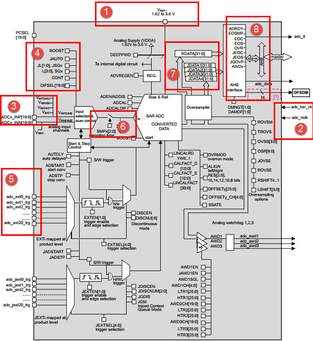
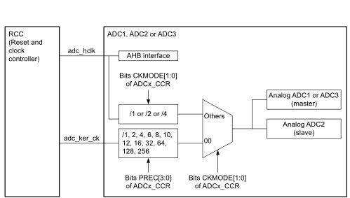
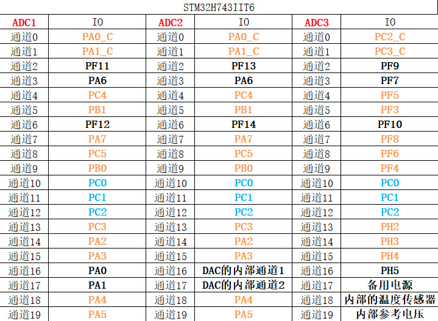
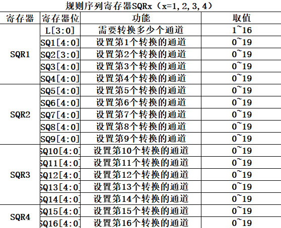
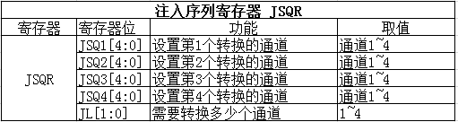
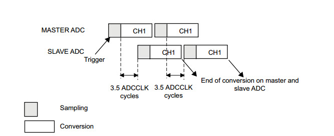

.. vim: syntax=rst

ADC—电压采集
=================

本章参考资料：《STM32H743用户手册》ADC章节。

学习本章时，配合《STM32H743用户手册》ADC章节一起阅读，效果会更佳，特别是涉及到寄存器说明的部分。

ADC简介
~~~~~~~~~~~~~

STM32H743有3个ADC，每个ADC有16位、14位、12位、10位和8位可选，每个ADC有20个外部通道。
ADC3的通道ADC3_INP/INN18连接到芯片内部的温度传感器V\ :sub:`SENSE`\ ，通道ADC3_INP/INN19连接到了内部参考电压V\:sub:`REFINT` 连接，
通道ADC3_INP/INN17连接到了备用电源V\ :sub:`BAT`\。ADC2通道16、17连接到了DAC的内部通道1、2。ADC具有独立模式、双重模式，
对于不同AD转换要求几乎都有合适的模式可选。ADC功能非常强大，具体的我们在功能框图中分析每个部分的功能。

ADC功能框图剖析
~~~~~~~~~~~~~~~~~~~~~~~~~

掌握了ADC的功能框图，就可以对ADC有一个整体的把握，在编程的时候可以做到了然如胸，不会一知半解。

电压输入范围
^^^^^^^^^^^^^^^^^^^^

ADC输入范围为：V\ :sub:`REF-` ≤ V\ :sub:`IN` ≤ V\ :sub:`REF+`\ 。由V\ :sub:`REF-`\ 、V\ :sub:`REF+` 、V\ :sub:`DDA` 、V\ :sub:`SSA`\ 、这四个外部引脚决定。

我们在设计原理图的时候一般把V\ :sub:`SSA`\ 和V\ :sub:`REF-`\ 接地，把V\ :sub:`REF+`\ 和V\ :sub:`DDA` 接3V3，得到ADC的输入电压范围为：0~3.3V。

如果我们想让输入的电压范围变宽，去到可以测试负电压或者更高的正电压，我们可以在外部加一个电压调理电路，把需要转换的电压抬升或者降压到0~3.3V，这样ADC就可以测量了。

外设时钟
^^^^^^^^^^^^

STM32H7采用双时钟结构，彼此之间不会互相影响，见图 ADC的时钟来源_ 。ADC外设时钟是来自于AHB，而ADC的内核时钟，可以通过ADCx_CCR的位CKMODE来选择，
分别有：一、ADC的外设时钟通过1分频、2分频或者四分频得到的时钟；二、选择ADC内核时钟（配置RCC寄存器RCC_D3CCIPR的位ADCSEL[1:0]来选择内核时钟的来源，
可以是外设时钟，PLL2P和PLL3R）经过PREC[3:0]分频得到的时钟。

输入通道
^^^^^^^^^^^^

我们确定好ADC输入电压之后，那么电压怎么输入到ADC？这里我们引入通道的概念，STM32H7的ADC多达25个通道，
其中外部的20个通道就是框图中的ADCx_INP[19:0]、ADCx_INN[19:0]。ADCx_INN只有在差分模式下有效，且要求输入的电压小于参考电压的一半。
这20个通道对应着不同的IO口，具体是哪一个IO口可以从手册查询到。其中ADC1/2/3还有内部通道：
ADC3的通道ADC3_INP/INN18连接到芯片内部的温度传感器V\ :sub:`SENSE`\ ，通道ADC3_INP/INN19连接到了内部参考电压V\
:sub:`REFINT`连接，通道ADC3_INP/INN17连接到了备用电源V\ :sub:`BAT`\ 。ADC2通道16、17连接到了DAC的内部通道1、2。

外部通道在转换的时候又分为规则通道和注入通道，其中规则通道最多有16路，注入通道最多有4路。那这两个通道有什么区别？在什么时候使用？

**规则通道**

规则通道：顾名思意，规则通道就是很规矩的意思，我们平时一般使用的就是这个通道，或者应该说我们用到的都是这个通道，没有什么特别要注意的可讲。

**注入通道**

注入，可以理解为插入，插队的意思，是一种不安分的通道。它是一种在规则通道转换的时候强行插入要转换的一种。如果在规则通道转换过程中，
有注入通道插队，那么就要先转换完注入通道，等注入通道转换完成后，再回到规则通道的转换流程。这点跟中断程序很像，都是不安分的主。
所以，注入通道只有在规则通道存在时才会出现。

转换顺序
^^^^^^^^^^^^

**规则序列**

规则序列寄存器有4个，分别为SQR1、SQR2、SQR3、SQR4。SQR1控制着规则序列中的第一个到第六个转换，对应的位为：SQ1[4:0]~SQ4[4:0]，
第一次转换的是位4:0 SQ1[4:0]，如果通道16想第一次转换，那么在SQ1[4:0]写16即可。SQR2控制着规则序列中的第5到第9个转换，
对应的位为：SQ5[4:0]~SQ9[4:0]，如果通道1想第8个转换，则SQ8[4:0]写1即可。SQR4控制着规则序列中的第10到第14个转换，
对应位为：SQ10[4:0]~SQ14[4:0]，如果通道6想第10个转换，则SQ10[4:0]写6即可。具体使用多少个通道，由SQR1的位L[3:0]决定，最多16个通道。

**注入序列**

注入序列寄存器JSQR只有一个，最多支持4个通道，具体多少个由JSQR的JL[2:0]决定。转换顺序与规则序列寄存器SQR一样。

触发源
^^^^^^^^^^^^

通道选好了，转换的顺序也设置好了，那接下来就该开始转换了。ADC转换可以由ADC控制寄存器: ADC_CR的ADSTART这个位来控制，写1的时候开始转换，
写0的时候停止转换，这个是最简单也是最好理解的开启ADC转换的控制方式，理解起来没啥技术含量。

除了这种庶民式的控制方法，ADC还支持外部事件触发转换，这个触发包括内部定时器触发和外部IO触发。触发源有很多，具体选择哪一种触发源，
由ADC控制寄存器:ADC_CR的EXTSEL[4:0]和ADC_JSQR的JEXTSEL[4:0]位来控制。EXTSEL[2:0]用于选择规则通道的触发源，JEXTSEL[4:0]用于选择注入通道的触发源。

如果使能了外部触发事件，我们还可以通过设置ADC控制寄存器:ADC_CR的EXTEN[1:0]和ADC_JSQR的JEXTEN[1:0]来控制触发极性，可以有4种状态，
分别是：禁止触发检测、上升沿检测、下降沿检测以及上升沿和下降沿均检测。

转换时间
^^^^^^^^^^^^

**采样时间**

ADC需要若干个ADC_CLK周期完成对输入的电压进行采样，采样的周期数可通过ADC 采样时间寄存器ADC_SMPR1和ADC_SMPR2中的SMP[2:0]位设置，
ADC_SMPR1控制的是通道0~9，ADC_SMPR2控制的是通道10~19。每个通道可以分别用不同的时间采样。其中采样周期最小是1.5个，
即如果我们要达到最快的采样，那么应该设置采样周期为3个周期，这里说的周期就是1/ADC_CLK。

ADC的总转换时间跟ADC的输入时钟和采样时间有关，公式为：

Tconv = 采样时间 + 7.5个周期

当ADCCLK = 24MHz，采样时间设置为1.5个时钟周期，那么总的转换时为：Tconv = 1.5 + 7.5 = 9个周期 =0.375us。

数据寄存器
^^^^^^^^^^^^

一切准备就绪后，ADC转换后的数据根据转换组的不同，规则组的数据放在ADC_DR寄存器，注入组的数据放在JDRx。如果是使用双重模式，
规矩组的数据是存放在通用规矩寄存器ADC_CDR内的。

**规则数据寄存器ADCx_DR**

ADC规则组数据寄存器ADC_DR只有一个，是一个32位的寄存器，只有低16位有效并且只是用于独立模式存放转换完成数据。因为ADC的最大精度是16位，
ADC_DR是16位有效，这样允许ADC存放数据时候选择左对齐或者右对齐，具体是以哪一种方式存放，由ADC_CFGR2的OVSS和LSHIFT设置。
假如设置ADC精度为12位，如果设置数据为左对齐，那AD转换完成数据存放在ADC_DR寄存器的[4:15]位内；如果为右对齐，则存放在ADC_DR寄存器的[0:11]位内。

规则通道可以有16个这么多，可规则数据寄存器只有一个，如果使用多通道转换，那转换的数据就全部都挤在了DR里面，前一个时间点转换的通道数据，
就会被下一个时间点的另外一个通道转换的数据覆盖掉，所以当通道转换完成后就应该把数据取走，或者开启DMA模式，把数据传输到内存里面，
不然就会造成数据的覆盖。最常用的做法就是开启DMA传输。

如果没有使用DMA传输，我们一般都需要使用ADC状态寄存器ADC_SR获取当前ADC转换的进度状态，进而进行程序控制。

**注入数据寄存器ADC_JDRx**

ADC注入组最多有4个通道，刚好注入数据寄存器也有4个，每个通道对应着自己的寄存器，不会跟规则寄存器那样产生数据覆盖的问题。ADC_JDRx是32位的，
低16位有效，高16位保留，数据同样分为左对齐和右对齐，具体是以哪一种方式存放，由ADC_CR2的11位ALIGN设置。

**通用规则数据寄存器ADC_CDR**

规则数据寄存器ADC_DR是仅适用于独立模式的，而通用规则数据寄存器ADC_CDR是适用于双重。独立模式就是仅仅适用三个ADC的其中一个，
双重模式就是同时使用ADC1和ADC2。在双重模式下一般需要配合DMA数据传输使用。

中断
^^^^^^^^^^^^

**转换结束中断**

数据转换结束后，可以产生中断，中断分为四种：规则通道转换结束中断，注入转换通道转换结束中断，模拟看门狗中断和溢出中断。其中转换结束中断很好理解，
跟我们平时接触的中断一样，有相应的中断标志位和中断使能位，我们还可以根据中断类型写相应配套的中断服务程序。

**模拟看门狗中断**

当被ADC转换的模拟电压低于低阈值或者高于高阈值时，就会产生中断，前提是我们开启了模拟看门狗中断，其中低阈值和高阈值由ADC_LTR和ADC_HTR设置。
例如我们设置高阈值是2.5V，那么模拟电压超过2.5V的时候，就会产生模拟看门狗中断，反之低阈值也一样。

**溢出中断**

如果发生DMA传输数据丢失，会置位ADC状态寄存器ADC_SR的OVR位，如果同时使能了溢出中断，那在转换结束后会产生一个溢出中断。

**DMA请求**

规则和注入通道转换结束后，除了产生中断外，还可以产生DMA请求，把转换好的数据直接存储在内存里面。对于独立模式的多通道AD转换使用DMA传输非常有必须要，
程序编程简化了很多。对于双重使用DMA传输几乎可以说是必要的。有关DMA请求需要配合《STM32H743用户手册》DMA控制器这一章节来学习。
一般我们在使用ADC的时候都会开启DMA传输。

电压转换
^^^^^^^^^^^^

模拟电压经过ADC转换后，是一个相对精度的数字值，如果通过串口以16进制打印出来的话，可读性比较差，那么有时候我们就需要把数字电压转换成模拟电压，
也可以跟实际的模拟电压（用万用表测）对比，看看转换是否准确。

我们一般在设计原理图的时候会把ADC的输入电压范围设定在：0~3.3v，如果设置ADC为12位的，那么12位满量程对应的就是3.3V，12位满量程对应的数字值是：2^12。
数值0对应的就是0V。如果转换后的数值为  X ，X对应的模拟电压为Y，那么会有这么一个等式成立：  2^12 / 3.3 =X / Y，=> Y = (3.3 \* X ) / 2^12。

ADC初始化结构体详解
~~~~~~~~~~~~~~~~~~~~~~~~~~~~~~~

Hal 库函数对每个外设都建立了一个初始化结构体xxx \_HandleTypeDef (xxx为外设名称)，结构体成员用于设置外设工作参数，
并由HAL库函数HAL_xxx_Init()调用这些设定参数进入设置外设相应的寄存器，达到配置外设工作环境的目的。

结构体xxx_HandleTypeDef和库函数HAL_xxx_Init配合使用是hal 精髓所在，理解了结构体xxx_HandleTypeDef每个成员意义基本上就可以对该外设运用自如了。
结构体xxx_HandleTypeDef定义在stm32h7xx_hal_xxx.h文件中，库函数HAL_xxx_Init定义在stm32h7xx_hal_xxx.c文件中，编程时我们可以结合这两个文件内注释使用。

**ADC_HandleTypeDef结构体**

ADC_HandleTypeDef结构体定义在stm32h7xx_hal_adc.h文件内，具体定义如下：

.. highlight:: c

::

    /**
    * @brief  ADC handle Structure definition
    */
    typedef struct {
        ADC_TypeDef                   *Instance; /*!< ADC寄存器基地址 */

        ADC_InitTypeDef               Init; /*!< ADC参数配置结构体 */

        DMA_HandleTypeDef             *DMA_Handle; /*!< DMA配置结构体 */

        HAL_LockTypeDef               Lock;        /*!< 锁资源 */

        __IO uint32_t                 State;       /*!<  ADC工作状态 */

        __IO uint32_t                 ErrorCode;   /*!< ADC错误操作内容 */

        ADC_InjectionConfigTypeDef    InjectionConfig;/*!<ADC注入通道配置结构体 */
    } ADC_HandleTypeDef;

(1) Instance：ADC寄存器基地址指针，所有参数都是指定基地址后才能正确写入寄存器。

(2) Init：ADC初始化结构体，下面会详细讲解每一个成员。

(3) DMA_Handle：DMA处理程序指针。

(4) Lock：ADC锁定对象。

(5) State：ADC转换状态。

(6) ErrorCode：ADC错误码。

(7) InjectionConfig：ADC注入通道配置结构体，用于配置注入通道的转换顺序，数据格式等。

**ADC_InitTypeDef结构体**

ADC_InitTypeDef初始化结构体被ADC_HandleTypeDef结构体引用。

ADC_InitTypeDef结构体定义在stm32h7xx_hal_adc.h文件内，具体定义如下：

.. highlight:: c

::

    typedef struct {
        uint32_t ClockPrescaler;        /*!< 时钟分频因子 */
        uint32_t Resolution;            /*!< ADC的分辨率 */
        uint32_t ScanConvMode;          /*!< ADC扫描选择 */
        uint32_t EOCSelection;          /*!< 转换完成标志位 */
        FunctionalState LowPowerAutoWait;      /*!< 低功耗自动延时 */
        FunctionalState ContinuousConvMode;    /*!< ADC连续转换模式选择 */
        uint32_t NbrOfConversion;       /*!< 转换通道数目 */
        FunctionalState DiscontinuousConvMode; /*!< ADC单次转换模式选择 */
        uint32_t NbrOfDiscConversion;   /*!< 单次转换通道的数目 */
        uint32_t ExternalTrigConv;      /*!< ADC外部触发源选择*/
        uint32_t ExternalTrigConvEdge;  /*!< ADC外部触发极性*/
        uint32_t ConversionDataManagement; /*!< 数据管理地址 */
        uint32_t Overrun;                  /*!< 发生溢出时，进行的操作 */
        uint32_t LeftBitShift;             /*!< 数据左移几位 */
        FunctionalState OversamplingMode;        /*!< 过采样模式 */
        ADC_OversamplingTypeDef Oversampling;   /*!< 过采样的参数配置*/
    } ADC_InitTypeDef;

(1)  ClockPrescaler：ADC时钟分频系数选择，系数决定ADC时钟频率，可选的分频系数为1、2、4和6等。ADC最大时钟配置为36MHz。

(2)  Resolution：配置ADC的分辨率，可选的分辨率有16位、12位、10位和8位。分辨率越高，AD转换数据精度越高，转换时间也越长；分辨率越低，AD转换数据精度越低，转换时间也越短。

(3)  ScanConvMode：可选参数为ENABLE和DISABLE，配置是否使用扫描。如果是单通道AD转换使用DISABLE，如果是多通道AD转换使用ENABLE。

(4)  EOCSelection：可选参数为ADC_EOC_SINGLE_CONV 和ADC_EOC_SEQ_CONV  ，指定通过轮询和中断来使用EOC标志或者是EOS标志进行转换。

(5)  LowPowerAutoWait：在低功耗模式下，自动调节ADC的转换频率。

(6)  ContinuousConvMode：可选参数为ENABLE 和DISABLE，配置是启动自动连续转换还是单次转换。使用ENABLE配置为使能自动连续转换；
使用DISABLE配置为单次转换，转换一次后停止需要手动控制才重新启动转换。

(7)  NbrOfConversion：指定AD规则转换通道数目，最大值为16。

(8)  DiscontinuousConvMode：不连续采样模式。一般为禁止模式。

(9)  NbrOfDiscConversion：ADC不连续转换通道数目。

(10) ExternalTrigConv：外部触发选择，图 单个ADC功能框图_ 中列举了很多外部触发条件，可根据项目需求配置触发来源。实际上，我们一般使用软件自动触发。

(11) ExternalTrigConvEdge：外部触发极性选择，如果使用外部触发，可以选择触发的极性，可选有禁止触发检测、上升沿触发检测、下降沿触发检测以及上升沿和下降沿均可触发检测。

(12) ConversionDataManagement： ADC转换后的数据处理方式。可以选择DMA传输，存储在数据寄存器中或者是传输到DFSDM寄存器中。

(13) Overrun：当数据溢出时，可以选择覆盖写入或者是丢弃新的数据。

(14) LeftBitShift：数据左移位数，一般用于数据对齐。最多可支持左移15位。

(15) OversamplingMode、Oversampling

..

   是否使能过采样模式，以及配置相应的参数。

**ADC_ChannelConfTypeDef结构体**

ADC_ChannelConfTypeDef结构体定义在stm32h7xx_hal_adc.h文件内，具体定义如下：

.. highlight:: c

::

    typedef struct {
        uint32_t Channel;                /*!< ADC转换通道*/
        uint32_t Rank;                   /*!< ADC转换顺序 */
        uint32_t SamplingTime;           /*!< ADC采样周期 */
        uint32_t SingleDiff;             /*!< 输入信号线的类型*/
        uint32_t OffsetNumber;           /*!< 采用偏移量的通道 */
        uint32_t Offset;                 /*!< 偏移量 */
        FunctionalState OffsetRightShift;   /*!< 数据右移位数*/
        FunctionalState OffsetSignedSaturation; /*!< 转换数据格式为有符号位数据 */
    } ADC_ChannelConfTypeDef;

(1) Channel：ADC转换通道。可以选择0~19。

(2) Rank：ADC转换顺序，可以选择1~16。

(3) SamplingTime：ADC的采样周期，最小值为1.5个ADC时钟。

(4) SingleDiff：选择ADC输入信号的类型。可以选择差分或者是单线。如果选择差分模式，则需要将相应的ADC_INNx连接到相应的信号线。

(5) OffsetNumber：使用偏移量的通道。当选择第一个通道时，则第一个通道转换的值需要减去一个偏移量，才能得到最终结果。

(6) Offset：偏移量。根据ADC的分辨率不同，支持的最大偏移量也不同，例如分辨率是16bit，，最大的偏移量为0xFFFF。

(7) OffsetRightShift：采样值进行右移的位数。

(8) OffsetSignedSaturation：是否使能ADC采样值的最高位为符号位。

独立模式单通道采集实验
~~~~~~~~~~~~~~~~~~~~~~~~~~~~~~~

STM32的ADC功能繁多，我们设计三个实验尽量完整的展示ADC的功能。首先是比较基础实用的单通道采集，
实现开发板上电位器的动触点输出引脚电压的采集并通过串口打印至PC端串口调试助手。单通道采集适用AD转换完成中断，
在中断服务函数中读取数据，不使用DMA传输，在多通道采集时才使用DMA传输。

硬件设计
^^^^^^^^^^^^

电路设计见图 开发板ADC原理图_ 。

.. image:: media/ADC007.png
    :align: center
    :name: 开发板电位器部分原理图
    :alt: 开发板电位器部分原理图

贴片滑动变阻器的动触点通过连接至STM32芯片的ADC通道引脚。当我们使用旋转滑动变阻器调节旋钮时，其动触点电压也会随之改变，
电压变化范围为0~3.3V，亦是开发板默认的ADC电压采集范围。

软件设计
^^^^^^^^^^^^

这里只讲解核心的部分代码，有些变量的设置，头文件的包含等并没有涉及到，完整的代码请参考本章配套的工程。

我们编写两个ADC驱动文件，bsp_adc.h 和 bsp_adc.c，用来存放ADC所用IO引脚的初始化函数以及ADC配置相关函数。

编程要点
''''''''''''

1) 初始化配置ADC目标引脚为模拟输入模式；

2) 使能ADC时钟；

3) 配置通用ADC为独立模式，采样1分频；

4) 设置目标ADC为16位分辨率，1通道的连续转换，不需要外部触发；

5) 设置ADC转换通道顺序及采样时间；

6) 配置使能ADC转换完成中断，在中断内读取转换完数据；

7) 启动ADC转换；

8) 使能软件触发ADC转换。

ADC转换结果数据使用中断方式读取，这里没有使用DMA进行数据传输。

代码分析
''''''''''''

**ADC宏定义**

.. code-block:: c
    :caption: 代码清单:ADC-1 ADC宏定义
    :name: 代码清单:ADC-1
    :linenos:

    //引脚定义
    #define RHEOSTAT_ADC_PIN                            GPIO_PIN_3
    #define RHEOSTAT_ADC_GPIO_PORT                      GPIOF
    #define RHEOSTAT_ADC_GPIO_CLK_ENABLE()              __GPIOF_CLK_ENABLE()

    // ADC 序号宏定义
    #define RHEOSTAT_ADC                        ADC3
    #define RHEOSTAT_ADC_CLK_ENABLE()           __ADC3_CLK_ENABLE()
    #define RHEOSTAT_ADC_CHANNEL                ADC_CHANNEL_5

    #define Rheostat_ADC_IRQ                    ADC3_IRQn

使用宏定义引脚信息方便硬件电路改动时程序移植。

**ADC GPIO初始化函数**

.. code-block:: c
    :caption: 代码清单:ADC-2 ADC GPIO初始化
    :name: 代码清单:ADC-2
    :linenos:

    static void ADC_GPIO_Mode_Config(void)
    {
        /* 定义一个GPIO_InitTypeDef类型的结构体 */
        GPIO_InitTypeDef  GPIO_InitStruct;
        /* 使能ADC3引脚的时钟 */
        RHEOSTAT_ADC_GPIO_CLK_ENABLE();
        __HAL_RCC_SYSCFG_CLK_ENABLE();

        GPIO_InitStruct.Mode = GPIO_MODE_ANALOG;
        GPIO_InitStruct.Pull = GPIO_NOPULL;
        GPIO_InitStruct.Pin = RHEOSTAT_ADC_PIN;
        /* 配置为模拟输入，不需要上拉电阻 */
        HAL_GPIO_Init(RHEOSTAT_ADC_GPIO_PORT, &GPIO_InitStruct);

        /* H743XIHx的ADC3_CH1使用的是PC3_C，与PC3是两个不同的引脚，
        通过一个模拟开关连接，使用时需要切换 */
        /* PC3_C ------> ADC3_INP1  */
        HAL_SYSCFG_AnalogSwitchConfig(SYSCFG_SWITCH_PC3, SYSCFG_SWITCH_PC3_OPEN);
    }

使用到GPIO时候都必须开启对应的GPIO时钟，GPIO用于AD转换功能必须配置为模拟输入模式。PC3_C和PC3引脚是两个独立的焊盘，通过模拟开关连接，使用时需要切换。

**配置ADC工作模式**

.. code-block:: c
    :caption: 代码清单:ADC-3 ADC工作模式配置
    :name: 代码清单:ADC-3
    :linenos:

    static void ADC_Mode_Config(void)
    {
        ADC_ChannelConfTypeDef ADC_Config;

        RCC_PeriphCLKInitTypeDef RCC_PeriphClkInit;
        /*            配置ADC3时钟源             */
        /*    HSE Frequency(Hz)    = 25000000   */
        /*         PLL_M                = 5     */
        /*         PLL_N                = 160   */
        /*         PLL_P                = 25    */
        /*         PLL_Q                = 2     */
        /*         PLL_R                = 2     */
        /*     ADC_ker_clk         = 32000000   */
        RCC_PeriphClkInit.PeriphClockSelection = RCC_PERIPHCLK_ADC;
        RCC_PeriphClkInit.PLL2.PLL2FRACN = 0;
        RCC_PeriphClkInit.PLL2.PLL2M = 5;
        RCC_PeriphClkInit.PLL2.PLL2N = 160;
        RCC_PeriphClkInit.PLL2.PLL2P = 25;
        RCC_PeriphClkInit.PLL2.PLL2Q = 2;
        RCC_PeriphClkInit.PLL2.PLL2R = 2;
        RCC_PeriphClkInit.PLL2.PLL2RGE = RCC_PLL2VCIRANGE_2;
        RCC_PeriphClkInit.PLL2.PLL2VCOSEL = RCC_PLL2VCOWIDE;
        RCC_PeriphClkInit.AdcClockSelection = RCC_ADCCLKSOURCE_PLL2;
        HAL_RCCEx_PeriphCLKConfig(&RCC_PeriphClkInit);

        /* 使能ADC3时钟 */
        RHEOSTAT_ADC_CLK_ENABLE();

        ADC_Handle.Instance = RHEOSTAT_ADC;
        //使能Boost模式,1.5.0版hal库做出修改，取消了这个参数选项
        ADC_Handle.Init.BoostMode = ENABLE;
        //ADC时钟1分频
        ADC_Handle.Init.ClockPrescaler = ADC_CLOCK_ASYNC_DIV1;
        //使能连续转换模式
        ADC_Handle.Init.ContinuousConvMode = ENABLE;
        //转换通道 1个
        ADC_Handle.Init.NbrOfConversion = 1;
        //数据存放在数据寄存器中
        ADC_Handle.Init.ConversionDataManagement = ADC_CONVERSIONDATA_DR;
        //关闭不连续转换模式
        ADC_Handle.Init.DiscontinuousConvMode = DISABLE;
        //非连续转换个数
        ADC_Handle.Init.NbrOfDiscConversion = 0;
        //数据右对齐
        ADC_Handle.Init.LeftBitShift = ADC_LEFTBITSHIFT_NONE;

        //使能EOC标志位
        ADC_Handle.Init.EOCSelection = ADC_EOC_SINGLE_CONV;
        //软件触发
        ADC_Handle.Init.ExternalTrigConv = ADC_SOFTWARE_START;
        //关闭低功耗自动等待
        ADC_Handle.Init.LowPowerAutoWait = DISABLE;
        //数据溢出时，覆盖写入
        ADC_Handle.Init.Overrun = ADC_OVR_DATA_OVERWRITTEN;
        //不使能过采样模式
        ADC_Handle.Init.OversamplingMode = DISABLE;
        //分辨率为：16bit
        ADC_Handle.Init.Resolution = ADC_RESOLUTION_16B;
        //不使能多通道扫描
        ADC_Handle.Init.ScanConvMode = DISABLE;
        //初始化 ADC
        HAL_ADC_Init(&ADC_Handle);

        //使用通道1
        ADC_Config.Channel = ADC_CHANNEL_1;
        //转换顺序为1
        ADC_Config.Rank = ADC_REGULAR_RANK_1 ;
        //采样周期为64.5个周期
        ADC_Config.SamplingTime = ADC_SAMPLETIME_64CYCLES_5;
        //不使用差分输入的功能
        ADC_Config.SingleDiff = ADC_SINGLE_ENDED ;
        //配置ADC通道
        HAL_ADC_ConfigChannel(&ADC_Handle, &ADC_Config);
        //使能ADC
        ADC_Enable(&ADC_Handle);
    }

首先，使用ADC_HandleTypeDef和ADC_ChannelConfTypeDef结构体分别定义一个ADC初始化和ADC通道配置变量，这两个结构体我们之前已经有详细讲解。

我们调用RHEOSTAT_ADC_CLK_ENABLE()开启ADC时钟。

接下来我们使用ADC_HandleTypeDef结构体变量ADC_Handle来配置ADC的寄存器基地址指针、分频系数为1、ADC3为16位分辨率、单通道采集不需要扫描、
启动连续转换、使用内部软件触发无需外部触发事件，并调用HAL_ADC_Init函数完成ADC1工作环境配置。

使用ADC_ChannelConfTypeDef结构体变量ADC_Config来配置ADC的通道、转换顺序，可选为1到16；采样周期选择，采样周期越短，
ADC转换数据输出周期就越短但数据精度也越低，采样周期越长，ADC转换数据输出周期就越长同时数据精度越高。PC3对应ADC3通道ADC_Channel_1，
这里我们选择ADC_SAMPLETIME_64CYCLES_5即64.5周期的采样时间，调用HAL_ADC_ConfigChannel函数完成ADC3的配置。

利用ADC转换完成中断可以非常方便的保证我们读取到的数据是转换完成后的数据而不用担心该数据可能是ADC正在转换时“不稳定”的数据。
我们使用HAL_ADC_Start_IT函数使能ADC转换完成中断，并在中断服务函数中读取转换结果数据。

**ADC中断配置**

.. code-block:: c
    :caption: 代码清单:ADC-4 ADC中断配置
    :name: 代码清单:ADC-4
    :linenos:

    // 配置中断优先级
    static void Rheostat_ADC_NVIC_Config(void)
    {
        HAL_NVIC_SetPriority(Rheostat_ADC_IRQ, 0, 0);
        HAL_NVIC_EnableIRQ(Rheostat_ADC_IRQ);
    }

在Rheostat_ADC_NVIC_Config函数中我们配置了ADC转换完成的中断源和中断优先级。

**ADC中断服务函数**

.. code-block:: c
    :caption: 代码清单:ADC-5 ADC中断服务函数
    :name: 代码清单:ADC-5
    :linenos:

    void ADC_IRQHandler(void)
    {
        HAL_ADC_IRQHandler(&ADC_Handle);
    }
    /**
    * @brief  转换完成中断回调函数（非阻塞模式）
    * @param  AdcHandle : ADC句柄
    * @retval 无
    */
    void HAL_ADC_ConvCpltCallback(ADC_HandleTypeDef* AdcHandle)
    {
        /* 获取结果 */
        ADC_ConvertedValue = HAL_ADC_GetValue(AdcHandle);
    }

中断服务函数一般定义在stm32h7xx_it.c文件内，HAL_ADC_IRQHandler是HAL中自带的一个中断服务函数，他处理过程中会指向一个回调函数给我们去添加用户代码，
这里我们使用HAL_ADC_ConvCpltCallback转换完成中断，在ADC转换完成后就会进入中断服务函数，在进入回调函数，
我们在回调函数内直接读取ADC转换结果保存在变量ADC_ConvertedValue(在bsp_adc.c中定义)中。

ADC_GetConversionValue函数是获取ADC转换结果值的库函数，只有一个形参为ADC句柄，该函数还返回一个16位的ADC转换结果值。

**主函数**

.. code-block:: c
    :caption: 代码清单:ADC-6 主函数
    :name: 代码清单:ADC-6
    :linenos:

    int main(void)
    {

        /* 系统时钟初始化成480MHz */
        SystemClock_Config();

        /* 默认不配置 MPU，若需要更高性能，当配置 MPU 后，使用
        DMA 时需注意 Cache 与 内存内容一致性的问题，
        具体注意事项请参考配套教程的 MPU 配置相关章节 */
    //  Board_MPU_Config(0, MPU_Normal_WT, 0xD0000000, MPU_32MB);
    //  Board_MPU_Config(1, MPU_Normal_WT, 0x24000000, MPU_512KB);

        SCB_EnableICache();    // 使能指令 Cache
        SCB_EnableDCache();    // 使能数据 Cache

        LED_GPIO_Config();
        /* 配置串口1为：115200 8-N-1 */
        DEBUG_USART_Config();

        /* ADC初始化子程序 */
        ADC_Init();

        while (1) {
            LED2_TOGGLE;
            Delay(0xffffee);

            printf("\r\n The current AD value = 0x%04X \r\n", ADC_ConvertedValue);

            printf("\r\n The current AD value = %f V \r\n", ADC_vol);

            /*开启ADC3中断 */
            HAL_NVIC_EnableIRQ(Rheostat_ADC_IRQ);
            /* ADC的采样值 / ADC精度 = 电压值 / 3.3 */
            ADC_vol = (float)(ADC_ConvertedValue*3.3/65536);
            /*关闭ADC3中断 */
            HAL_NVIC_DisableIRQ(Rheostat_ADC_IRQ);
        }
    }

配置调试串口相关参数，函数定义在bsp_debug_usart.c文件中。

接下来调用ADC \_Init函数进行ADC初始化配置并启动ADC。ADC \_Init函数是定义在bsp_adc.c文件中，它只是简单的分别调用ADC_GPIO_Mode_Config()、
ADC_Mode_Config ()和Rheostat_ADC_NVIC_Config()。

Delay函数只是一个简单的延时函数。

在ADC中断服务函数的回调函数中我们把AD转换结果保存在变量ADC_ConvertedValue中，根据我们之前的分析可以非常清楚的计算出对应的电位器动触点的电压值。

最后就是把相关数据打印至串口调试助手。

下载验证
^^^^^^^^^^^^

用USB线连接开发板“USB TO UART”接口跟电脑，在电脑端打开串口调试助手，把编译好的程序下载到开发板。在串口调试助手可看到不断有数据从开发板传输过来，
此时我们旋转电位器改变其电阻值，那么对应的数据也会有变化。

独立模式多通道采集实验
~~~~~~~~~~~~~~~~~~~~~~~~~~~~~~~

硬件设计
^^^^^^^^^^^^

开发板已通过排针接口把部分ADC通道引脚引出，我们可以根据需要选择使用。实际使用时候必须注意保存ADC引脚是单独使用的，不可能与其他模块电路共用同一引脚。

软件设计
^^^^^^^^^^^^

这里只讲解核心的部分代码，有些变量的设置，头文件的包含等并没有涉及到，完整的代码请参考本章配套的工程。

跟单通道例程一样，我们编写两个ADC驱动文件，bsp_adc.h 和 bsp_adc.c，用来存放ADC所用IO引脚的初始化函数以及ADC配置相关函数，
实际上这两个文件跟单通道实验的文件是非常相似的。

编程要点
''''''''''''

1) 初始化配置ADC目标引脚为模拟输入模式；

2) 使能ADC时钟和DMA时钟；

3) 配置DMA从ADC规矩数据寄存器传输数据到我们指定的存储区；

4) 配置通用ADC为独立模式，采样时钟1分频；

5) 设置ADC为16位分辨率，启动扫描，连续转换，不需要外部触发；

6) 设置ADC转换通道顺序及采样时间；

7) 使能DMA请求，DMA在AD转换完自动传输数据到指定的存储区；

8) 启动ADC转换；

9) 使能软件触发ADC转换。

ADC转换结果数据使用DMA方式传输至指定的存储区，这样取代单通道实验使用中断服务的读取方法。实际上，多通道ADC采集一般使用DMA数据传输方式更加高效方便。

代码分析
''''''''''''

**ADC宏定义**

.. code-block:: c
    :caption: 代码清单:ADC-7 多通道ADC相关宏定义
    :name: 代码清单:ADC-7
    :linenos:

    //引脚定义
#define RHEOSTAT_ADC_PIN1                           GPIO_PIN_3  
#define RHEOSTAT_ADC_PIN2                           GPIO_PIN_4
#define RHEOSTAT_ADC_PIN3                           GPIO_PIN_5
#define RHEOSTAT_ADC_PIN4                           GPIO_PIN_6
#define RHEOSTAT_ADC_PIN5                           GPIO_PIN_7
#define RHEOSTAT_ADC_PIN6                           GPIO_PIN_8

#define RHEOSTAT_ADC_GPIO_PORT                      GPIOF                     
#define RHEOSTAT_ADC_GPIO_CLK_ENABLE()              __GPIOF_CLK_ENABLE()

// ADC 序号宏定义
#define RHEOSTAT_ADC1                        ADC3
#define RHEOSTAT_ADC1_CLK_ENABLE()           __ADC3_CLK_ENABLE()

#define RHEOSTAT_ADC_CHANNEL1                 ADC_CHANNEL_5
#define RHEOSTAT_ADC_CHANNEL2                 ADC_CHANNEL_9
#define RHEOSTAT_ADC_CHANNEL3                 ADC_CHANNEL_4
#define RHEOSTAT_ADC_CHANNEL4                 ADC_CHANNEL_8
#define RHEOSTAT_ADC_CHANNEL5                 ADC_CHANNEL_3
#define RHEOSTAT_ADC_CHANNEL6                 ADC_CHANNEL_7

#define Rheostat_ADC12_IRQ                    ADC_IRQn

定义多个通道进行多通道ADC实验，并且定义DMA相关配置。

**ADC GPIO初始化函数**

.. code-block:: c
    :caption: 代码清单:ADC-8 ADC GPIO初始化
    :name: 代码清单:ADC-8
    :linenos:

    static void ADC_GPIO_Mode_Config(void)
    {
         /* 定义一个GPIO_InitTypeDef类型的结构体 */
         GPIO_InitTypeDef  GPIO_InitStruct;
         /* 使能ADC引脚的时钟 */
         RHEOSTAT_ADC_GPIO_CLK_ENABLE();
         //通道18——IO初始化
         GPIO_InitStruct.Mode = GPIO_MODE_ANALOG; 
         GPIO_InitStruct.Pull = GPIO_NOPULL;
         GPIO_InitStruct.Pin = RHEOSTAT_ADC_PIN1; 
         /* 配置为模拟输入，不需要上拉电阻 */ 
         HAL_GPIO_Init(RHEOSTAT_ADC_GPIO_PORT, &GPIO_InitStruct);
         //通道19——IO初始化
         GPIO_InitStruct.Pin = RHEOSTAT_ADC_PIN2;
         HAL_GPIO_Init(RHEOSTAT_ADC_GPIO_PORT, &GPIO_InitStruct);
         //通道3——IO初始化
         GPIO_InitStruct.Pin = RHEOSTAT_ADC_PIN3;
         HAL_GPIO_Init(RHEOSTAT_ADC_GPIO_PORT, &GPIO_InitStruct);
         //通道7——IO初始化
         GPIO_InitStruct.Pin = RHEOSTAT_ADC_PIN4;
         HAL_GPIO_Init(RHEOSTAT_ADC_GPIO_PORT, &GPIO_InitStruct);  
         
         GPIO_InitStruct.Pin = RHEOSTAT_ADC_PIN5;
         HAL_GPIO_Init(RHEOSTAT_ADC_GPIO_PORT, &GPIO_InitStruct);  
            
         GPIO_InitStruct.Pin = RHEOSTAT_ADC_PIN6;
         HAL_GPIO_Init(RHEOSTAT_ADC_GPIO_PORT, &GPIO_InitStruct);  
    }

使用到GPIO时候都必须开启对应的GPIO时钟，GPIO用于AD转换功能必须配置为模拟输入模式。

**配置ADC工作模式**

.. code-block:: c
    :caption: 代码清单:ADC-9 ADC工作模式配置
    :name: 代码清单:ADC-9
    :linenos:

    static void ADC_Mode_Config(void)
    {
         ADC_ChannelConfTypeDef ADC_Config;
  
         RCC_PeriphCLKInitTypeDef RCC_PeriphClkInit;  
         /*            配置ADC3时钟源             */
         /*    HSE Frequency(Hz)    = 25000000   */                                             
         /*         PLL_M                = 5     */
         /*         PLL_N                = 160   */
         /*         PLL_P                = 25    */
         /*         PLL_Q                = 2     */
         /*         PLL_R                = 2     */
         /*     ADC_ker_clk         = 32000000   */
            RCC_PeriphClkInit.PeriphClockSelection = RCC_PERIPHCLK_ADC;
         RCC_PeriphClkInit.PLL2.PLL2FRACN = 0;
         RCC_PeriphClkInit.PLL2.PLL2M = 5;
         RCC_PeriphClkInit.PLL2.PLL2N = 160;
         RCC_PeriphClkInit.PLL2.PLL2P = 25;
         RCC_PeriphClkInit.PLL2.PLL2Q = 2;
         RCC_PeriphClkInit.PLL2.PLL2R = 2;
         RCC_PeriphClkInit.PLL2.PLL2RGE = RCC_PLL2VCIRANGE_2;
         RCC_PeriphClkInit.PLL2.PLL2VCOSEL = RCC_PLL2VCOWIDE;
         RCC_PeriphClkInit.AdcClockSelection = RCC_ADCCLKSOURCE_PLL2; 
            HAL_RCCEx_PeriphCLKConfig(&RCC_PeriphClkInit);  
      
         /* 使能ADC1、2时钟 */
         RHEOSTAT_ADC1_CLK_ENABLE();
         __HAL_RCC_DMA1_CLK_ENABLE();
         
         hdma_adc1.Instance = DMA1_Stream1;
         hdma_adc1.Init.Request = DMA_REQUEST_ADC3;
         hdma_adc1.Init.Direction = DMA_PERIPH_TO_MEMORY;
         hdma_adc1.Init.PeriphInc = DMA_PINC_DISABLE;
         hdma_adc1.Init.MemInc = DMA_MINC_ENABLE;
         hdma_adc1.Init.PeriphDataAlignment = DMA_PDATAALIGN_HALFWORD;
         hdma_adc1.Init.MemDataAlignment = DMA_MDATAALIGN_HALFWORD;
         hdma_adc1.Init.Mode = DMA_CIRCULAR;
         hdma_adc1.Init.Priority = DMA_PRIORITY_LOW;
         hdma_adc1.Init.FIFOMode = DMA_FIFOMODE_DISABLE;
         if(HAL_DMA_Init(&hdma_adc1) != HAL_OK)
         {}
         __HAL_LINKDMA(&ADC1_Handle,DMA_Handle,hdma_adc1);    
            
         
         ADC1_Handle.Instance = RHEOSTAT_ADC1;
         //ADC时钟1分频
         ADC1_Handle.Init.ClockPrescaler = ADC_CLOCK_ASYNC_DIV2;
         //使能连续转换模式
         ADC1_Handle.Init.ContinuousConvMode = ENABLE;
         //数据存放在数据寄存器中
         ADC1_Handle.Init.ConversionDataManagement = ADC_CONVERSIONDATA_DMA_CIRCULAR;
         //关闭不连续转换模式
         ADC1_Handle.Init.DiscontinuousConvMode = DISABLE;
         //单次转换
         ADC1_Handle.Init.EOCSelection = ADC_EOC_SINGLE_CONV;
         //软件触发
         ADC1_Handle.Init.ExternalTrigConv = ADC_SOFTWARE_START;
         //关闭低功耗自动等待
         ADC1_Handle.Init.LowPowerAutoWait = DISABLE;
         //数据溢出时，覆盖写入
         ADC1_Handle.Init.Overrun = ADC_OVR_DATA_OVERWRITTEN;
         //不使能过采样模式
         ADC1_Handle.Init.OversamplingMode = DISABLE;
         //分辨率为：16bit
         ADC1_Handle.Init.Resolution = ADC_RESOLUTION_16B;
         //不使能多通道扫描
         ADC1_Handle.Init.ScanConvMode = ENABLE;
         //扫描四个通道
         ADC1_Handle.Init.NbrOfConversion = 6;
         //初始化 ADC1
         HAL_ADC_Init(&ADC1_Handle);
               
         //使用通道18
         ADC_Config.Channel = RHEOSTAT_ADC_CHANNEL1;
         //转换顺序为1
         ADC_Config.Rank = ADC_REGULAR_RANK_1;
         //采样周期为64.5个周期
         ADC_Config.SamplingTime = ADC_SAMPLETIME_64CYCLES_5;
         //不使用差分输入的功能
         ADC_Config.SingleDiff = ADC_SINGLE_ENDED ;
         //配置ADC通道
         HAL_ADC_ConfigChannel(&ADC1_Handle, &ADC_Config);    

         //使用通道19
         ADC_Config.Channel = RHEOSTAT_ADC_CHANNEL2;
         //转换顺序为2
         ADC_Config.Rank = ADC_REGULAR_RANK_2;
         //配置ADC通道
         HAL_ADC_ConfigChannel(&ADC1_Handle, &ADC_Config);
         
         //使用通道3
         ADC_Config.Channel = RHEOSTAT_ADC_CHANNEL3;
         //转换顺序为1
         ADC_Config.Rank = ADC_REGULAR_RANK_3;
         //配置ADC通道
         HAL_ADC_ConfigChannel(&ADC1_Handle, &ADC_Config); 

         //使用通道7
         ADC_Config.Channel = RHEOSTAT_ADC_CHANNEL4;
         //转换顺序为1
         ADC_Config.Rank = ADC_REGULAR_RANK_4;
         //配置ADC通道
         HAL_ADC_ConfigChannel(&ADC1_Handle, &ADC_Config);
            
               //使用通道7
         ADC_Config.Channel = RHEOSTAT_ADC_CHANNEL5;
         //转换顺序为1
         ADC_Config.Rank = ADC_REGULAR_RANK_5;
         //配置ADC通道
         HAL_ADC_ConfigChannel(&ADC1_Handle, &ADC_Config);
            
               //使用通道7
         ADC_Config.Channel = RHEOSTAT_ADC_CHANNEL6;
         //转换顺序为1
         ADC_Config.Rank = ADC_REGULAR_RANK_6;
         //配置ADC通道
         HAL_ADC_ConfigChannel(&ADC1_Handle, &ADC_Config);
         
         //使能ADC1
         ADC_Enable(&ADC1_Handle);
         
         HAL_ADC_Start_DMA(&ADC1_Handle, (uint32_t *)ADC_ConvertedValue, 6);

    }

首先，我们使用了DMA_HandleTypeDef定义了一个DMA初始化类型变量，该结构体内容我们在DMA篇已经做了非常详细的讲解；
另外还使用ADC_HandleTypeDef和ADC_ChannelConfTypeDef结构体分别定义一个ADC初始化和ADC通道配置变量，这两个结构体我们之前已经有详细讲解。

调用RHEOSTAT_ADC_DMA_CLK_ENABLE()和RHEOSTAT_ADC1_CLK_ENABLE ()函数开启ADC时钟以及开启DMA时钟。

我们需要对DMA进行必要的配置。首先设置外设基地址就是ADC的规则数据寄存器地址；存储器的地址就是我们指定的数据存储区空间，
ADC_ConvertedValue是我们定义的一个全局数组名，它是一个无符号16位含有4个元素的整数数组；ADC规则转换对应只有一个数据寄存器所以地址不能递增，
而我们定义的存储区是专门用来存放不同通道数据的，所以需要自动地址递增。ADC的规则数据寄存器只有低16位有效，所以设置数据大小为半字大小。
ADC配置为连续转换模式DMA也设置为循环传输模式。设置好DMA相关参数后就使用HAL_DMA_Init函数初始化。

接下来我们使用ADC_HandleTypeDef和ADC_ChannelConfTypeDef来配置ADC为独立模式、分频系数为1、数据通过DMA进行传输、64.5个周期的采样延迟，
并调用HAL_ADC_ConfigChannel函数完成ADC通道的配置。

我们使用ADC_HandleTypeDef结构体变量ADC_InitTypeDef来配置ADC1为16位分辨率、使能扫描模式、启动连续转换、使用内部软件触发无需外部触发事件、
使用右对齐数据格式、转换通道为4，是否使能ADC的DMA请求，如果使能请求，并调用HAL_ADC_Start_DMA函数控制ADC转换启动。
在ADC转换完成后就请求DMA实现数据传输，并调用ADC_Init函数完成ADC1工作环境配置。

ADC_ChannelConfTypeDef函数用来配置ADC通道转换顺序和采样时间。分别配置四个ADC通道引脚并设置相应的转换顺序和采样周期。

**主函数**

.. code-block:: c
    :caption: 代码清单:ADC-10 主函数
    :name: 代码清单:ADC-10
    :linenos:

    int main(void)
    {
       /* 系统时钟初始化成480MHz */
         SystemClock_Config();

         /* 配置串口1为：115200 8-N-1 */
         DEBUG_USART_Config();
      
      /* ADC初始化子程序 */ 
      ADC_Init();
      
      while(1)
         {	
            ADC_vol[0] =(float) ADC_ConvertedValue[0]/65536*(float)3.3;
            ADC_vol[1] =(float) ADC_ConvertedValue[1]/65536*(float)3.3;
            ADC_vol[2] =(float) ADC_ConvertedValue[2]/65536*(float)3.3;
            ADC_vol[3] =(float) ADC_ConvertedValue[3]/65536*(float)3.3;
            ADC_vol[4] =(float) ADC_ConvertedValue[4]/65536*(float)3.3;
            ADC_vol[5] =(float) ADC_ConvertedValue[5]/65536*(float)3.3;
         
            printf("\r\n CH5_PF3 value = %f V \r\n",ADC_vol[0]);
            printf("\r\n CH9_PF4 value = %f V \r\n",ADC_vol[1]);
            printf("\r\n CH4_PF5 value = %f V \r\n",ADC_vol[2]);
            printf("\r\n CH8_PF6 value = %f V \r\n",ADC_vol[3]);
            printf("\r\n CH3_PF7 value = %f V \r\n",ADC_vol[4]);
            printf("\r\n CH7_PF8 value = %f V \r\n",ADC_vol[5]);
         
            printf("\r\n\r\n");
            Delay(0xffffff);  
         }  
        }
    }

主函数先初始化系统时钟，然后开启指令和数据cache，再调用DEBUG_USART_Config函数配置调试串口相关参数，函数定义在bsp_debug_usart.c文件中。

接下来调用ADC_Init函数进行ADC初始化配置并启动ADC。ADC_Init函数是定义在bsp_adc.c文件中，它只是简单的分别调用ADC_GPIO_Mode_Config ()，
ADC_Mode_Config ()以及软件触发ADC采样函数HAL_ADC_Start（）。

Delay函数只是一个简单的延时函数。

我们配置了DMA数据传输所以它会自动把ADC转换完成后数据保存到数组ADC_ConvertedValue内，我们只要直接使用数组就可以了。经过简单地计算就可以得到每个通道对应的实际电压。

最后就是把相关数据打印至串口调试助手。

下载验证
^^^^^^^^^^^^

将待测电压通过杜邦线接在对应引脚上，用USB线连接开发板“USB TO UART”接口跟电脑，在电脑端打开串口调试助手，把编译好的程序下载到开发板。
在串口调试助手可看到不断有数据从开发板传输过来，此时我们改变输入电压值，那么对应的数据也会有变化。

双重ADC交替模式采集实验
~~~~~~~~~~~~~~~~~~~~~~~~~~~~~~~~~~~~~

AD转换包括采样阶段和转换阶段，在采样阶段才对通道数据进行采集；而在转换阶段只是将采集到的数据进行转换为数字量输出，此刻通道数据变化不会改变转换结果。
独立模式的ADC采集需要在一个通道采集并且转换完成后才会进行下一个通道的采集。
双重的机制使用两个或以上ADC同时采样两个或以上不同通道的数据或者使用两个或以上ADC交叉采集同一通道的数据。双重或者三重ADC模式较独立模式一个最大的优势就是转换速度快。

我们这里介绍双重ADC交替模式，只适用于ADC1和ADC2。双重ADC交替模式是针对同一通道的使用两个ADC（ADC1作为主ADC，ADC2作为从ADC）交叉采集，
就是在ADC1采样完等几个时钟周期后ADC2开始采样，此时ADC1处在转换阶段，当ADC2采样完成再等几个时钟周期后ADC1就进行采样，
充分利用转换阶段时间达到增快采样速度的效果。AD转换过程见图 双重ADC交叉模式_ ，利用ADC的转换阶段时间另外一个ADC进行采样，
而不用像独立模式必须等待采样和转换结束后才进行下一次采样及转换。

硬件设计
^^^^^^^^^^^^

双重ADC交叉模式是针对同一个通道的ADC采集模式，这种情况跟29.4 29.4 小节的单通道实验非常类似，
只是同时使用两个ADC对同一通道进行采集，所以电路设计与之相同即可，具体可参考图 开发板电位器部分原理图_ 。

软件设计
^^^^^^^^^^^^

这里只讲解核心的部分代码，有些变量的设置，头文件的包含等并没有涉及到，完整的代码请参考本章配套的工程。

跟单通道例程一样，我们编写两个ADC驱动文件，bsp_adc.h 和 bsp_adc.c，用来存放ADC所用IO引脚的初始化函数以及ADC配置相关函数，实际上这两个文件跟单通道实验的文件非常相似。

编程要点
''''''''''''

1) 初始化配置ADC目标引脚为模拟输入模式；

2) 使能ADC1、ADC2以及DMA时钟；

3) 配置DMA控制将ADC通用规矩数据寄存器数据转存到指定存储区；

4) 配置通用ADC为双重ADC交替模式，采样1分频；

5) 设置ADC1、ADC2为16位分辨率，禁用扫描，连续转换，不需要外部触发；

6) 设置ADC1、ADC2转换通道顺序及采样时间；

7) 使能ADC1的 DMA请求，在ADC转换完后自动请求DMA进行数据传输；

8) 启动ADC1、ADC2转换；

9) 使能软件触发ADC转换。

ADC转换结果数据使用DMA方式传输至指定的存储区，这样取代单通道实验使用中断服务的读取方法。

代码分析
''''''''''''

**ADC宏定义**

.. code-block:: c
    :caption: 代码清单:ADC-11 多通道ADC相关宏定义（bsp_adc.h文件）
    :name: 代码清单:ADC-11
    :linenos:

      #define RHEOSTAT_ADC_PIN                            GPIO_PIN_4
      #define RHEOSTAT_ADC_GPIO_PORT                      GPIOA                     
      #define RHEOSTAT_ADC_GPIO_CLK_ENABLE()              __GPIOA_CLK_ENABLE()

      // ADC_MASTER序号宏定义
      #define RHEOSTAT_ADC_MASTER                         ADC1
      #define RHEOSTAT_ADC_MASTER_CLK_ENABLE()            __ADC12_CLK_ENABLE()
      #define RHEOSTAT_ADC_MASTER_CHANNEL                 ADC_CHANNEL_18

      // ADC_SLAVE序号宏定义
      #define RHEOSTAT_ADC_SLAVE                          ADC2
      #define RHEOSTAT_ADC_SLAVE_CLK_ENABLE()             __ADC12_CLK_ENABLE()
      #define RHEOSTAT_ADC_SLAVE_CHANNEL                  ADC_CHANNEL_18

      //DMA时钟使能
      #define RHEOSTAT_ADC_DMA_CLK_ENABLE()               __HAL_RCC_DMA1_CLK_ENABLE();
      #define RHEOSTAT_ADC_DMA_Base                       DMA1_Stream1
      #define RHEOSTAT_ADC_DMA_Request                    DMA_REQUEST_ADC1
      //DMA中断服务函数
      #define RHEOSTAT_ADC_DMA_IRQHandler                 DMA1_Stream1_IRQHandler

      #define Rheostat_ADC12_IRQ                          ADC_IRQn

双重ADC需要使用通用规则数据寄存器ADC_CDR，这点跟独立模式不同。定义光敏电阻的引脚作为三重ADC的模拟输入。

**ADC GPIO初始化函数**

.. code-block:: c
    :caption: 代码清单:ADC-12 ADC GPIO初始化
    :name: 代码清单:ADC-12
    :linenos:

    static void ADC_GPIO_Mode_Config(void)
    {
        /* 定义一个GPIO_InitTypeDef类型的结构体 */
        GPIO_InitTypeDef  GPIO_InitStruct;
        /* 使能ADC引脚的时钟 */
        RHEOSTAT_ADC_GPIO_CLK_ENABLE();

        GPIO_InitStruct.Mode = GPIO_MODE_ANALOG;
        GPIO_InitStruct.Pull = GPIO_NOPULL;
        GPIO_InitStruct.Pin = RHEOSTAT_ADC_PIN;
        /* 配置为模拟输入，不需要上拉电阻 */
        HAL_GPIO_Init(RHEOSTAT_ADC_GPIO_PORT, &GPIO_InitStruct);

    }

使用到GPIO时候都必须开启对应的GPIO时钟，GPIO用于AD转换功能必须配置为模拟输入模式。

**配置双重ADC交替模式**

.. code-block:: c
    :caption: 代码清单:ADC-13 双重ADC交替模式配置（bsp_adc.c文件）
    :name: 代码清单:ADC-13
    :linenos:

    static void ADC_Mode_Config(void)
    {
        ADC_ChannelConfTypeDef ADC_Config;

        RCC_PeriphCLKInitTypeDef RCC_PeriphClkInit;
        /*            配置ADC3时钟源             */
        /*    HSE Frequency(Hz)    = 25000000   */
        /*         PLL_M                = 5     */
        /*         PLL_N                = 160   */
        /*         PLL_P                = 25    */
        /*         PLL_Q                = 2     */
        /*         PLL_R                = 2     */
        /*     ADC_ker_clk         = 32000000   */
        RCC_PeriphClkInit.PeriphClockSelection = RCC_PERIPHCLK_ADC;
        RCC_PeriphClkInit.PLL2.PLL2FRACN = 0;
        RCC_PeriphClkInit.PLL2.PLL2M = 5;
        RCC_PeriphClkInit.PLL2.PLL2N = 160;
        RCC_PeriphClkInit.PLL2.PLL2P = 25;
        RCC_PeriphClkInit.PLL2.PLL2Q = 2;
        RCC_PeriphClkInit.PLL2.PLL2R = 2;
        RCC_PeriphClkInit.PLL2.PLL2RGE = RCC_PLL2VCIRANGE_2;
        RCC_PeriphClkInit.PLL2.PLL2VCOSEL = RCC_PLL2VCOWIDE;
        RCC_PeriphClkInit.AdcClockSelection = RCC_ADCCLKSOURCE_PLL2;
        HAL_RCCEx_PeriphCLKConfig(&RCC_PeriphClkInit);

        /* 使能ADC时钟 */
        RHEOSTAT_ADC_MASTER_CLK_ENABLE();
        /* 使能DMA时钟 */
        RHEOSTAT_ADC_DMA_CLK_ENABLE();
        /* 使能ADC_SLAVE时钟 */
        RHEOSTAT_ADC_SLAVE_CLK_ENABLE();

        //选择DMA1的Stream1
        hdma_adc.Instance = RHEOSTAT_ADC_DMA_Base;
        //ADC1的DMA请求
        hdma_adc.Init.Request = RHEOSTAT_ADC_DMA_Request;
        //传输方向：外设-》内存
        hdma_adc.Init.Direction = DMA_PERIPH_TO_MEMORY;
        //外设地址不自增
        hdma_adc.Init.PeriphInc = DMA_PINC_DISABLE;
        //内存地址不自增
        hdma_adc.Init.MemInc = DMA_PINC_DISABLE;
        //外设数据宽度：半字
        hdma_adc.Init.PeriphDataAlignment = DMA_PDATAALIGN_WORD;
        //内存数据宽度：半字
        hdma_adc.Init.MemDataAlignment = DMA_PDATAALIGN_WORD;
        //DMA循环传输
        hdma_adc.Init.Mode = DMA_CIRCULAR;
        //DMA的软件优先级：低
        hdma_adc.Init.Priority = DMA_PRIORITY_LOW;
        //FIFO模式关闭
        hdma_adc.Init.FIFOMode = DMA_FIFOMODE_DISABLE;
        //DMA初始化
        HAL_DMA_Init(&hdma_adc);
        //hdma_adc和ADC_Handle.DMA_Handle链接
        __HAL_LINKDMA(&ADC_Handle,DMA_Handle,hdma_adc);

        ADC_Handle.Instance = RHEOSTAT_ADC_MASTER;
        //使能Boost模式。1.5.0hal库中已经取消这个配置参数
        //ADC_Handle.Init.BoostMode = ENABLE;
        //ADC时钟1分频
        ADC_Handle.Init.ClockPrescaler = ADC_CLOCK_ASYNC_DIV1;
        //使能连续转换模式
        ADC_Handle.Init.ContinuousConvMode = ENABLE;
        //数据存放在数据寄存器中
        ADC_Handle.Init.ConversionDataManagement = ADC_CONVERSIONDATA_DMA_CIRCULAR;
        //关闭不连续转换模式
        ADC_Handle.Init.DiscontinuousConvMode = DISABLE;
        //单次转换
        ADC_Handle.Init.EOCSelection = ADC_EOC_SINGLE_CONV;
        //软件触发
        ADC_Handle.Init.ExternalTrigConv = ADC_SOFTWARE_START;
        //关闭低功耗自动等待
        ADC_Handle.Init.LowPowerAutoWait = DISABLE;
        //数据溢出时，覆盖写入
        ADC_Handle.Init.Overrun = ADC_OVR_DATA_OVERWRITTEN;
        //不使能过采样模式
        ADC_Handle.Init.OversamplingMode = DISABLE;
        //分辨率为：16bit
        ADC_Handle.Init.Resolution = ADC_RESOLUTION_16B;
        //不使能多通道扫描
        ADC_Handle.Init.ScanConvMode = DISABLE;
        //初始化 ADC_MASTER
        HAL_ADC_Init(&ADC_Handle);
        //初始化 ADC_SLAVE
        ADC_SLAVE_Handle.Instance = RHEOSTAT_ADC_SLAVE;
        ADC_SLAVE_Handle.Init = ADC_Handle.Init;
        HAL_ADC_Init(&ADC_SLAVE_Handle);

        //使用通道18
        ADC_Config.Channel = RHEOSTAT_ADC_MASTER_CHANNEL;
        //转换顺序为1
        ADC_Config.Rank = ADC_REGULAR_RANK_1;
        //采样周期为64.5个周期
        ADC_Config.SamplingTime = ADC_SAMPLETIME_64CYCLES_5;
        //不使用差分输入的功能
        ADC_Config.SingleDiff = ADC_SINGLE_ENDED ;
        //设置ADC选择的偏移量
        ADC_Config.offsetNUmber = ADC_OFFSET_NONE;
        //配置ADC_MASTER通道
        HAL_ADC_ConfigChannel(&ADC_Handle, &ADC_Config);
        //配置ADC_SLAVE通道
        HAL_ADC_ConfigChannel(&ADC_SLAVE_Handle, &ADC_Config);
        //使能ADC1、2
        ADC_Enable(&ADC_Handle);
        ADC_Enable(&ADC_SLAVE_Handle);
        //数据格式
        ADC_multimode.DualModeData = ADC_DUALMODEDATAFORMAT_32_10_BITS;
        //双重ADC交替模式
        ADC_multimode.Mode = ADC_DUALMODE_INTERL;
        //ADC_MASTER和ADC_SLAVE采样间隔3个ADC时钟
        ADC_multimode.TwoSamplingDelay = ADC_TWOSAMPLINGDELAY_3CYCLES;
        //ADC双重模式配置初始化
        HAL_ADCEx_MultiModeConfigChannel(&ADC_Handle, &ADC_multimode);
        //使能DMA
        HAL_ADCEx_MultiModeStart_DMA(&ADC_Handle, (uint32_t*)&ADC_ConvertedValue, 1);

    }

首先，我们使用了DMA_HandleTypeDef定义了一个DMA初始化类型变量，该结构体内容我们在DMA篇已经做了非常详细的讲解；
另外还使用ADC_HandleTypeDef和ADC_ChannelConfTypeDef结构体分别定义一个ADC初始化和ADC通道配置变量，这两个结构体我们之前已经有详细讲解。

调用RHEOSTAT_ADC_DMA_CLK_ENABLE ()，RHEOSTAT_ADC_MASTER_CLK_ENABLE ()和RHEOSTAT_ADC_SLAVE_CLK_ENABLE()函数开启ADC时钟以及开启DMA时钟。

我们需要对DMA进行必要的配置。首先设置外设基地址就是ADC的通用规则数据寄存器地址；存储器的地址就是我们指定的数据存储区空间，ADC_ConvertedValue是我们定义的一个全局变量名，
它是一个无符号32位的整型数据；ADC规则转换对应只有一个数据寄存器所以地址不能递增，我们指定的存储区也需要递增地址。ADC的通用规则数据寄存器是32位有效，我们配置DMA模式，
设置数据大小为字大小。ADC配置为连续转换模式，DMA也设置为循环传输模式。设置好DMA相关参数后就使能DMA的ADC通道。

接下来我们使用ADC_HandleTypeDef结构体变量ADC_InitStructure来配置ADC1为16位分辨率、不使用扫描模式、启动连续转换、使用内部软件触发无需外部触发事件、
使用右对齐数据格式、转换通道为1，并调用ADC_Init函数完成ADC1工作环境配置。ADC2使用与ADC1相同配
置即可。

ADC_ChannelConfTypeDef函数用来绑定ADC通道转换顺序和采样时间。绑定ADC通道引脚并设置相应的转换顺序。

接下来我们使用ADC_MultiModeTypeDef结构体变量ADC_multimode来配置ADC为双重ADC交替模式、3个周期的采样延迟、数据格式选择32位数据格式。

HAL_ADC_Start函数控制ADC转换启动。

HAL_ADCEx_MultiModeConfigChannel函数控制是否使能ADC的DMA请求，如果使能请求，并调用HAL_ADCEx_MultiModeStart_DMA函数使能DMA，
则在ADC转换完成后就请求DMA实现数据传输。双重模式只需使能ADC1的DMA通道，并且转换后的结果放在ADC1和ADC2的公共数据寄存器CDR中，
主ADC的转换结果放在CDR的低16位，从ADC的转换结果放在CDR的高16位。

**主函数**

.. code-block:: c
    :caption: 代码清单:ADC-14 主函数
    :name: 代码清单:ADC-14
    :linenos:

    int main(void)
    {

        /* 系统时钟初始化成480MHz */
        SystemClock_Config();

        /* 默认不配置 MPU，若需要更高性能，当配置 MPU 后，使用
        DMA 时需注意 Cache 与 内存内容一致性的问题，
        具体注意事项请参考配套教程的 MPU 配置相关章节 */
    //  Board_MPU_Config(0, MPU_Normal_WT, 0xD0000000, MPU_32MB);
    //  Board_MPU_Config(1, MPU_Normal_WT, 0x24000000, MPU_512KB);

        SCB_EnableICache();    // 使能指令 Cache
    //  SCB_EnableDCache();    // 使能数据 Cache

        /* 配置串口1为：115200 8-N-1 */
        DEBUG_USART_Config();

        /* ADC初始化子程序 */
        ADC_Init();

        while (1) {
            Delay(0xffffee);
            //双ADC交替采样：ADC_MASTER的采样值存放在低16位；
            //              ADC_SLAVE的采样值存放在高16位；
            ADC_ConvertedValueLocal[0] = (uint16_t)ADC_ConvertedValue;
            ADC_ConvertedValueLocal[1] = (uint16_t)((ADC_ConvertedValue&0xFFFF0000)>>16);

            ADC_vol[0] =(float)((uint16_t)ADC_ConvertedValueLocal[0]*3.3/65536);
            ADC_vol[1] =(float)((uint16_t)ADC_ConvertedValueLocal[1]*3.3/65536);

            printf("\r\n The current AD value = 0x%08X \r\n", ADC_ConvertedValueLocal[0]);
            printf("\r\n The current AD value = 0x%08X \r\n", ADC_ConvertedValueLocal[1]);
            //读取转换的AD值
            printf("\r\n The current ADC1 value = %f V \r\n",ADC_vol[0]);
            printf("\r\n The current ADC2 value = %f V \r\n",ADC_vol[1]);
        }
    }

主函数先初始化系统时钟，然后开启指令和数据cache，再调用DEBUG_USART_Config()函数配置调试串口相关参数，函数定义在bsp_debug_usart.c文件中。

接下来调用ADC_Init()函数进行ADC初始化配置并启动ADC。ADC_Init()函数是定义在bsp_adc.c文件中，它只是简单的分别调用ADC_GPIO_Mode_Config()和ADC_Mode_Config()。

Delay函数只是一个简单的延时函数。

我们配置了DMA数据传输所以它会自动把ADC转换完成后数据保存到数组变量ADC_ConvertedValue内，根据数据存放规则，ADC_ConvertedValue低16位存放ADC1数据、
高16位存放ADC2数据，我们可以根据需要提取出对应ADC的转换结果数据。经过简单地计算就可以得到每个ADC对应的实际电压。

最后就是把相关数据打印至串口调试助手。

下载验证
^^^^^^^^^^^^

保证开发板相关硬件连接正确，用USB线连接开发板“USB TO UART”接口跟电脑，在电脑端打开串口调试助手，把编译好的程序下载到开发板。
在串口调试助手可看到不断有数据从开发板传输过来，此时我们旋转电位器改变其电阻值，那么对应的数据也会有变化。

