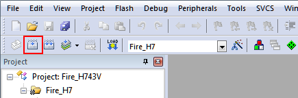

.. vim: syntax=rst

如何用DAP仿真器下载程序
==========================

仿真器简介
~~~~~~~~~~~~~

本书配套的仿真器为Fire-Debugger，遵循ARM公司的CMSIS-DAP标准，支持所有基于Cortex-M内核的单片机，
常见的M3、M4和M7都可以完美支持，其外观见图 DAP下载器外观_ 。

Fire-Debugger支持下载和在线仿真程序，支持XP/WIN7/WIN8/WIN10这四个操作系统，免驱，不需要安装驱动即可使用，支持KEIL和IAR直接下载，非常方便。

.. image:: media/image1.png
    :align: center
    :name:  DAP下载器外观
    :alt:  DAP下载器外观

硬件连接
~~~~~~~~~~~~

把仿真器用USB线连接电脑，如果仿真器的灯亮则表示正常，可以使用。然后把仿真器的另外一端连接到开发板，给开发板上电，
然后就可以通过软件KEIL或者IAR给开发板下载程序。

.. image:: media/image2.png
    :align: center
    :name: 仿真器与电脑和开发板连接方式
    :alt: 仿真器与电脑和开发板连接方式

仿真器配置
~~~~~~~~~~~~~

在仿真器连接好电脑和开发板且开发板供电正常的情况下，打开编译软件KEIL，在魔术棒选项卡里面选择仿真器的型号，具体过程看图示：

Debug选项配置
'''''''''''''''''

.. image:: media/image3.png
    :align: center
    :alt: Debug选择CMSIS-DAP Debugger

Utilities选项配置
'''''''''''''''''''''''''

.. image:: media/image4.png
    :align: center
    :alt: Utilities选择 Use Debug Driver

Debug Settings 选项配置
'''''''''''''''''''''''''''''''''''

.. image:: media/image5.png
    :align: center
    :alt: Debug Settings 选项配置

选择目标板
~~~~~~~~~~~~~

选择目标板，具体选择多大的FLASH要根据板子上的芯片型号决定。
野火STM32开发板的配置是：F1选512K，F4选1M，F7选1M，H7选2M。这里面有个小技巧就是把Reset and Run也勾选上，
这样程序下载完之后就会自动运行，否则需要手动复位。擦除的FLASH大小选择Sectors即可，不要选择Full Chip，不然下载会比较慢。

编译程序
~~~~~~~~~~~~

选择好工程版本后，点击软件的编译按钮进行编译，见图 编译程序_ 。

若编译正常，可以看到软件的输出，生成一个“xxx.axf”文件，见图 编译提示_ 。

若使用我们配套的例程编译失败，请确认Keil软件已注册正常，并且重新使用我们提供的代码进行编译。

下载程序
~~~~~~~~~~~~

如果前面步骤都成功了，接下来就可以把编译好的程序下载到开发板上运行。下载程序不需要其他额外的软件，直接点击KEIL中的LOAD按钮即可。

.. image:: media/image9.png
    :align: center

程序下载后，Build Output选项卡如果打印出 Application running…则表示程序下载成功。如果没有出现实验现象，按复位键试试。

.. image:: media/image10.png
    :align: center

