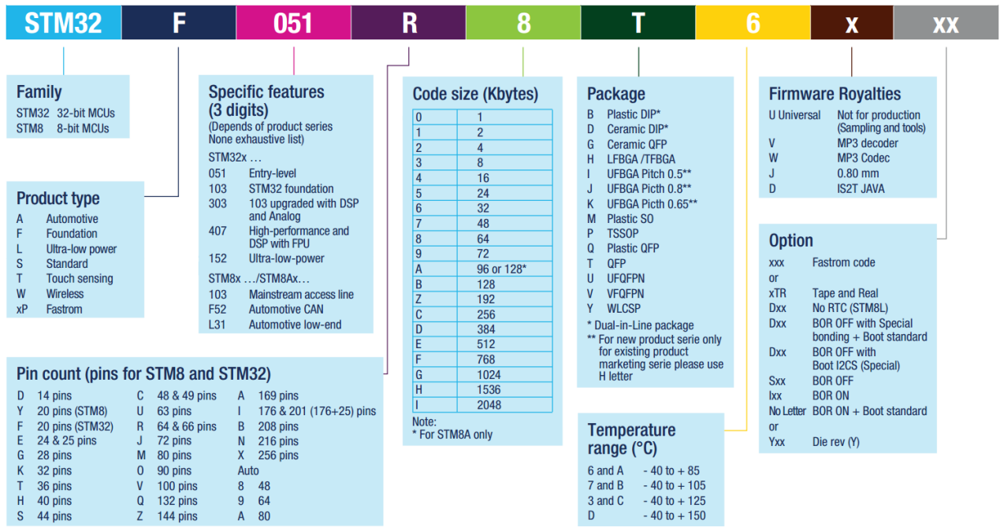

.. vim: syntax=rst

初识STM32
============================

本章参考资料：1、《STM8和STM32产品选型手册》2、SetupSTM32CubeMX-4.26.0.exe

什么是STM32
~~~~~~~~~~~~~~~~~~

STM32，从字面上来理解，ST是意法半导体，M是Microelectronics的缩写，32表示32位，合起来理解，STM32就是指ST公司开发的32位微控制器。
在如今的32位控制器当中，STM32可以说是最璀璨的新星，它受宠若娇，大受工程师和市场的青睐，在Cortex-M系列中。

STM32诞生的背景
^^^^^^^^^^^^^^^^^^^^^^^^^^^^^^

51 是嵌入式学习中一款入门级的精典MCU，因其结构简单，易于教学，且可以通过串口编程而不需要额外的仿真器，所以在教学时被大量采用，至今很多大学在嵌入式教学
中用的还是 51。51诞生于70年代，属于传统的8位单片机，如今，久经岁月的洗礼，既有其辉煌又有其不足。现在的市场产品竞争越来越激烈，对成本极其敏感，
相应地对 MCU 的 性能要求也更苛刻：更多功能，更低功耗，易用界面和多任务。面对这些要求，51现有的资源就显得得抓襟见肘。所以无论是高校教学还是市场需求，
都急需一款新的MCU来为这个领域注入新的活力。

基于这样的市场需求， ARM公司推出了其全新的基于ARMv7 架构的32位 Cortex-M3 微控制器内核。紧随其后，ST（意法半导体）公司就推出了基于Cortex-M3内核的MCU—STM32。
STM32 凭借其产品线的多样化、极高的性价比、简单易用的库开发方式，迅速在众多Cortex-M3 MCU中脱颖而出，成为最闪亮的一颗新星。STM32一上市就迅速占领了中低端MCU市场，
受到了市场和工程师的无比青睐，颇有星火燎原之势。

作为一名合格的嵌入式工程师，面对新出现的技术，我们不是充耳不闻，而是要尽快 吻合市场的需要，跟上技术的潮流。如今 STM32 的出现就是一种趋势，
一种潮流，我们要 做的就是搭上这趟快车，让自己的技术更有竞争力。

STM32能做什么
~~~~~~~~~~~~~~~~~~~~~~~~~

STM32属于一个微控制器，自带了各种常用通信接口，比如USART、I2C、SPI等，可接非常多的传感器，可以控制很多的设备。现实生活中，
我们接触到的很多电器产品都有STM32的身影，比如智能手环，微型四轴飞行器，平衡车、移动POST机，智能电饭锅，3D打印机等等。
下面我们以最近（特指2015~2016年）最为火爆的两个产品来讲解下，一个是手环，一个是飞行器。

智能手环
^^^^^^^^^^^^

-   红圈：STM32F439ZIY6S处理器，2048KB FLASH ，256KB RAM ,WLCSP143封装。

-   橙圈：Macronix MX69V28F64 16 MB闪存，基于MCP封装的存储器，是一种包含了NOR和SRAM的闪存，
    这在手环手机这种移动设备中经常使用，优点是体积小，可以减小PCB的尺寸。这个闪存用的439的FSMC接口驱动。

-   黄圈：InvenSense MPU-6500陀螺仪/加速度计，用439的I2C接口驱动。

-   绿圈：博通BCM4334WKUBG芯片，支持802.11n，蓝牙4.0+HS以及FM接收芯片，用439的SDIO或者SPI接口驱动。

-   显示：1.84"可弯曲屏幕(Super AMOLED)，432 x 128像素。触摸部分用439的I2C接口驱动，OLED显示部分用LTDC接口驱动。

.. image:: media/image2.png
    :align: center
    :name: 三星Gear Fit 和野火STM32H743 Pro资源对比
    :alt: 三星Gear Fit 和野火STM32H743 Pro资源对比

除了这几个重要资源的对比，我们的H743开发板上还集成了以太网，音频，CAN，485，232，USB转串口，蜂鸣器，LED，电容按键等外设资源，
可以充分的学习H743这个芯片。在板子上面，还可以跑系统FreeRTOS/ucosiii，学习图形界面emwin/emXGUI。如果功夫所至，学完之后，自己都可以做一个类似Gear Fit这样的手环。
可很多人又会说，Gear Fit 涉及硬件和软件，整个系统这么复杂，并不是一个人可以完成的。说的没错，我们可以做不了，但是我们的能力可以无限接近，多学点，技多不压身嘛。

微型四轴飞行器
^^^^^^^^^^^^^^^^^^^

现在无人机非常火热，高端的无人机用STM32做不来，但是小型的四轴飞行器用STM32还是绰绰有余的。
如图 微型四轴飞行器_ 所示飞行器的基本都可以用STM32搞定。

上面的是属于产品，如果想自己DIY，可以在入门STM32之后，买一本飞行器DIY的书，边做边学。入门级的书籍推荐《四轴飞行器DIY—基于STM32微控制器》，
见图 四轴飞行器DIY_ 。

淘宝众筹
^^^^^^^^^^^^

学会了STM32，想自己做产品，如何实现自己的梦想，淘宝众筹吧。做出产品原型，用别人的钱为自己的梦想买单。

淘宝众筹科技类网址：这里面有很多产品都可以用STM32实现，只要你的创意到了，就会有人买单，前提是我们要先学会STM32。

https://hi.taobao.com/market/hi/list.php?spm=a215p.1596646.1.8.LbVyJk#type=121288001

STM32怎么选型
~~~~~~~~~~~~~~~~~~~~~~~~~

STM32分类
^^^^^^^^^^^^^^^^^^^

STM32有很多系列，可以满足市场的各种需求，从内核上分有Cortex-M0、M3、M4和M7这几种，每个内核又大概分为主流、高性能和低功耗。
具体的见表格 STM8和STM32分类_ 。

单纯从学习的角度出发，可以选择F1、F4、F7和H7，F1代表了基础型，基于Cortex-M3内核，主频为72MHZ，F4代表了高性能，基于Cortex-M4内核，主频180M，F7代表了高性能，基于Cortex-M7内核，主频216M。H7代表了超高性能，基于Cortex-M7内核，主频480M。

之于F1，F4（429系列以上），F7（746系列以上）和H7（743系列）除了内核不同和主频的提升外，升级的明显特色就是带了LCD控制器和摄像头接口，支持SDRAM，这个区别在项目选型上会被优先考虑。

STM32 命名方法
^^^^^^^^^^^^^^^^^^^^^^^^^^^^^^

这里我们以野火H743 PRO用的型号STM32H743XIH6来讲解下STM32的命名方法。

有关更详细的命名方法见图 STM8和STM32命名方法_ 。

.. image:: media/image9.png
    :align: center
    :name: STM8和STM32命名方法
    :alt: STM8和STM32命名方法

选择合适的MCU
^^^^^^^^^^^^^^^^^^^^^^^^

了解了STM32的分类和命名方法之后，就可以根据项目的具体需求先大概选择哪类内核的MCU，普通应用，不需要接大屏幕的一般选择Cortex-M3内核的F1系列，
如果要追求高性能，需要大量的数据运算，且需要外接RGB大屏幕的则选择Cortex-M7内核的F7系列和H7系列。

明确了大方向之后，接下来就是细分选型，先确定引脚，引脚多的功能就多，价格也贵，具体得根据实际项目中需要使用到什么功能，够用就好。确定好了引脚数目之后再选择FLASH大小，
相同引脚数的MCU会有不同的FLASH大小可供选择，这个也是根据实际需要选择，程序大的就选择大点的FLASH，要是产品一量产，这些省下来的都是钱。
有些月出货量以M（百万数量级）为单位的产品，不仅是MCU，连电阻电容能少用就少用，更甚者连PCB的过孔的多少都有讲究。项目中的元器件的选型的水很深，很多学问。

如何分配原理图IO
'''''''''''''''''''''''''''

在画原理图之前，一般的做法是先把引脚分类好，然后才开始画原理图，
引脚分类具体见表格 画原理图时的引脚分类_ 。

如何寻找IO的功能说明
'''''''''''''''''''''''''''''

要想根据功能来分配IO，那就得先知道每个IO的功能说明，这个我们可以从官方的数据手册里面找到。在学习的时候，有两个官方资料我们会经常用到，
一个是参考手册（英文叫Reference manual），另外一个是数据手册（英文叫Data Sheet）。
两者的具体区别见表格 参考手册和数据手册的内容区别_ 。

一句话概括：数据手册主要用于芯片选型和设计原理图时参考，参考手册主要用于在编程的时候查阅。
官方的这两个文档可以从官方网址里面下载：\ http://www.stmcu.org/document/list/index/category-1102\，也可以从我们配置的光盘资料里面找到。

在数据手册中，有关引脚定义的部分在Pinouts and pin description这个小节中，
具体定义见表格 对引脚定义的解读_ 。

开始分配原理图IO
'''''''''''''''''''''''''''

比如我们的H743 战擎用的MCU型号是STM32H743IIT6，封装为LOFP176，我们在数据手册中找到这个封装的引脚定义，然后根据引脚序号，一个一个复制出来，整理成excel表。
具体整理方法按照表格 画原理图时的引脚分类_  画原理图时的引脚分类即可。分配好之后就开始画原理图。

