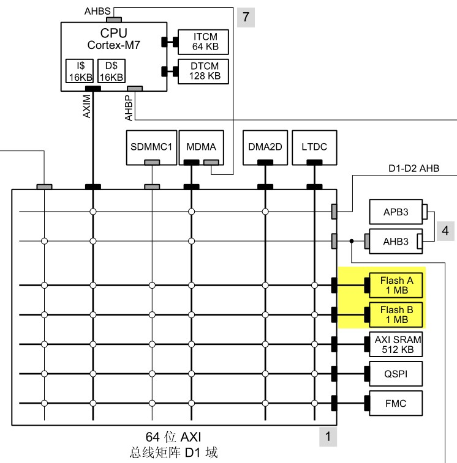
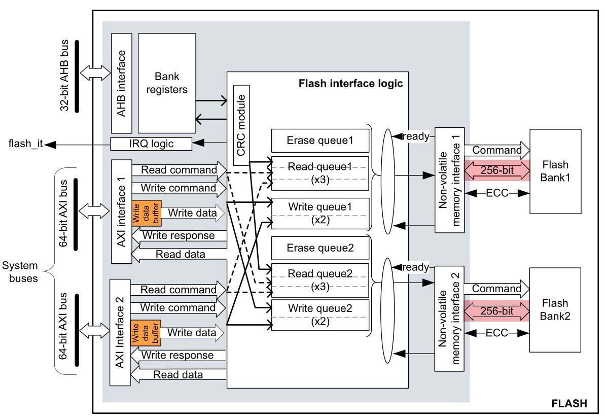
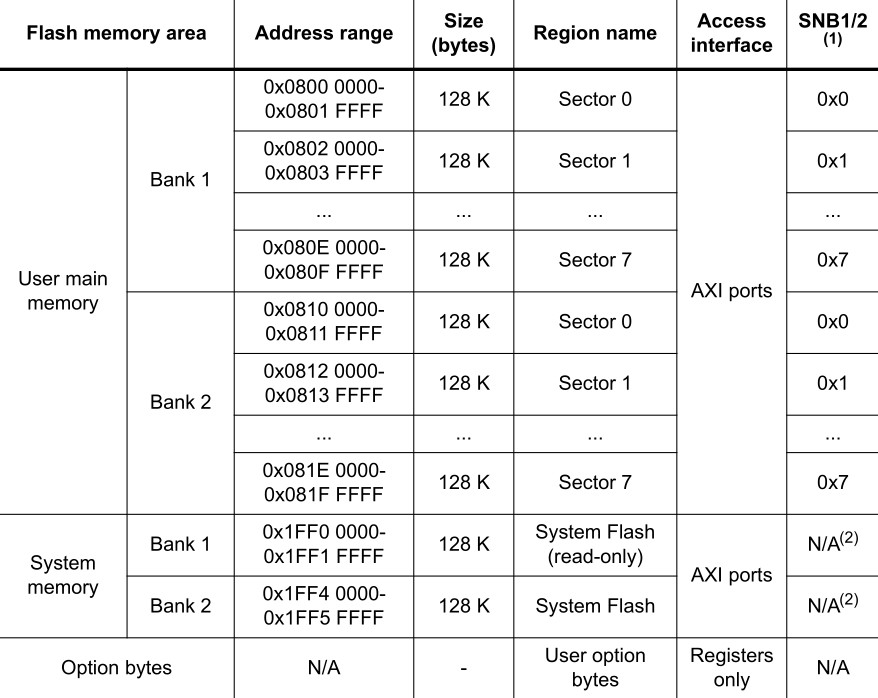
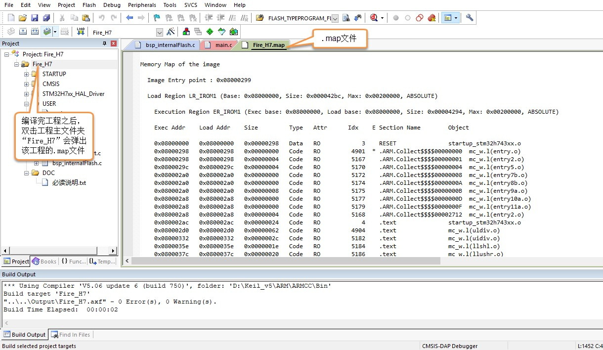
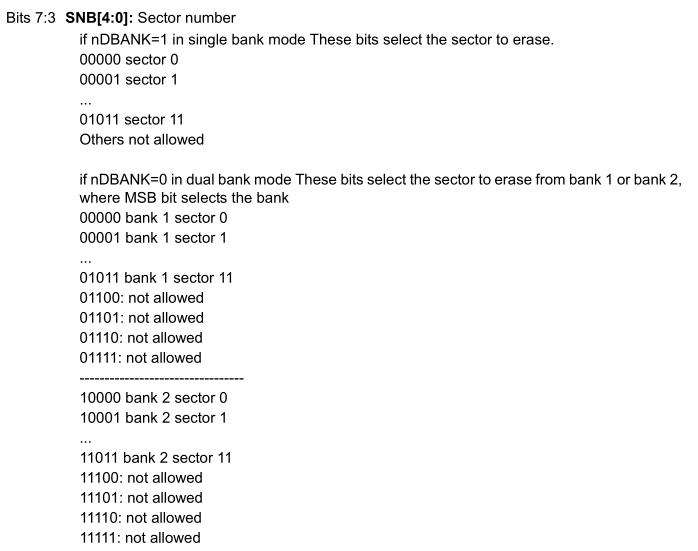

读写内部FLASH
--------------

本章参考资料：《STM32H74xxx参考手册》、《STM32F7xx规格书》、库说明文档《STM32F779xx_User_Manual.chm》.

STM32的内部FLASH简介
~~~~~~~~~~~~~~~~~~~~~

在STM32芯片内部有一个FLASH存储器，它主要用于存储代码，我们在电脑上编写好应用程序后，使用下载器把编译后的代码文件烧录到该内部FLASH中，由于FLASH存储器的内容在掉电后不会丢失，芯片重新上电复位后，内核可从内部FLASH中加载代码并运行，见 图一_。

图 44‑1 STM32的内部框架图

图 51 1 STM32H7X3的系统架构图
除了使用外部的工具（如下载器）读写内部FLASH外，STM32芯片在运行的时候，也能对自身的内部FLASH进行读写，因此，若内部FLASH存储了应用程序后还有剩余的空间，我们可以把它像外部SPI-FLASH那样利用起来，存储一些程序运行时产生的需要掉电保存的数据。
由于访问内部FLASH的速度要比外部的SPI-FLASH快得多，所以在紧急状态下常常会使用内部FLASH存储关键记录；为了防止应用程序被抄袭，有的应用会禁止读写内部FLASH中的内容，或者在第一次运行时计算加密信息并记录到某些区域，然后删除自身的部分加密代码，这些应用都涉及到内部FLASH的操作。

内部FLASH的构成
'''''''''''''''

嵌入式FLASH是整个微控制器的核心资源，它作为两个非易失性存储体的接口，并以非常特定的方式组织存储器。嵌入式FLASH还提供了一组安全功能，以便在启动、运行以及固件和配置升级期间保护存储在非易失性存储器中的数据。
STM32H743的内部FLASH拥有两个用于代码和数据访问的64位AXI从接口，以及一个用于寄存器组访问的32位AHB配置从接口。应用程序可以通过每个AXI接口同时请求读取和写入操作。
STM32H743的内部FLASH详细架构图如 图2_ 所示。

从上面的架构图中可以看到，H743的内部FLASH接口存在写缓冲区和ECC误码校正，写缓冲区无法回读，所以通过AXI接口发出的写访问可视为可缓冲、但不可缓存。由于10位ECC码关联到每个256位数据Flash字，因此只支持按256位进行的写操作。
STM32H743的内部FLASH包含主存储器、系统存储器、OTP区域以及选项字节区域，它们的地址分布及大小见 表一_ 。

各个存储区域的说明如下：
	用户存储区
一般我们说STM32内部FLASH的时候，都是指这个用户存储区区域，它是存储用户应用程序的空间，芯片型号说明中的1M FLASH、2M FLASH都是指这个区域的大小。如我们实验板中使用的STM32H743XIH6型号芯片，主存储器分为一块，共1MB，每块内分8个扇区，每个扇区大小为128KB。它的主存储区域大小为1MB，所以它只包含有表中的扇区0-扇区7。
与其它FLASH一样，在写入数据前，要先按扇区擦除，而有的时候我们希望能以小规格操纵存储单元，所以STM32针对1MB FLASH的产品还提供了一种双块的存储格式。
	系统存储区
系统存储区大小为128KB，是用户不能访问的区域，它在芯片出厂时已经固化了根安全服务 (root secure services, RSS) 和自举程序启动代码，它负责实现串口、USB（DFU）、I2C、SPI或以太网等ISP烧录功能。
	选项字节
选项字节用于配置FLASH的读写保护、电源管理中的BOR级别、软件/硬件看门狗等功能，这部分共32字节。可以通过修改FLASH的选项控制寄存器修改。此区域仅在存储区1中可用。与用户FLASH和系统FLASH不同，该区域并未映射到任何存储器地址，并且仅可通过FLASH寄存器接口进行访问。 

对内部FLASH的写入过程
~~~~~~~~~~~~~~~~~~~~~

解锁
''''

由于内部FLASH空间主要存储的是应用程序，是非常关键的数据，为了防止误操作修改了这些内容，芯片复位后默认会结FLASH上锁，这个时候不允许设置FLASH的控制寄存器，并且不能对修改FLASH中的内容。

所以对FLASH写入数据前，需要先给它解锁。解锁的操作步骤如下：

(1)	往Flash 密钥寄存器 FLASH_KEYR中写入 KEY1 = 0x45670123

(2)	再往Flash 密钥寄存器 FLASH_KEYR中写入 KEY2 = 0xCDEF89AB

数据操作位数
''''''''''''

在内部FLASH进行擦除及写入操作时，电源电压会影响数据的最大操作位数，该电源电压可通过配置FLASH_CR 寄存器中的 PSIZE位改变，见下表

==============  =====================  ========  ========  ========
电压范围        2.7-3.6V(使用外部Vpp)  2.7-3.6V  2.1–2.7V  1.8–2.1V
位数            64                     32        16        8
PSIZE(1:0)配置  11b                    10b       01b       00b
==============  =====================  ========  ========  ========

最大操作位数会影响擦除和写入的速度，其中64位宽度的操作除了配置寄存器位外，还需要在Vpp引脚外加一个8-9V的电压源，且其供电时间不得超过一小时，否则FLASH可能损坏，所以64位宽度的操作一般是在量产时对FLASH写入应用程序时才使用，大部分应用场合都是用32位的宽度。

擦除扇区
''''''''''''

在写入新的数据前，需要先擦除存储区域，STM32提供了扇区擦除指令和整个FLASH擦除(批量擦除)的指令，批量擦除指令仅针对主存储区。

页擦除的过程如下：

(1) 检查 FLASH_SR 寄存器中的“忙碌寄存器位 BSY”，以确认当前未执行任何
    Flash 操作；

(2) 在 FLASH_CR 寄存器中，将“激活扇区擦除寄存器位SER ”置 1，并设置“扇区编号寄存器位SNB”，选择要擦除的扇区;

(3) 将 FLASH_CR 寄存器中的“开始擦除寄存器位 STRT ”置 1，开始擦除；

(4) 等待 BSY 位被清零时，表示擦除完成。

写入数据
''''''''

擦除完毕后即可写入数据，写入数据的过程并不是仅仅使用指针向地址赋值，赋值前还还需要配置一系列的寄存器，步骤如下：

(1)	检查 FLASH_SR 中的 BSY 位，以确认当前未执行任何其它的内部 Flash 操作；

(2)	将 FLASH_CR 寄存器中的 “激活编程寄存器位PG” 置 1；

(3)	针对所需存储器地址（主存储器块或 OTP 区域内）执行数据写入操作；

(4)	等待 BSY 位被清零时，表示写入完成。

查看工程的空间分布
~~~~~~~~~~~~~~~~~~

由于内部FLASH本身存储有程序数据，若不是有意删除某段程序代码，一般不应修改程序空间的内容，所以在使用
内部FLASH存储其它数据前需要了解哪一些空间已经写入了程序代码，存储了程序代码的扇区都不应作任何修改。
通过查询应用程序编译时产生的“\*.map”后缀文件，可以了解程序存储到了哪些区域，它在工程中的打开方式见
 图4_ ，也可以到工程目录中的“Listing”文件夹中找到。

图 44‑2 打开工程的.map文件

打开map文件后，查看文件最后部分的区域，可以看到一段以“Memory Map of the
image”开头的记录(若找不到可用查找功能定位)，见 代码清单44_1_。

.. code-block:: c
   :caption: 代码清单 44‑1 map文件中的存储映像分布说明
   :name: 代码清单44_1

   ==============================================================================

   Memory Map of the image //内存映射镜像

   Image Entry point : 0x08000299

   /* 程序ROM加载空间 */
   Load Region LR_IROM1 (Base: 0x08000000, Size: 0x000014f0, Max: 0x00200000, ABSOLUTE)

   /* 程序ROM执行空间 */
   Execution Region ER_IROM1 (Exec base: 0x08000000, Load base: 0x08000000, Size: 0x000014e8, Max: 0x00200000, ABSOLUTE)

   /* 地址分布列表 */
   Exec Addr    Load Addr    Size         Type   Attr      Idx    E Section Name        Object

   0x08000000   0x08000000   0x00000298   Data   RO            3    RESET               startup_stm32h743xx.o
   0x08000298   0x08000298   0x00000000   Code   RO         3772  * .ARM.Collect$$$$00000000  mc_w.l(entry.o)
   0x08000298   0x08000298   0x00000004   Code   RO         3775    .ARM.Collect$$$$00000001  mc_w.l(entry2.o)
   0x0800029c   0x0800029c   0x00000004   Code   RO         3778    .ARM.Collect$$$$00000004  mc_w.l(entry5.o)
   0x080002a0   0x080002a0   0x00000000   Code   RO         3780    .ARM.Collect$$$$00000008  mc_w.l(entry7b.o)
   0x080002a0   0x080002a0   0x00000000   Code   RO         3782    .ARM.Collect$$$$0000000A  mc_w.l(entry8b.o)
   0x080002a0   0x080002a0   0x00000008   Code   RO         3783    .ARM.Collect$$$$0000000B  mc_w.l(entry9a.o)
   0x080002a8   0x080002a8   0x00000000   Code   RO         3785    .ARM.Collect$$$$0000000D  mc_w.l(entry10a.o)
   0x080002a8   0x080002a8   0x00000000   Code   RO         3787    .ARM.Collect$$$$0000000F  mc_w.l(entry11a.o)
   0x080002a8   0x080002a8   0x00000004   Code   RO         3776    .ARM.Collect$$$$00002712  mc_w.l(entry2.o)
   0x080002ac   0x080002ac   0x00000024   Code   RO            4    .text               startup_stm32h743xx.o
   0x080002d0   0x080002d0   0x00000024   Code   RO         3789    .text               mc_w.l(init.o)
   0x080002f4   0x080002f4   0x00000004   Code   RO         3601    i.BusFault_Handler  stm32h7xx_it.o
   0x080002f8   0x080002f8   0x0000000c   Code   RO         3700    i.CPU_TS_TmrRd      core_delay.o
   0x08000304   0x08000304   0x00000050   Code   RO         3701    i.CPU_TS_Tmr_Delay_US  core_delay.o
   0x08000354   0x08000354   0x00000002   Code   RO         3602    i.DebugMon_Handler  stm32h7xx_it.o
   0x08000356   0x08000356   0x00000002   PAD
   0x08000358   0x08000358   0x0000024c   Code   RO         1315    i.HAL_GPIO_Init     stm32h7xx_hal_gpio.o
   0x080005a4   0x080005a4   0x0000000a   Code   RO         1319    i.HAL_GPIO_WritePin  stm32h7xx_hal_gpio.o
   0x080005ae   0x080005ae   0x00000002   PAD
   0x080005b0   0x080005b0   0x0000001c   Code   RO         3702    i.HAL_GetTick       core_delay.o
   0x080005cc   0x080005cc   0x0000002c   Code   RO         3703    i.HAL_InitTick      core_delay.o
   0x080005f8   0x080005f8   0x00000250   Code   RO         2837    i.HAL_RCC_ClockConfig  stm32h7xx_hal_rcc.o
   0x08000848   0x08000848   0x00000244   Code   RO         2845    i.HAL_RCC_GetSysClockFreq  stm32h7xx_hal_rcc.o
   0x08000a8c   0x08000a8c   0x000006bc   Code   RO         2848    i.HAL_RCC_OscConfig  stm32h7xx_hal_rcc.o
   0x08001148   0x08001148   0x00000002   Code   RO          532    i.HAL_SYSTICK_Callback  stm32h7xx_hal_cortex.o
   0x0800114a   0x0800114a   0x00000008   Code   RO          534    i.HAL_SYSTICK_IRQHandler  stm32h7xx_hal_cortex.o
   0x08001152   0x08001152   0x00000004   Code   RO         3603    i.HardFault_Handler  stm32h7xx_it.o
   0x08001156   0x08001156   0x00000002   PAD
   0x08001158   0x08001158   0x000000a4   Code   RO         3676    i.LED_GPIO_Config   bsp_led.o
   0x080011fc   0x080011fc   0x00000004   Code   RO         3604    i.MemManage_Handler  stm32h7xx_it.o
   0x08001200   0x08001200   0x00000002   Code   RO         3605    i.NMI_Handler       stm32h7xx_it.o
   0x08001202   0x08001202   0x00000002   Code   RO         3606    i.PendSV_Handler    stm32h7xx_it.o
   0x08001204   0x08001204   0x00000002   Code   RO         3607    i.SVC_Handler       stm32h7xx_it.o
   0x08001206   0x08001206   0x00000008   Code   RO         3608    i.SysTick_Handler   stm32h7xx_it.o
   0x0800120e   0x0800120e   0x00000002   PAD
   0x08001210   0x08001210   0x000000bc   Code   RO         3566    i.SystemClock_Config  main.o
   0x080012cc   0x080012cc   0x00000094   Code   RO           14    i.SystemInit        system_stm32h7xx.o
   0x08001360   0x08001360   0x00000004   Code   RO         3609    i.UsageFault_Handler  stm32h7xx_it.o
   0x08001364   0x08001364   0x0000000e   Code   RO         3793    i.__scatterload_copy  mc_w.l(handlers.o)
   0x08001372   0x08001372   0x00000002   Code   RO         3794    i.__scatterload_null  mc_w.l(handlers.o)
   0x08001374   0x08001374   0x0000000e   Code   RO         3795    i.__scatterload_zeroinit  mc_w.l(handlers.o)
   0x08001382   0x08001382   0x00000002   PAD
   0x08001384   0x08001384   0x00000134   Code   RO         3567    i.main              main.o
   0x080014b8   0x080014b8   0x00000010   Data   RO           15    .constdata          system_stm32h7xx.o
   0x080014c8   0x080014c8   0x00000020   Data   RO         3791    Region$$Table       anon$$obj.o

这一段是某工程的ROM存储器分布映像，在STM32芯片中，ROM区域的内容就是指存储到内部FLASH的代码。

程序ROM的加载与执行空间
'''''''''''''''''''''''

上述说明中有两段分别以“Load Region LR_ROM1”及“Execution Region ER_IROM1”开头的内容，
它们分别描述程序的加载及执行空间。在芯片刚上电运行时，会加载程序及数据，
例如它会从程序的存储区域加载到程序的执行区域，
还把一些已初始化的全局变量从ROM复制到RAM空间，以便程序运行时可以修改变量的内容。
加载完成后，程序开始从执行区域开始执行。

在上面map文件的描述中，我们了解到加载及执行空间的基地址(Base)都是0x08000000，它正好是STM32内部FLASH的首地址，即STM32的程序存储空间就直接是执行空间；它们的大小(Size)分别为0x00000aa4及0x00000a90，执行空间的ROM比较小的原因就是因为部分RW-data类型的变量被拷贝到RAM空间了；它们的最大空间(Max)均为0x00100000，即1M字节，它指的是内部FLASH的最大空间。

计算程序占用的空间时，需要使用加载区域的大小进行计算，本例子中应用程序使用的内部FLASH是从0x08000000至(0x08000000+0x00000aa4)地址的空间区域。

ROM空间分布表
'''''''''''''

在加载及执行空间总体描述之后，紧接着一个ROM详细地址分布表，
它列出了工程中的各个段(如函数、常量数据)所在的地址Base Addr及占用的空间Size，
列表中的Type说明了该段的类型，CODE表示代码，DATA表示数据，
而PAD表示段之间的填充区域，它是无效的内容，PAD区域往往是为了解决地址对齐的问题。

观察表中的最后一项，它的基地址是0x08000a70，大小为0x00000020，可知它占用的最高的地址空间为0x08000a90，跟执行区域的最高地址0x00000a90一样，但它们比加载区域说明中的最高地址0x8000aa4要小，所以我们以加载区域的大小为准。对比表
44‑1的内部FLASH扇区地址分布表，可知仅使用扇区0就可以完全存储本应用程序，所以从扇区1(地址0x08004000)后的存储空间都可以作其它用途，使用这些存储空间时不会篡改应用程序空间的数据。

操作内部FLASH的库函数
~~~~~~~~~~~~~~~~~~~~~

为简化编程，STM32HAL库提供了一些库函数，它们封装了对内部FLASH写入数据操作寄存器的过程。

FLASH解锁、上锁函数
'''''''''''''''''''

对内部FLASH解锁、上锁的函数见 代码清单44_2_。

.. code-block:: c
   :caption: 代码清单 44‑2 FLASH解锁、上锁
   :name: 代码清单44_2

   /** @defgroup FLASH_Keys FLASH Keys
   * @{
   */
   #define FLASH_KEY1               ((uint32_t)0x45670123U)
   #define FLASH_KEY2               ((uint32_t)0xCDEF89ABU)
   #define FLASH_OPT_KEY1           ((uint32_t)0x08192A3BU)
   #define FLASH_OPT_KEY2           ((uint32_t)0x4C5D6E7FU)
   /**
   * @brief  Unlock the FLASH control registers access
   * @retval HAL Status
   */
   HAL_StatusTypeDef HAL_FLASH_Unlock(void)
   {
      if ((READ_BIT(FLASH->CR1, FLASH_CR_LOCK) != RESET) && (READ_BIT(FLASH->CR2, FLASH_CR_LOCK) != RESET)) {
         /* Authorize the FLASH A Registers access */
         WRITE_REG(FLASH->KEYR1, FLASH_KEY1);
         WRITE_REG(FLASH->KEYR1, FLASH_KEY2);

         /* Authorize the FLASH B Registers access */
         WRITE_REG(FLASH->KEYR2, FLASH_KEY1);
         WRITE_REG(FLASH->KEYR2, FLASH_KEY2);
      } else {
         return HAL_ERROR;
      }

      return HAL_OK;
   }

   /**
   * @brief  Locks the FLASH control registers access
   * @retval HAL Status
   */
   HAL_StatusTypeDef HAL_FLASH_Lock(void)
   {
      /* Set the LOCK Bit to lock the FLASH A Registers access */
      SET_BIT(FLASH->CR1, FLASH_CR_LOCK);

      /* Set the LOCK Bit to lock the FLASH B Registers access */
      SET_BIT(FLASH->CR2, FLASH_CR_LOCK);

      return HAL_OK;
   }

解锁的时候，它对FLASH_KEYR寄存器写入两个解锁参数，上锁的时候，对FLASH_CR寄存器的FLASH_CR_LOCK位置1。

设置操作位数及页擦除
''''''''''''''''''''

解锁后擦除扇区时可调用FLASH_EraseSector完成，见 代码清单44_3_。

.. code-block:: c
   :caption: 代码清单 44‑3 擦除扇区
   :name: 代码清单44_3

   /**
      * @brief  Perform a mass erase or erase the specified FLASH memory sectors
      * @param[in]  pEraseInit pointer to an FLASH_EraseInitTypeDef structure that
      *         contains the configuration information for the erasing.
      *
      * @param[out]  SectorError pointer to variable  that
      *         contains the configuration information on faulty sector in case of error
      *         (0xFFFFFFFF means that all the sectors have been correctly erased)
      *
      * @retval HAL Status
      */
   HAL_StatusTypeDef HAL_FLASHEx_Erase(FLASH_EraseInitTypeDef *pEraseInit, uint32_t *SectorError)
   {
      HAL_StatusTypeDef status = HAL_OK;
      uint32_t index = 0;
   
      /* Process Locked */
      __HAL_LOCK(&pFlash);
   
      /* Check the parameters */
      assert_param(IS_FLASH_TYPEERASE(pEraseInit->TypeErase));
      assert_param(IS_VOLTAGERANGE(pEraseInit->VoltageRange));
      assert_param(IS_FLASH_BANK(pEraseInit->Banks));
   
   
      /* Wait for last operation to be completed */
      if ((pEraseInit->Banks & FLASH_BANK_1) == FLASH_BANK_1) {
            status = FLASH_WaitForLastOperation((uint32_t)FLASH_TIMEOUT_VALUE, FLASH_BANK_1);
      }
   
      if ((pEraseInit->Banks & FLASH_BANK_2) == FLASH_BANK_2) {
            status |= FLASH_WaitForLastOperation((uint32_t)FLASH_TIMEOUT_VALUE, FLASH_BANK_2);
      }
   
      if (status == HAL_OK) {
            /*Initialization of SectorError variable*/
            *SectorError = 0xFFFFFFFF;
   
            if (pEraseInit->TypeErase == FLASH_TYPEERASE_MASSERASE) {
               /*Mass erase to be done*/
               FLASH_MassErase(pEraseInit->VoltageRange, pEraseInit->Banks);
   
               /* Wait for last operation to be completed */
               if ((pEraseInit->Banks & FLASH_BANK_1) == FLASH_BANK_1) {
                  status = FLASH_WaitForLastOperation((uint32_t)FLASH_TIMEOUT_VALUE, FLASH_BANK_1);
                  /* if the erase operation is completed, disable the Bank1 BER Bit */
                  FLASH->CR1 &= (~FLASH_CR_BER);
               }
               if ((pEraseInit->Banks & FLASH_BANK_2) == FLASH_BANK_2) {
                  status |= FLASH_WaitForLastOperation((uint32_t)FLASH_TIMEOUT_VALUE, FLASH_BANK_2);
                  /* if the erase operation is completed, disable the Bank2 BER Bit */
                  FLASH->CR2 &= (~FLASH_CR_BER);
               }
            } else {
               /* Check the parameters */
               assert_param(IS_FLASH_BANK_EXCLUSIVE(pEraseInit->Banks));
               assert_param(IS_FLASH_NBSECTORS(pEraseInit->NbSectors + pEraseInit->Sector));
   
               /* Erase by sector by sector to be done*/
               for (index = pEraseInit->Sector; index < (pEraseInit->NbSectors + pEraseInit->Sector); index++) {
                  FLASH_Erase_Sector(index, pEraseInit->Banks, pEraseInit->VoltageRange);
   
                  if ((pEraseInit->Banks & FLASH_BANK_1) == FLASH_BANK_1) {
                        /* Wait for last operation to be completed */
                        status = FLASH_WaitForLastOperation((uint32_t)FLASH_TIMEOUT_VALUE, FLASH_BANK_1);
   
                        /* If the erase operation is completed, disable the SER Bit */
                        FLASH->CR1 &= (~(FLASH_CR_SER | FLASH_CR_SNB));
                  }
                  if ((pEraseInit->Banks & FLASH_BANK_2) == FLASH_BANK_2) {
                        /* Wait for last operation to be completed */
                        status = FLASH_WaitForLastOperation((uint32_t)FLASH_TIMEOUT_VALUE, FLASH_BANK_2);
   
                        /* If the erase operation is completed, disable the SER Bit */
                        FLASH->CR2 &= (~(FLASH_CR_SER | FLASH_CR_SNB));
                  }
   
                  if (status != HAL_OK) {
                        /* In case of error, stop erase procedure and return the faulty sector*/
                        *SectorError = index;
                        break;
                  }
               }
            }
      }
   
      /* Process Unlocked */
      __HAL_UNLOCK(&pFlash);
   
      return status;
   }

本函数包含两个输入参数，分别是擦除flash初始化结构体和返回擦除出错编码，FLASH_EraseInitTypeDef擦除flash初始化结构体主要包含擦除的方式，是扇区擦除还是批量擦除，选择不同电压时实质是选择不同的数据操作位数，并且确定擦除首地址即擦除的扇区个数。函数根据输入参数配置PSIZE位，然后擦除扇区，擦除扇区的时候需要等待一段时间，它使用FLASH_WaitForLastOperation等待，擦除完成的时候才会退出HAL_FLASHEx_Erase函数。

写入数据
''''''''

对内部FLASH写入数据不像对SDRAM操作那样直接指针操作就完成了，还要设置一系列的寄存器，利用FLASH_TYPEPROGRAM_DOUBLEWORD、FLASH_TYPEPROGRAM_WORD、FLASH_TYPEPROGRAM_HALFWORD和FLASH_TYPEPROGRAM_BYTE函数

可按字、半字的单位单位写入数据，见 代码清单44_4_。

.. code-block:: c
   :caption: 代码清单 44‑4 写入数据
   :name: 代码清单44_4

      /**
   * @brief  Program flash word of 256 bits at a specified address
   * @param  TypeProgram Indicate the way to program at a specified address.
   *                      This parameter can be a value of @ref FLASH_Type_Program
   * @param  FlashAddress specifies the address to be programmed.
   * @param  DataAddress specifies the address of data (256 bits) to be programmed
   *
   * @retval HAL_StatusTypeDef HAL Status
   */
   HAL_StatusTypeDef HAL_FLASH_Program(uint32_t TypeProgram, uint32_t FlashAddress, uint64_t DataAddress)
   {
      HAL_StatusTypeDef status = HAL_ERROR;
      __IO uint64_t *dest_addr = (__IO uint64_t *)FlashAddress;
      __IO uint64_t *src_addr = (__IO uint64_t*)((uint32_t)DataAddress);
      uint32_t bank;
      uint8_t row_index = 4;

      /* Process Locked */
      __HAL_LOCK(&pFlash);

      /* Check the parameters */
      assert_param(IS_FLASH_TYPEPROGRAM(TypeProgram));
      assert_param(IS_FLASH_PROGRAM_ADDRESS(FlashAddress));

      if (IS_FLASH_PROGRAM_ADDRESS_BANK1(FlashAddress)) {
         bank = FLASH_BANK_1;
      } else {
         bank = FLASH_BANK_2;
      }

      /* Wait for last operation to be completed */
      status = FLASH_WaitForLastOperation((uint32_t)FLASH_TIMEOUT_VALUE, bank);

      if (status == HAL_OK) {
         if (bank == FLASH_BANK_1) {
               /* Clear bank 1 pending flags (if any) */
               __HAL_FLASH_CLEAR_FLAG_BANK1(FLASH_FLAG_EOP_BANK1 | FLASH_FLAG_QW_BANK1 | 
  FLASH_FLAG_WBNE_BANK1 | FLASH_FLAG_ALL_ERRORS_BANK1);

               /* Set PG bit */
               SET_BIT(FLASH->CR1, FLASH_CR_PG);
         } else {
               /* Clear bank 2 pending flags (if any) */
               __HAL_FLASH_CLEAR_FLAG_BANK2(FLASH_FLAG_EOP_BANK2 | FLASH_FLAG_QW_BANK2 | 
   FLASH_FLAG_WBNE_BANK2 | FLASH_FLAG_ALL_ERRORS_BANK2);

               /* Set PG bit */
               SET_BIT(FLASH->CR2, FLASH_CR_PG);
         }

         /* Program the 256 bits flash word */
         do {
               *dest_addr++ = *src_addr++;
         } while (--row_index != 0);

         __DSB();

         /* Wait for last operation to be completed */
         status = FLASH_WaitForLastOperation((uint32_t)FLASH_TIMEOUT_VALUE, bank);

         if (bank == FLASH_BANK_1) {
               /* Check FLASH End of Operation flag  */
               if (__HAL_FLASH_GET_FLAG_BANK1(FLASH_FLAG_EOP_BANK1)) {
                  /* Clear FLASH End of Operation pending bit */
                  __HAL_FLASH_CLEAR_FLAG_BANK1(FLASH_FLAG_EOP_BANK1);
               }

               /* If the program operation is completed, disable the PG*/
               CLEAR_BIT(FLASH->CR1, FLASH_CR_PG);
         } else {
               /* Check FLASH End of Operation flag  */
               if (__HAL_FLASH_GET_FLAG_BANK2(FLASH_FLAG_EOP_BANK2)) {
                  /* Clear FLASH End of Operation pending bit */
                  __HAL_FLASH_CLEAR_FLAG_BANK2(FLASH_FLAG_EOP_BANK2);
               }

               /* If the program operation is completed, disable the PG */
               CLEAR_BIT(FLASH->CR2, FLASH_CR_PG);
         }
      }

      /* Process Unlocked */
      __HAL_UNLOCK(&pFlash);

      return status;
   }

看函数代码可了解到，形参依次设置了数据操作宽度，写入数据地址，写入的数据。在赋值操作后，调用了FLASH_WaitForLastOperation函数等待写操作完毕。

实验：读写内部FLASH
~~~~~~~~~~~~~~~~~~~~

在本小节中我们以实例讲解如何使用内部FLASH存储数据。

硬件设计
''''''''''''

本实验仅操作了STM32芯片内部的FLASH空间，无需额外的硬件。

软件设计
''''''''''''

本小节讲解的是“内部FLASH编程”实验，请打开配套的代码工程阅读理解。为了方便展示及移植，我们把操作内部FLASH相关的代码都编写到“bsp_internal_Flash.c”及“bsp_internal_Flash.h”文件中，这些文件是我们自己编写的，不属于HAL库的内容，可根据您的喜好命名文件。

程序设计要点
...............

(1) 对内部FLASH解锁；

(2) 找出空闲扇区，擦除目标扇区；

(3) 进行读写测试。

代码分析
..............

硬件定义
===============

读写内部FLASH不需要用到任何外部硬件，不过在编写测试时我们要先确定内部FLASH的页大小以及要往哪些地址写入数据，
在本工程中这些定义在bsp_internal_Flash.h头文件中，见
代码清单44_5_。

.. code-block:: c
   :caption: 代码清单 44‑5 各个扇区的基地址(bsp_internal_Flash.h文件)
   :name: 代码清单44_5

   /* Base address of the Flash sectors */
   #define ADDR_FLASH_SECTOR_0     ((uint32_t)0x08000000) /* Base address
                                    of Sector 0, 16 Kbytes   */
   #define ADDR_FLASH_SECTOR_1     ((uint32_t)0x08004000) /* Base address
                                    of Sector 1, 16 Kbytes   */
   #define ADDR_FLASH_SECTOR_2     ((uint32_t)0x08008000) /* Base address
                                    of Sector 2, 16 Kbytes   */
   #define ADDR_FLASH_SECTOR_3     ((uint32_t)0x0800C000) /* Base address
                                    of Sector 3, 16 Kbytes   */
   #define ADDR_FLASH_SECTOR_4     ((uint32_t)0x08010000) /* Base address
                                    of Sector 4, 64 Kbytes   */
   #define ADDR_FLASH_SECTOR_5     ((uint32_t)0x08020000) /* Base address
                                    of Sector 5, 128 Kbytes  */
   #define ADDR_FLASH_SECTOR_6     ((uint32_t)0x08040000) /* Base address
                                    of Sector 6, 128 Kbytes  */
   #define ADDR_FLASH_SECTOR_7     ((uint32_t)0x08060000) /* Base address
                                    of Sector 7, 128 Kbytes  */

这些宏跟表44-1中的地址说明一致。

根据扇区地址计算SNB寄存器的值
==============================

在擦除操作时，需要向FLASH控制寄存器FLASH_CR的SNB位写入要擦除的扇区号，固件库把各个扇区对应的寄存器值使用宏定义到了stm32f4xx_hal_flash.h文件。为了便于使用，我们自定义了一个GetSector函数，根据输入的内部FLASH地址，找出其所在的扇区，并返回该扇区对应的SNB位寄存器值，见 代码清单44_0_6_。

.. code-block:: c
   :caption: 写入到SNB寄存器位的值（stm32f4xx_hal_flash.h及bsp_internalFlash.c文件）
   :name: 代码清单44_0_6

   /** 固件库定义的用于扇区写入到SNB寄存器位的宏(stm32f4xx_hal_flash.h文件)
      * @{
      */
   #define FLASH_SECTOR_0           ((uint32_t)0U) /*!< Sector Number 0   */
   #define FLASH_SECTOR_1           ((uint32_t)1U) /*!< Sector Number 1   */
   #define FLASH_SECTOR_2           ((uint32_t)2U) /*!< Sector Number 2   */
   #define FLASH_SECTOR_3           ((uint32_t)3U) /*!< Sector Number 3   */
   #define FLASH_SECTOR_4           ((uint32_t)4U) /*!< Sector Number 4   */
   #define FLASH_SECTOR_5           ((uint32_t)5U) /*!< Sector Number 5   */
   #define FLASH_SECTOR_6           ((uint32_t)6U) /*!< Sector Number 6   */
   #define FLASH_SECTOR_7           ((uint32_t)7U) /*!< Sector Number 7   */
   /**
      * @brief  根据输入的地址给出它所在的sector
      *         例如：
               uwStartSector = GetSector(FLASH_USER_START_ADDR);
               uwEndSector = GetSector(FLASH_USER_END_ADDR);
      * @param  Address：地址
      * @retval 地址所在的sector
      */
   static uint32_t GetSector(uint32_t Address)
   {
      uint32_t sector = 0;

   if ((Address < ADDR_FLASH_SECTOR_1) && (Address >= ADDR_FLASH_SECTOR_0)) {
            sector = FLASH_SECTOR_0;
   } else if((Address < ADDR_FLASH_SECTOR_2) &&
   (Address >= ADDR_FLASH_SECTOR_1)) {
            sector = FLASH_SECTOR_1;
      } else if ((Address < ADDR_FLASH_SECTOR_3) &&
   (Address >= ADDR_FLASH_SECTOR_2)) {
            sector = FLASH_SECTOR_2;
      } else if ((Address < ADDR_FLASH_SECTOR_4) &&
   (Address >= ADDR_FLASH_SECTOR_3)) {
            sector = FLASH_SECTOR_3;
      } else if ((Address < ADDR_FLASH_SECTOR_5) &&
   (Address >= ADDR_FLASH_SECTOR_4)) {
            sector = FLASH_SECTOR_4;
      } else if ((Address < ADDR_FLASH_SECTOR_6) &&
   (Address >= ADDR_FLASH_SECTOR_5)) {
            sector = FLASH_SECTOR_5;
      } else if ((Address < ADDR_FLASH_SECTOR_7) &&
   (Address >= ADDR_FLASH_SECTOR_6)) {
            sector = FLASH_SECTOR_6;
      } else { /*(Address < FLASH_END_ADDR) &&
   (Address >= ADDR_FLASH_SECTOR_23))*/
            sector = FLASH_SECTOR_7;
      }
      return sector;
   }

代码中固件库定义的宏FLASH_Sector_0-7对应的值是跟寄存器说明一致的，见 图44_3_

GetSector函数根据输入的地址与各个扇区的基地址进行比较，找出它所在的扇区，并使用FLASH_EraseInitTypeDef擦除flash初始化结构体，最终计算出NbSectors（扇区个数）。

读写内部FLASH
================

一切准备就绪，可以开始对内部FLASH进行擦写，这个过程不需要初始化任何外设，只要按解锁、擦除及写入的流程走就可以了，见
代码清单44_6_。

.. code-block:: c
   :caption: 代码清单 44‑6 对内部地FLASH进行读写测试(bsp_internal_Flash.c文件)
   :name: 代码清单44_6

   /*准备写入的测试数据*/
   #define DATA_32                 ((uint32_t)0x87645321)

   /* Exported types -----------------------------------------------------*/
   /* Exported constants -------------------------------------------------*/
   /* 要擦除内部FLASH的起始地址 */
   #define FLASH_USER_START_ADDR   ADDR_FLASH_SECTOR_5
   /* 要擦除内部FLASH的结束地址 */
   #define FLASH_USER_END_ADDR     ADDR_FLASH_SECTOR_7

   static uint32_t GetSector(uint32_t Address);

   /**
   * @brief  InternalFlash_Test,对内部FLASH进行读写测试
   * @param  None
   * @retval None
   */
   int InternalFlash_Test(void)
   {
      /*要擦除的起始扇区(包含)及结束扇区(不包含)，如8-12，表示擦除8、9、10、11扇区*/
      uint32_t FirstSector = 0;
      uint32_t NbOfSectors = 0;

      uint32_t SECTORError = 0;

      uint32_t Address = 0;

      __IO uint32_t Data32 = 0;
      __IO uint32_t MemoryProgramStatus = 0;
      static FLASH_EraseInitTypeDef EraseInitStruct;

      /* FLASH 解锁 ********************************/
      /* 使能访问FLASH控制寄存器 */
      HAL_FLASH_Unlock();

      FirstSector = GetSector(FLASH_USER_START_ADDR);
      NbOfSectors = GetSector(FLASH_USER_END_ADDR)- FirstSector + 1;

      /* 擦除用户区域 (用户区域指程序本身没有使用的空间，可以自定义)**/
      /* Fill EraseInit structure*/
      EraseInitStruct.TypeErase     = FLASH_TYPEERASE_SECTORS;
   /*以“字”的大小进行操作 */
      EraseInitStruct.VoltageRange  = FLASH_VOLTAGE_RANGE_3;
      EraseInitStruct.Sector        = FirstSector;
      EraseInitStruct.NbSectors     = NbOfSectors;
      /* 开始擦除操作 */
      if (HAL_FLASHEx_Erase(&EraseInitStruct, &SECTORError) != HAL_OK) {
         /*擦除出错，返回，实际应用中可加入处理 */
         return -1;
      }

      /* 以“字”的大小为单位写入数据 ********************************/
      Address = FLASH_USER_START_ADDR;

      while (Address < FLASH_USER_END_ADDR) {
         if (HAL_FLASH_Program(FLASH_TYPEPROGRAM_WORD,
   Address, DATA_32) == HAL_OK) {
               Address = Address + 4;
         } else {
               /*写入出错，返回，实际应用中可加入处理 */
               return -1;
         }
      }

      /* 给FLASH上锁，防止内容被篡改*/
      HAL_FLASH_Lock();

      /* 从FLASH中读取出数据进行校验***************************************/
      /*  MemoryProgramStatus = 0: 写入的数据正确
         MemoryProgramStatus != 0: 写入的数据错误，其值为错误的个数 */
      Address = FLASH_USER_START_ADDR;
      MemoryProgramStatus = 0;

      while (Address < FLASH_USER_END_ADDR) {
         Data32 = *(__IO uint32_t*)Address;

         if (Data32 != DATA_32) {
               MemoryProgramStatus++;
         }

         Address = Address + 4;
      }
      /* 数据校验不正确 */
      if (MemoryProgramStatus) {
         return -1;
      } else { /*数据校验正确*/
         return 0;
      }
   }

该函数的执行过程如下：

(1)	调用HAL_FLASH_Unlock解锁；
(2)	调用GetSector根据起始地址及结束地址计算要擦除的扇区；
(3)	配置FLASH_EraseInitTypeDef擦除flash初始化结构体；
(4)	调用HAL_FLASHEx_Erase擦除扇区，擦除时按字为单位进行操作；
(5)	调用HAL_FLASH_Program函数向起始地址至结束地址的存储区域都写入数值“DATA_32”；
(6)	调用HAL_FLASH_Lock上锁；
(7)	使用指针读取数据内容并校验。

main函数
==============

最后我们来看看main函数的执行流程，见 代码清单44_7_。

.. code-block:: c
   :caption: 代码清单 44‑7 main函数(main.c文件)
   :name: 代码清单44_7

   int main(void)
   {
      /* 系统时钟初始化成480MHz */
      SystemClock_Config();
      /* LED 端口初始化 */
      LED_GPIO_Config();	

      DEBUG_USART_Config();

      printf("\r\n 欢迎使用野火  STM32 H743 开发板。\r\n");
      printf("正在进行读写内部FLASH实验，请耐心等待\r\n");

      if(InternalFlash_Test() == 0)
      {
         LED1_ON;
         printf("\r\n读写内部FLASH测试成功\r\n");
      }
      else
      {
         LED2_ON;
         printf("\r\n读写内部FLASH测试失败\r\n");
      }
      while (1)
      {
      }

   }

main函数中初始化了用于指示调试信息的LED及串口后，直接调用了InternalFlash_Test函数，进行读写测试并根据测试结果输出调试信息。

下载验证
'''''''''''''''''''

用USB线连接开发板“USB TO
UART”接口跟电脑，在电脑端打开串口调试助手，把编译好的程序下载到开发板。在串口调试助手可看到擦写内部FLASH的调试信息。
