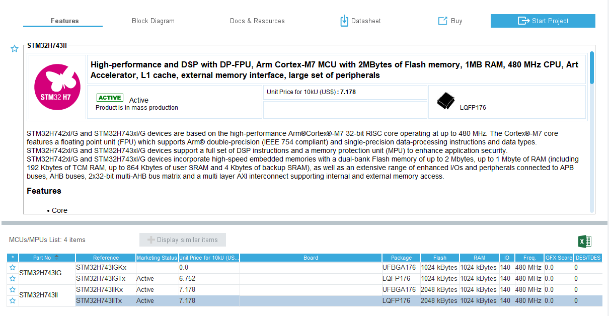

.. vim: syntax=rst

开发板资源简介
==============================

芯片型号
------------------

野火STM32电机控制开发板----繁星，选择了STM32H743IIT6这款MCU作为开发板的核心处理单元，其片上资源丰富，LQFP的封装拥有176各引脚，能满足控制电机领域多个设备控制的需求，此外480Mhz强悍的性能也让它在处理数据的时候游刃有余。

STM32H743IIT6拥有15个通信接口，包括3个I2C总线接口、6个串口、3个SPI总线接口、2个CAN接口、SDIO接口。还支持USB、以太网接口。最为关键的此芯片配置了17个定时器，其中包括2个高级定时器，可以实现4路捕获、比较、PWM输出。

Cube中STM32F743IIT6的介绍，点击图片以放大。

此外，野火繁星电机开发板上将引出了LCD屏幕驱动的8080接口，满足部分场景下需要使用显示器的需要。

板上资源
------------------

野火繁星开发板作为一款电机控制开发板，适配了十分丰富的接口，将实验中会用到的接口全接线端子引入引出，对应端口的隔离功能也是下功夫堆料，保护工作做的十分到位。

野火繁星电机控制开发板引出了CAN、RS485接口、6路模拟输入接口、4路隔离输出接口 * 1、4路隔离输入接口 * 3、步进电机驱动接口 * 4、24V-5V-3.3V电源接口、编码器接口、刹车步进电源接口、无刷电机驱动接口 * 2、舵机接口、LCD的FSMC与8080接口、野火模块通用接口等等等等。通过这些接口，可以轻松在板上完成电机控制的各种实验，一板控制步进电机、舵机、直流有刷电机、无刷电机不是难题。

此外232接口、以太网、Type-C串口及供电、USBHost、Device、一些基本的功能也是延续了野火开发板设计的一贯风格。

硬件设计
------------------

电源部分，野火繁星电机控制开发板可以支持12v~24v及5v的USB供电，提供了多种供电方案的选择。设计上外部电源供电时断开USB供电，防止灌电流，保护电脑USB口。板上提供了3.3v电源的输出，3.3v的电源输出也做了对应的输出电流过流保护允许提供最大的电流为2A，防止电流过大造成电路的损坏。

对于电机的控制引脚，野火繁星电机控制开发板也是做足了相应的隔离工作，在控制电机工作时，有时候电机停止工作后还会随着惯性运行一段时间，这时候电机产生的反电动势是很容易损坏控制电路的，可见电机控制电路的隔离工作不可忽视，而野火繁星电机控制开发板将所有控制电机的输入输出引脚，都做好的光耦隔离，保证控制板的安全性和可靠性。