.. vim: syntax=rst

什么是寄存器
==============

本章参考资料：《STM32H743xx参考手册》、《STM32H743xx数据手册》、学习本章时，配合《STM32H743xx参考手册》“存储器和总线架构”、
“嵌入式FLASH接口”及“通用I/O(GPIO)”章节一起阅读，效果会更佳，特别是涉及到寄存器说明的部分。

什么是寄存器
~~~~~~~~~~~~~~~~~~

我们经常说寄存器，那么什么是寄存器？这是我们本章需要讲解的内容，在学习的过程中，大家带着这个疑问好好思考下，到最后看看大家能否用一句话给寄存器下一个定义。

STM32长啥样
~~~~~~~~~~~~~~~~~~~~~~~~

我们开发板中使用的芯片是STM32H743IIT6，具体见图 STM32H743IIT6实物图_ 。这个就是我们接下来要学习的STM32，它将带领我们进入嵌入式的殿堂。

芯片正面是丝印，左上角的是ST的LOGO，右侧ARM表示该芯片使用的是ARM的内核，STM32H743IIT6是芯片型号，后面的字是跟生产批次相关。

芯片四周是引脚，开发板中把芯片的引脚引出来，连接到各种传感器上，然后在STM32上编程（实际就是通过程序控制这些引脚输出高电平或者低电平）来控制各种传感器工作，
通过做实验的方式来学习STM32芯片的各个资源。开发板是一种评估板，板载资源非常丰富，引脚复用比较多，力求在一个板子上验证芯片的全部功能。

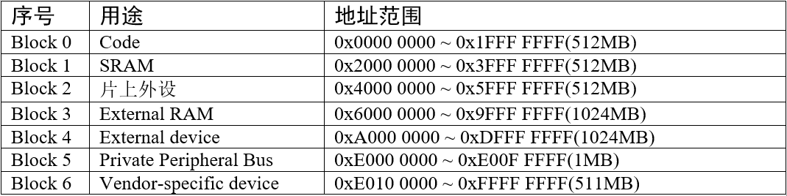

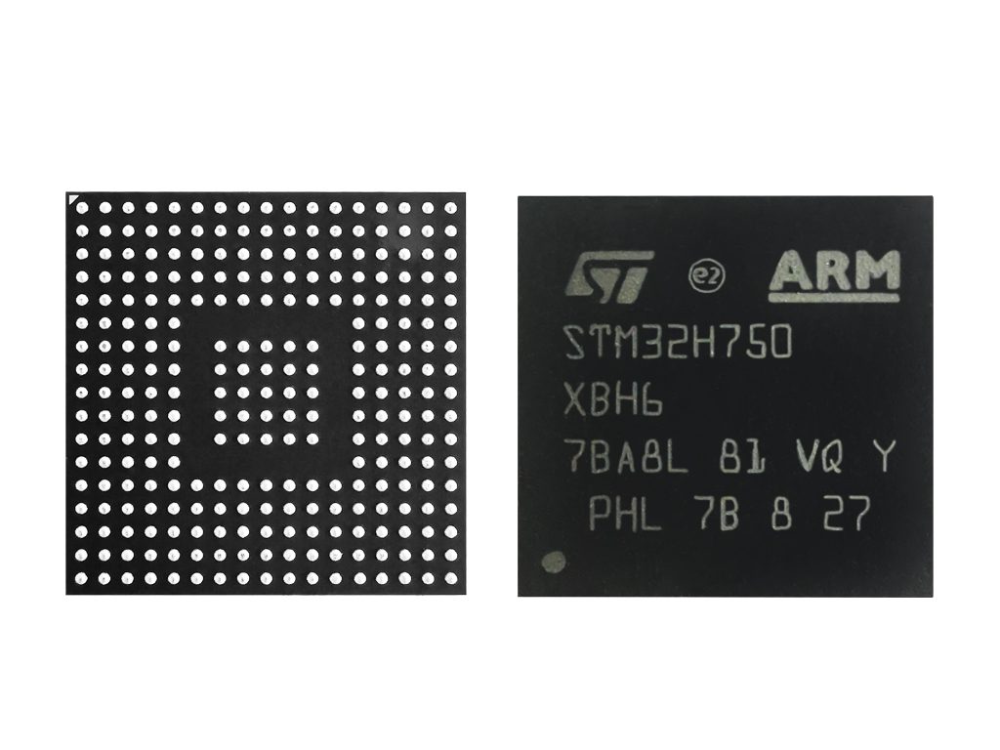

芯片里面有什么
~~~~~~~~~~~~~~~~~~~

我们看到的STM32芯片已经是已经封装好的成品，主要由内核和片上外设组成。若与电脑类比，内核与外设就如同电脑上的CPU与主板、内存、显卡、硬盘的关系。

STM32H743采用的是Cortex-M7内核，内核即CPU，由ARM公司设计。ARM公司并不生产芯片，而是出售其芯片技术授权。芯片生产厂商(SOC)如ST、TI、Freescale，
负责在内核之外设计部件并生产整个芯片，这些内核之外的部件被称为核外外设或片上外设。如GPIO、USART（串口）、
I2C、SPI等都叫做片上外设。具体见图 STM32芯片架构简图_ 。

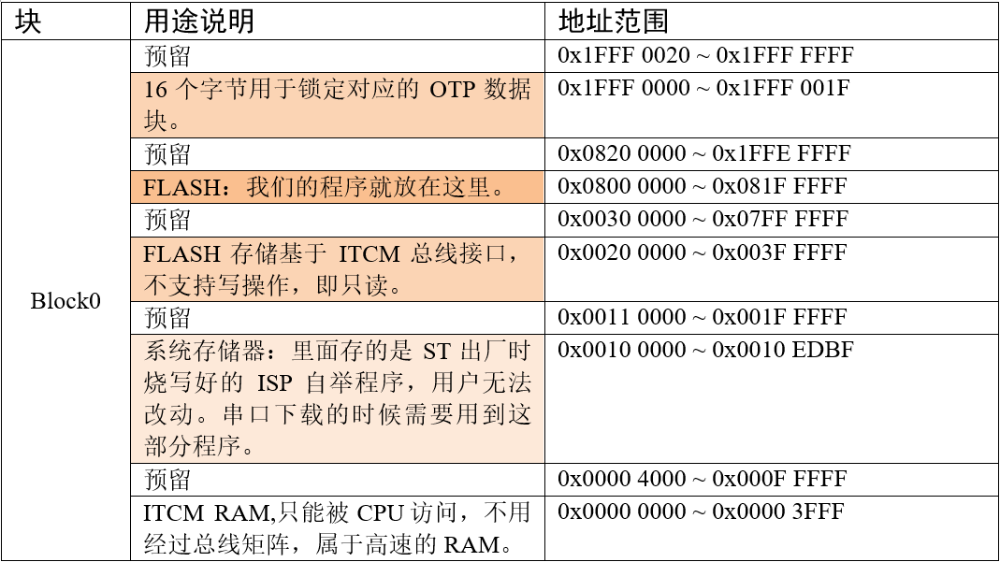

芯片主系统架构基于两个子系统，一个是AXI转多层AHB桥，多层AHB总线矩阵。

AXI转多层AHB桥，从AXI4协议转成AHB-Lite协议，其中包含3个AXI转32-bit AHB桥通过32-bit的AHB总线矩阵连接到外部存储器FMC接口、
外部存储器Quad SPI接口、内部SRAM(SRAM1 and SRAM2)。还包含一个AXI转64-bitAHB桥通过64-bit总线矩阵连接到内部FLASH。

多层AHB总线矩阵，其中32-bit多层AHB总线矩阵互联11个主设备和8个从设备，
64-bit多层AHB总线矩阵则是CPU通过AXI转AHB桥通过这个64-bit多层AHB总线矩阵连接到内部Flash。
DMA主设备通过32-bitAHB总线矩阵通过这个64-bit多层AHB总线矩阵连接到内部Flash。具体见图 STM32H743xx器件的总线接口_ 。
主控总线通过一个总线矩阵来连接被控总线，总线矩阵用于主控总线之间的访问仲裁管理，仲裁采用循环调度算法。
总线之间交叉的时候如果有个圆圈则表示可以通信，没有圆圈则表示不可以通信。

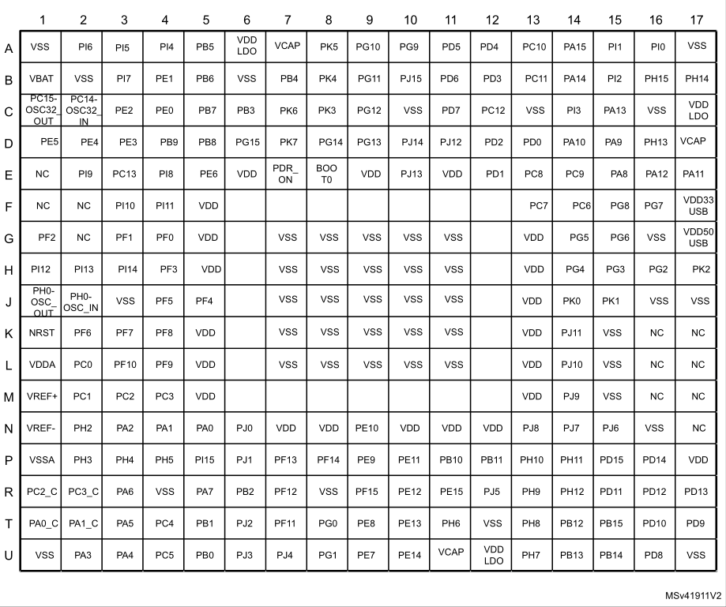

存储器映射
~~~~~~~~~~~~~

在图 STM32H743xx器件的总线接口_ 中，连接被控总线的是FLASH，RAM和片上外设，这些功能部件共同排列在一个4GB的地址空间内。我们在编程的时候，操作的也正是这些功能部件。

存储器映射
^^^^^^^^^^^^^

存储器本身不具有地址信息，它的地址是由芯片厂商或用户分配，给存储器分配地址的过程就称为存储器映射，
具体见图 STM32H743存储器映射_ 。如果给存储器再分配一个地址就叫存储器重映射。

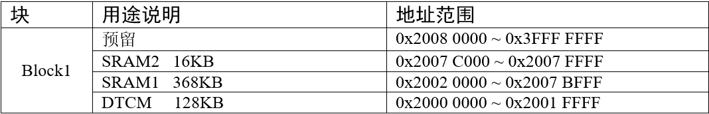

存储器区域功能划分
'''''''''''''''''''''''''

在这4GB的地址空间中，ARM将其分成了7个块，每个块也都规定了用途，具体分类见表格 STM32H743存储器映射_ 。
有的块的大小为1GB，有的块的大小为512MB ，
显然这是非常大的，芯片厂商在每个块的范围内设计各具特色的外设时并不一定都用得完，都是只用了其中的一部分而已。

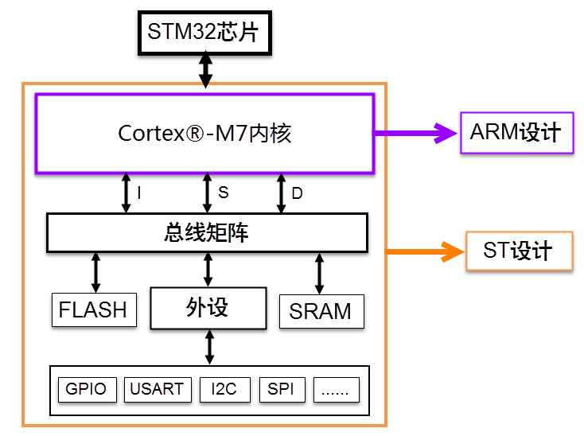

在这8个Block里面，有3个块非常重要，也是我们最关心的三个块。Boock0用来设计成内部FLASH，Block1用来设计成内部RAM，
Block2用来设计成片上的外设，下面我们简单的介绍下这三个Block里面的具体区域的功能划分。

**存储器Block0内部区域功能划分**

Block0是存放程序代码的区域。 用户也可以在此处放置数据。通过ITCM或AXIM接口执行指令提取和数据访问。
Block内部区域的功能划分具体见表格 存储器Block0内部区域功能划分_ 。

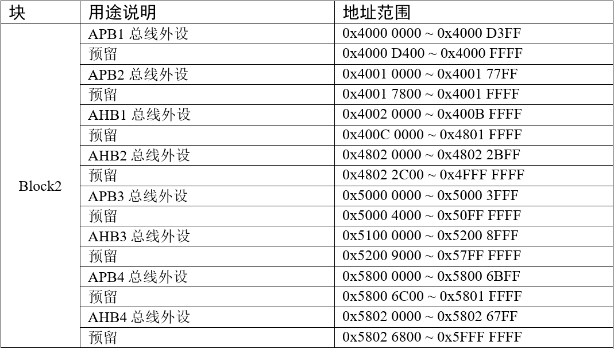

**储存器Block1内部区域功能划分**

Block1为存放数据的区域。 用户也可以在这里进行编码。通过DTCM或AXIM接口执行指令提取和数据访问。H743内部SRAM的大小为868KB，
分SRAM1 128KB，SRAM2 128KB，SRAM3 32KB，SRAM4 64KB以及预留了4KB的SRAM。
Block内部区域的功能划分具体见表格 存储器Block1内部区域功能划分_ 。

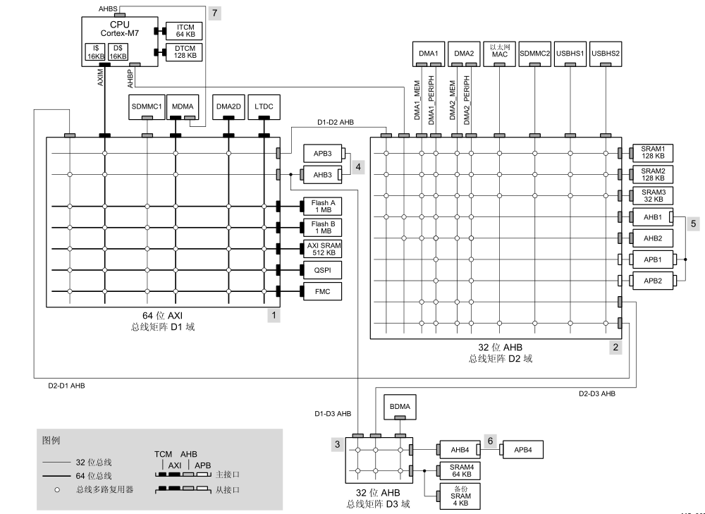

**储存器Block2内部区域功能划分**

Block2用于设计片内的外设，根据外设的总线速度不同，Block被分成了APB和AHB两部分，其中APB又被分为APB1，
APB2，APB3和APB4。AHB分为AHB1，AHB2，AHB3和AHB4。具体见表格 存储器Block2内部区域功能划分_ 。

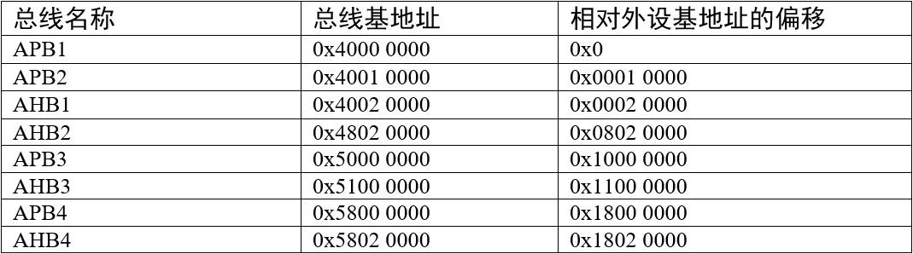

寄存器映射
~~~~~~~~~~~~~

我们知道，存储器本身没有地址，给存储器分配地址的过程叫存储器映射，那什么叫寄存器映射？寄存器到底是什么？

在存储器Block2这块区域，设计的是片上外设，它们以四个字节为一个单元，共32bit，每一个单元对应不同的功能，当我们控制这些单元时就可以驱动外设工作。
我们可以找到每个单元的起始地址，然后通过C语言指针的操作方式来访问这些单元，如果每次都是通过这种地址的方式来访问，不仅不好记忆还容易出错，
这时我们可以根据每个单元功能的不同，以功能为名给这个内存单元取一个别名，这个别名就是我们经常说的寄存器，
这个给已经分配好地址的有特定功能的内存单元取别名的过程就叫寄存器映射。

比如，我们找到GPIOH端口的输出数据寄存器ODR的地址是0x58021C14（至于这个地址如何找到可以先跳过，
后面我们会有详细的讲解），ODR寄存器是32bit，低16bit有效，对应着16个外部IO，
写0/1对应的的IO则输出低/高电平。现在我们通过C语言指针的操作方式，让GPIOH的16个IO都输出高电平，具体见 代码清单:寄存器-1_ 。

.. code-block:: c
    :caption: 代码清单:寄存器-1 通过绝对地址访问内存单元
    :name: 代码清单:寄存器-1
    :linenos:

    // GPIOH 端口全部输出 高电平
    *(unsigned int*)(0x5802 1C14) = 0xFFFF;

0x5802 1C14在我们看来是GPIOH端口ODR的地址，但是在编译器看来，这只是一个普通的变量，是一个立即数，要想让编译器也认为是指针，
我们得进行强制类型转换，把它转换成指针，即(unsigned int \*)0x5802 1C14，然后再对这个指针进行 \* 操作。

刚刚我们说了，通过绝对地址访问内存单元不好记忆且容易出错，我们可以通过寄存器的方式来操作，具体见 代码清单:寄存器-2_ 。

.. code-block:: c
    :caption: 代码清单:寄存器-2 通过寄存器别名方式访问内存单元
    :name: 代码清单:寄存器-2
    :linenos:

    // GPIOH 端口全部输出 高电平
    #define GPIOH_ODR                   (unsigned int*)(GPIOH_BASE+0x14)
    * GPIOH_ODR = 0xFF;

为了方便操作，我们干脆把指针操作“*”也定义到寄存器别名里面，具体见 代码清单:寄存器-3。

.. code-block:: c
    :caption: 代码清单:寄存器-3 通过寄存器别名访问内存单元
    :name: 代码清单:寄存器-3
    :linenos:

    // GPIOH 端口全部输出 高电平
    #define GPIOH_ODR                   *(unsigned int*)(GPIOH_BASE+0x14)
    GPIOH_ODR = 0xFF;

STM32的外设地址映射
^^^^^^^^^^^^^^^^^^^^^^^^^^^^^^^^^^^^

片上外设区分为四条总线，根据外设速度的不同，不同总线挂载着不同的外设，APB挂载低速外设，AHB挂载高速外设。
相应总线的最低地址我们称为该总线的基地址，总线基地址也是挂载在该总线上的首个外设的地址。其中APB1总线的地址最低，片上外设从这里开始，也叫外设基地址。

总线基地址
'''''''''''''

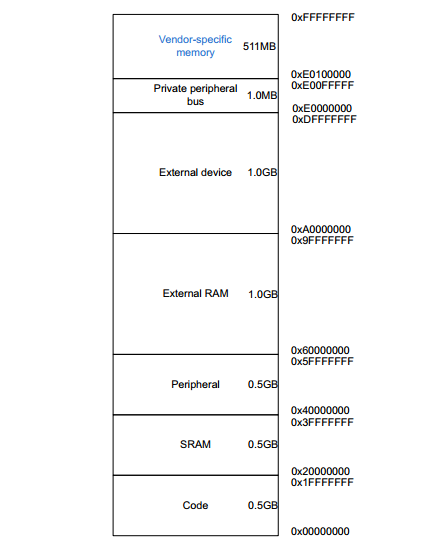

表格 总线基地址_ 的“相对外设基地址偏移”即该总线地址与“片上外设”基地址0x4000 0000的差值。关于地址的偏移我们后面还会讲到。

外设基地址
'''''''''''''

总线上挂载着各种外设，这些外设也有自己的地址范围，特定外设的首个地址称为“XX外设基地址”，也叫XX外设的边界地址。
具体有关STM32H7xx外设的边界地址请参考《STM32H743x数据手册》的第4章节的存储器映射的表Table 13.STM32F765xx,
STM32H743xx, STM32F768Ax and STM32F769xx register boundary addresses。

这里面我们以GPIO这个外设来讲解外设的基地址，具体见表格 外设GPIO基地址_ 。

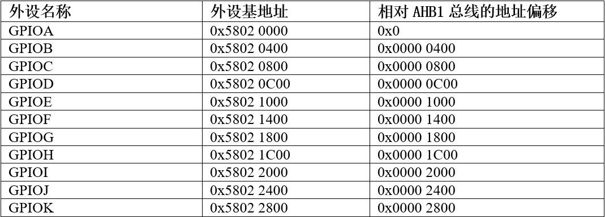

从表格 外设GPIO基地址_ 看到，GPIOA的基址相对于AHB4总线的地址偏移为0，我们应该就可以猜到，AHB4总线的第一个外设就是GPIOA。

外设寄存器
'''''''''''''

在XX外设的地址范围内，分布着的就是该外设的寄存器。以GPIO外设为例，GPIO是通用输入输出端口的简称，简单来说就是STM32可控制的引脚，
基本功能是控制引脚输出高电平或者低电平。最简单的应用就是把GPIO的引脚连接到LED灯的阴极，LED灯的阳极接电源，然后通过STM32控制该引脚的电平，
从而实现控制LED灯的亮灭。

GPIO有很多个寄存器，每一个都有特定的功能。每个寄存器为32bit，占四个字节，在该外设的基地址上按照顺序排列，
寄存器的位置都以相对该外设基地址的偏移地址来描述。这里我们以GPIOH端口为例，来说明GPIO都有哪些寄存器，
具体见表格 GPIOH端口的寄存器地址列表_ 。

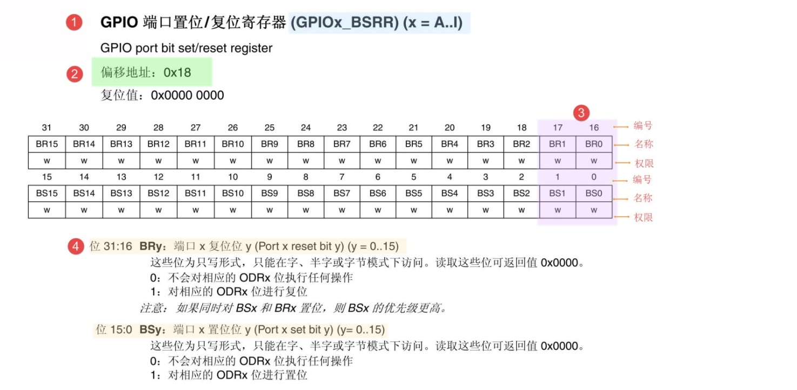

有关外设的寄存器说明可参考《STM32H743xx参考手册》中具体章节的寄存器描述部分，在编程的时候我们需要反复的查阅外设的寄存器说明。

这里我们以“GPIO端口置位/复位寄存器”为例，教大家如何理解寄存器的说明，具体见图 GPIO端口置位_复位寄存器说明_ 。

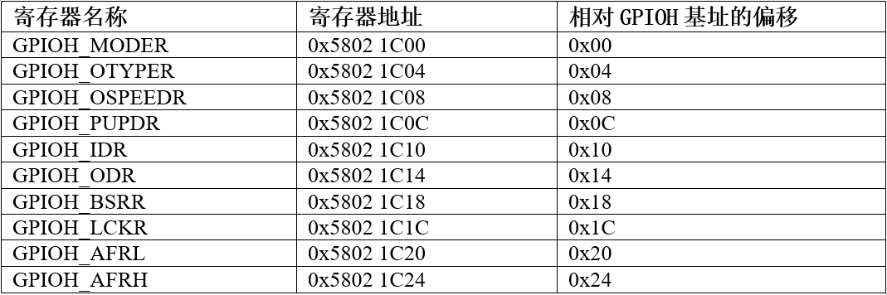

-  ①名称

寄存器说明中首先列出了该寄存器中的名称，“(GPIOx_BSRR)(x=A…K)”这段的意思是该寄存器名为“GPIOx_BSRR”其中的“x”可以为A-K，
也就是说这个寄存器说明适用于GPIOA、GPIOB至GPIOK，这些GPIO端口都有这样的一个寄存器。

-  ②偏移地址

偏移地址是指本寄存器相对于这个外设的基地址的偏移。本寄存器的偏移地址是0x18，从参考手册中我们可以查到GPIOA外设的基地址为0x5802 0000 ，
我们就可以算出GPIOA的这个GPIOA_BSRR寄存器的地址为：0x5802 0000+0x18；同理，由于GPIOB的外设基地址为0x5802 0400，
可算出GPIOB_BSRR寄存器的地址为：0x5802 0400+0x18 。其他GPIO端口以此类推即可。

-  ③寄存器位表

紧接着的是本寄存器的位表，表中列出它的0-31位的名称及权限。表上方的数字为位编号，中间为位名称，最下方为读写权限，其中w表示只写，
r表示只读，rw表示可读写。本寄存器中的位权限都是w，所以只能写，如果读本寄存器，是无法保证读取到它真正内容的。而有的寄存器位只读，
一般是用于表示STM32外设的某种工作状态的，由STM32硬件自动更改，程序通过读取那些寄存器位来判断外设的工作状态。

-  ④位功能说明

位功能是寄存器说明中最重要的部分，它详细介绍了寄存器每一个位的功能。例如本寄存器中有两种寄存器位，分别为BRy及BSy，其中的y数值可以是0-15，
这里的0-15表示端口的引脚号，如BR0、BS0用于控制GPIOx的第0个引脚，若x表示GPIOA，那就是控制GPIOA的第0引脚，而BR1、BS1就是控制GPIOA第1个引脚。

其中BRy引脚的说明是“0：不会对相应的ODRx位执行任何操作；1：对相应ODRx位进行复位”。这里的“复位”是将该位设置为0的意思，而“置位”表示将该位设置为1；
说明中的ODRx是另一个寄存器的寄存器位，我们只需要知道ODRx位为1的时候，对应的引脚x输出高电平，
为0的时候对应的引脚输出低电平即可(感兴趣的读者可以查询该寄存器GPIOx_ODR的说明了解)。所以，如果对BR0写入“1”的话，
那么GPIOx的第0个引脚就会输出“低电平”，但是对BR0写入“0”的话，却不会影响ODR0位，所以引脚电平不会改变。要想该引脚输出“高电平”，
就需要对“BS0”位写入“1”，寄存器位BSy与BRy是相反的操作。

C语言对寄存器的封装
^^^^^^^^^^^^^^^^^^^^^^^^^^^^^^

以上所有的关于存储器映射的内容，最终都是为大家更好地理解如何用C语言控制读写外设寄存器做准备，此处是本章的重点内容。

封装总线和外设基地址
''''''''''''''''''''''''''''''

在编程上为了方便理解和记忆，我们把总线基地址和外设基地址都以相应的宏定义起来，总线或者外设都以他们的名字作为宏名，
具体见 代码清单:寄存器-4_ 。

.. code-block:: c
    :caption: 代码清单:寄存器-4 总线和外设基址宏定义（STM32h7xx.h文件）
    :name: 代码清单:寄存器-4
    :linenos:

    /*片上外设基地址  */
    #define PERIPH_BASE           ((unsigned int)0x40000000)
    /*总线基地址 */
    #define D3_AHB1PERIPH_BASE    (PERIPH_BASE + 0x18020000)
    /*GPIO外设基地址*/
    #define GPIOH_BASE            (D3_AHB1PERIPH_BASE + 0x1C00)

    /* GPIOH寄存器地址,强制转换成指针 */
    #define GPIOH_MODER       *(unsigned int*)(GPIOH_BASE+0x00)
    #define GPIOH_OTYPER      *(unsigned int*)(GPIOH_BASE+0x04)
    #define GPIOH_OSPEEDR     *(unsigned int*)(GPIOH_BASE+0x08)
    #define GPIOH_PUPDR       *(unsigned int*)(GPIOH_BASE+0x0C)
    #define GPIOH_IDR         *(unsigned int*)(GPIOH_BASE+0x10)
    #define GPIOH_ODR         *(unsigned int*)(GPIOH_BASE+0x14)
    #define GPIOH_BSRR        *(unsigned int*)(GPIOH_BASE+0x18)
    #define GPIOH_LCKR        *(unsigned int*)(GPIOH_BASE+0x1C)
    #define GPIOH_AFRL        *(unsigned int*)(GPIOH_BASE+0x20)
    #define GPIOH_AFRH        *(unsigned int*)(GPIOH_BASE+0x24)

代码清单:寄存器-4_ 首先定义了 “片上外设”基地址PERIPH_BASE，接着在PERIPH_BASE上加入各个总线的地址偏移，得到总线地址D3_AHB1PERIPH_BASE，
在其之上加入外设地址的偏移，得到GPIOA、GPIOH的外设地址，最后在外设地址上加入各寄存器的地址偏移，得到特定寄存器的地址。一旦有了具体地址，
就可以用指针操作读写了，具体见 代码清单:寄存器-5_ 。

.. code-block:: c
    :caption: 代码清单:寄存器-5 使用指针控制BSRR寄存器
    :name: 代码清单:寄存器-5
    :linenos:

    /* 控制GPIOH 引脚10输出低电平(BSRR寄存器的BR10置1) */
    *(unsigned int *)GPIOH_BSRR = (0x01<<(16+10));

    /* 控制GPIOH 引脚10输出高电平(BSRR寄存器的BS10置1) */
    *(unsigned int *)GPIOH_BSRR = 0x01<<10;

    unsigned int temp;
    /* 控制GPIOH 端口所有引脚的电平(读IDR寄存器) */
    temp = *(unsigned int *)GPIOH_IDR;

该代码使用 (unsigned int \*) 把GPIOH_BSRR宏的数值强制转换成了地址，然后再用“*”号做取指针操作，对该地址的赋值，从而实现了写寄存器的功能。
同样，读寄存器也是用取指针操作，把寄存器中的数据取到变量里，从而获取STM32外设的状态。

封装寄存器列表
'''''''''''''''''''

用上面的方法去定义地址，还是稍显繁琐，例如GPIOA-GPIOH都各有一组功能相同的寄存器，
如GPIOA_MODER/GPIOB_MODER/GPIOC_MODER等等，它们只是地址不一样，但却要为每个寄存器都定义它的地址。
为了更方便地访问寄存器，我们引入C语言中的结构体语法对寄存器进行封装，具体见 代码清单:寄存器-6_ 。

.. code-block:: c
    :caption: 代码清单:寄存器-6 使用结构体对GPIO寄存器组的封装
    :name: 代码清单:寄存器-6
    :linenos:

    typedef unsigned           int uint32_t; /*无符号32位变量*/
    typedef unsigned short     int uint16_t; /*无符号16位变量*/

    /* GPIO寄存器列表 */
    typedef struct {
        uint32_t MODER;    /*GPIO模式寄存器             地址偏移: 0x00      */
        uint32_t OTYPER;   /*GPIO输出类型寄存器          地址偏移: 0x04      */
        uint32_t OSPEEDR;  /*GPIO输出速度寄存器          地址偏移: 0x08      */
        uint32_t PUPDR;    /*GPIO上拉/下拉寄存器         地址偏移: 0x0C      */
        uint32_t IDR;      /*GPIO输入数据寄存器          地址偏移: 0x10      */
        uint32_t ODR;      /*GPIO输出数据寄存器          地址偏移: 0x14      */
        uint16_t BSRR;    /*GPIO置位/复位寄存器          地址偏移: 0x18     */
        uint32_t LCKR;     /*GPIO配置锁定寄存器          地址偏移: 0x1C      */
        uint32_t AFR[2];   /*GPIO复用功能配置寄存器       地址偏移: 0x20-0x24  */
    } GPIO_TypeDef;

这段代码用typedef 关键字声明了名为GPIO_TypeDef的结构体类型，结构体内有8个 成员变量，变量名正好对应寄存器的名字。
C语言的语法规定，结构体内变量的存储空间是连续的，其中32位的变量占用4个字节，16位的变量占用2个字节，
具体见图 GPIO_TypeDef结构体成员的地址偏移_。

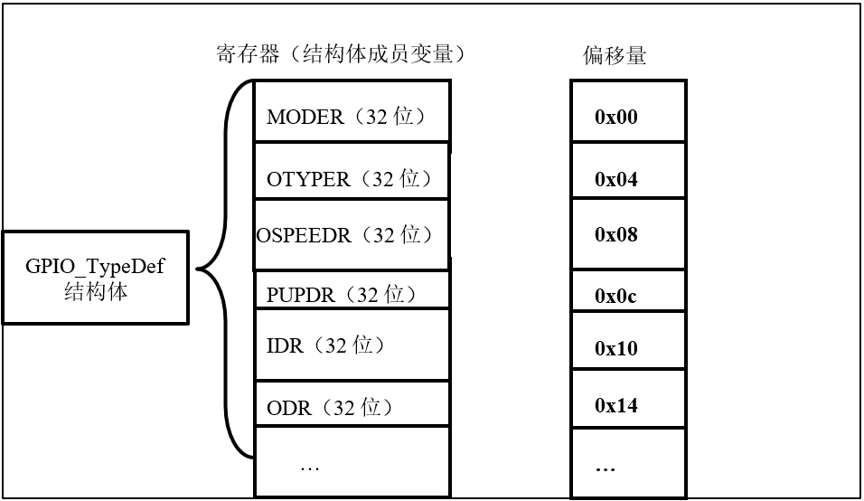

也就是说，我们定义的这个GPIO_TypeDef ，假如这个结构体的首地址为0x5802 1C00（这也是第一个成员变量MODER的地址），
那么结构体中第二个成员变量OTYPER的地址即为0x5802 1C00 +0x04 ，加上的这个0x04，正是代表MODER所占用的4个字节地址的偏移量，
其它成员变量相对于结构体首地址的偏移，在上述代码右侧注释已给出。

这样的地址偏移与STM32 GPIO外设定义的寄存器地址偏移一一对应，只要给结构体设置好首地址，就能把结构体内成员的地址确定下来，
然后就能以结构体的形式访问寄存器了，具体见 代码清单:寄存器-7_ 。

.. code-block:: c
    :caption: 代码清单:寄存器-7 通过结构体指针访问寄存器
    :name: 代码清单:寄存器-7
    :linenos:

    GPIO_TypeDef * GPIOx;        //定义一个GPIO_TypeDef型结构体指针GPIOx
    GPIOx = GPIOH_BASE;          //把指针地址设置为宏GPIOH_BASE地址
    GPIOx->BSRR  = 0x0000FFFF;        //通过指针访问并修改GPIOH_BSRR寄存器
    GPIOx->MODER = 0xFFFFFFFF;    //修改GPIOH_MODER寄存器
    GPIOx->OTYPER =0xFFFFFFFF;    //修改GPIOH_OTYPER寄存器

    uint32_t temp;
    temp = GPIOx->IDR;          //读取GPIOH_IDR寄存器的值到变量temp中

这段代码先用GPIO_TypeDef类型定义一个结构体指针GPIOx，并让指针指向地址GPIOH_BASE(0x4002 1C00)，使用地址确定下来，
然后根据C语言访问结构体的语法，用GPIOx->BSRR、GPIOx->MODER及GPIOx->IDR等方式读写寄存器。

最后，我们更进一步，直接使用宏定义好GPIO_TypeDef类型的指针，而且指针指向各个GPIO端口的首地址，使用时我们直接用该宏访问寄存器即可，具体 代码清单:寄存器-8_ 。

.. code-block:: c
    :caption: 代码清单:寄存器-8 定义好GPIO端口首地址址针
    :name: 代码清单:寄存器-8
    :linenos:

    /*使用GPIO_TypeDef把地址强制转换成指针*/
    #define GPIOA               ((GPIO_TypeDef *) GPIOA_BASE)
    #define GPIOB               ((GPIO_TypeDef *) GPIOB_BASE)
    #define GPIOC               ((GPIO_TypeDef *) GPIOC_BASE)
    #define GPIOD               ((GPIO_TypeDef *) GPIOD_BASE)
    #define GPIOE               ((GPIO_TypeDef *) GPIOE_BASE)
    #define GPIOH               ((GPIO_TypeDef *) GPIOH_BASE)
    #define GPIOG               ((GPIO_TypeDef *) GPIOG_BASE)
    #define GPIOH               ((GPIO_TypeDef *) GPIOH_BASE)

    /*使用定义好的宏直接访问*/
    /*访问GPIOH端口的寄存器*/
    GPIOH->BSRR = 0xFFFFFFFF;       //通过指针访问并修改GPIOH_BSRR寄存器
    GPIOH->MODER = 0xFFFFFFF;    //修改GPIOH_MODER寄存器
    GPIOH->OTYPER =0xFFFFFFF;    //修改GPIOH_OTYPER寄存器

    uint32_t temp;
    temp = GPIOH->IDR;          //读取GPIOH_IDR寄存器的值到变量temp中

    /*访问GPIOA端口的寄存器*/
    GPIOA->BSRR = 0xFFFFFFFF;       //通过指针访问并修改GPIOA_BSRR寄存器
    GPIOA->MODER = 0xFFFFFFF;    //修改GPIOA_MODER寄存器
    GPIOA->OTYPER =0xFFFFFFF;    //修改GPIOA_OTYPER寄存器

    uint32_t temp;
    temp = GPIOA->IDR;          //读取GPIOA_IDR寄存器的值到变量temp中

这里我们仅是以GPIO这个外设为例，给大家讲解了C语言对寄存器的封装。以此类推，其他外设也同样可以用这种方法来封装。好消息是，
这部分工作都由固件库帮我们完成了，这里我们只是分析了下这个封装的过程，让大家知其然，也只其所以然。

修改寄存器的位操作方法
^^^^^^^^^^^^^^^^^^^^^^^^^^^^^^^

使用C语言对寄存器赋值时，我们常常要求只修改该寄存器的某几位的值，且其它的寄存器位不变，这个时候我们就需要用到C语言的位操作方法了。

把变量的某位清零
''''''''''''''''''''''''

此处我们以变量a代表寄存器，并假设寄存器中本来已有数值，此时我们需要把变量a的某一位清零，且其它位不变，方法见 代码清单:寄存器-9_ 。

.. code-block:: c
    :caption: 代码清单:寄存器-9 对某位清零
    :name: 代码清单:寄存器-9
    :linenos:

    //定义一个变量a = 1001 1111 b (二进制数)
    unsigned char a = 0x9f;

    //对bit2 清零

    a &= ~(1<<2);

    //括号中的1左移两位，(1<<2)得二进制数：0000 0100 b
    //按位取反，~(1<<2)得1111 1011 b
    //假如a中原来的值为二进制数： a = 1001 1111 b
    //所得的数与a作”位与&”运算，a = (1001 1111 b)&(1111 1011 b),
    //经过运算后，a的值 a=1001 1011 b
    // a的bit2 位被被零，而其它位不变。

把变量的某几个连续位清零
''''''''''''''''''''''''''''''''''''

由于寄存器中有时会有连续几个寄存器位用于控制某个功能，现假设我们需要把寄存器的某几个连续位清零，且其它位不变，方法见 代码清单:寄存器-10_ 。

.. code-block:: c
    :caption: 代码清单:寄存器-10 对某几个连续位清零
    :name: 代码清单:寄存器-10
    :linenos:

    //若把a中的二进制位分成2个一组
    //即bit0、bit1为第0组，bit2、bit3为第1组，
    //  bit4、bit5为第2组，bit6、bit7为第3组
    //要对第1组的bit2、bit3清零

    a &= ~(3<<2*1);

    //括号中的3左移两位，(3<<2*1)得二进制数：0000 1100 b
    //按位取反，~(3<<2*1)得1111 0011 b
    //假如a中原来的值为二进制数： a = 1001 1111 b
    //所得的数与a作”位与&”运算，a = (1001 1111 b)&(1111 0011 b),
    //经过运算后，a的值 a=1001 0011 b
    // a的第1组的bit2、bit3被清零，而其它位不变。

    //上述(~(3<<2*1))中的(1)即为组编号;如清零第3组bit6、bit7此处应为3
    //括号中的(2)为每组的位数，每组有2个二进制位;若分成4个一组，此处即为4
    //括号中的(3)是组内所有位都为1时的值;若分成4个一组，此处即为二进制数“1111 b”

    //例如对第2组bit4、bit5清零
    a &= ~(3<<2*2);

对变量的某几位进行赋值。
''''''''''''''''''''''''''''''''''''

寄存器位经过上面的清零操作后，接下来就可以方便地对某几位写入所需要的数值了，且其它位不变，方法见 代码清单:寄存器-11_ ，这时候写入的数值一般就是需要设置寄存器的位参数。

.. code-block:: c
    :caption: 代码清单:寄存器-11 对某几位进行赋值
    :name: 代码清单:寄存器-11
    :linenos:

    //a = 1000 0011 b
    //此时对清零后的第2组bit4、bit5设置成二进制数“01 b ”

    a |= (1<<2*2);
    //a = 1001 0011 b，成功设置了第2组的值，其它组不变

对变量的某位取反
''''''''''''''''''''''''

某些情况下，我们需要对寄存器的某个位进行取反操作，即 1变0 ，0变1，这可以直接用如下操作，其它位不变，见 代码清单:寄存器-12_ 。

.. code-block:: c
    :caption: 代码清单:寄存器-12 对某位进行取反操作
    :name: 代码清单:寄存器-12
    :linenos:

    //a = 1001 0011 b
    //把bit6取反，其它位不变

    a ^=(1<<6);
    //a = 1101 0011 b

关于修改寄存器位的这些操作，在下一章中有应用实例代码，可配合阅读。
