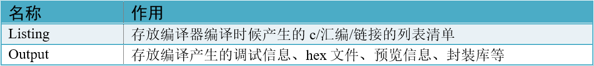
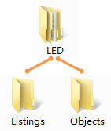
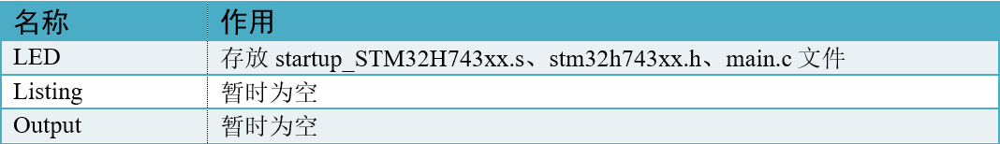
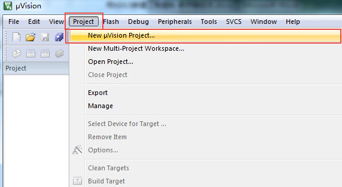
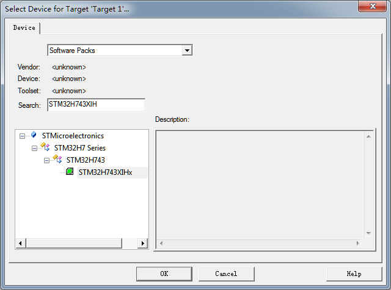
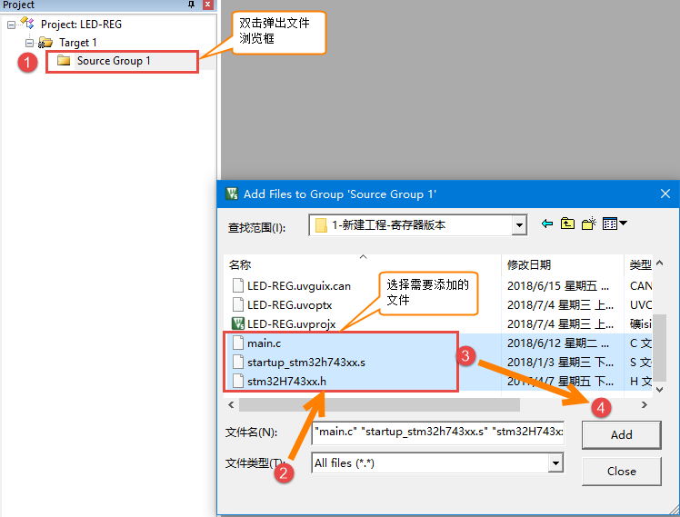
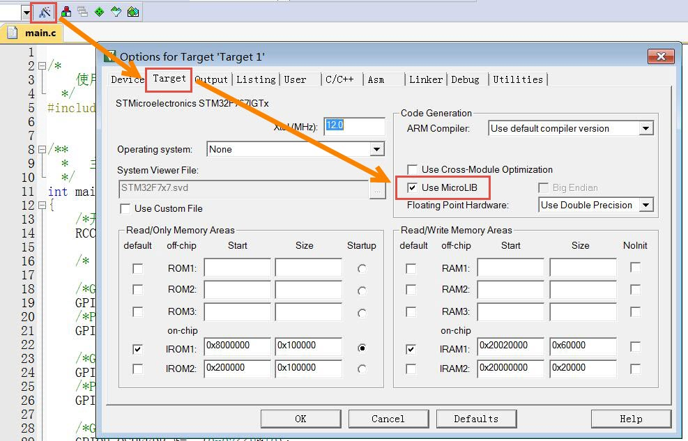
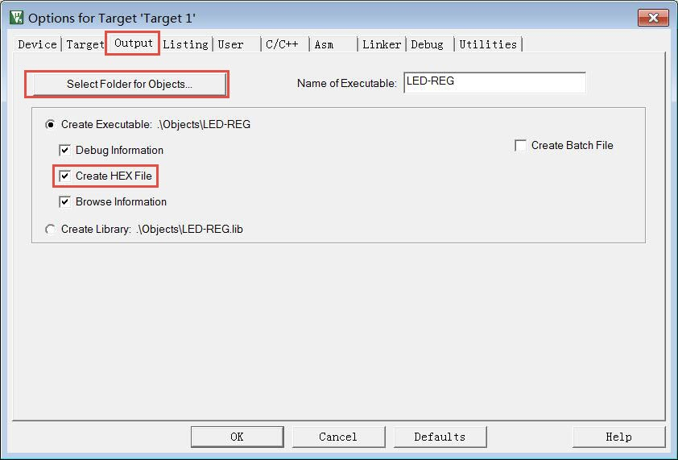
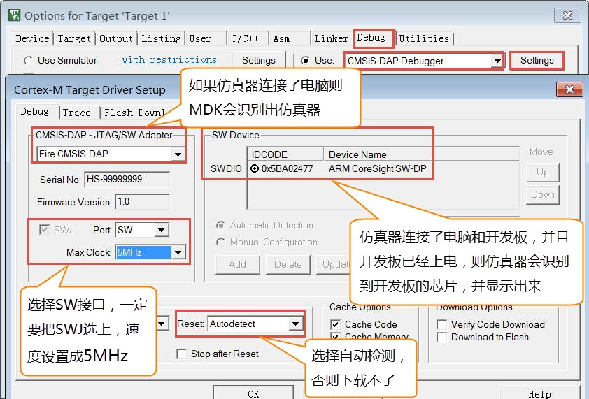
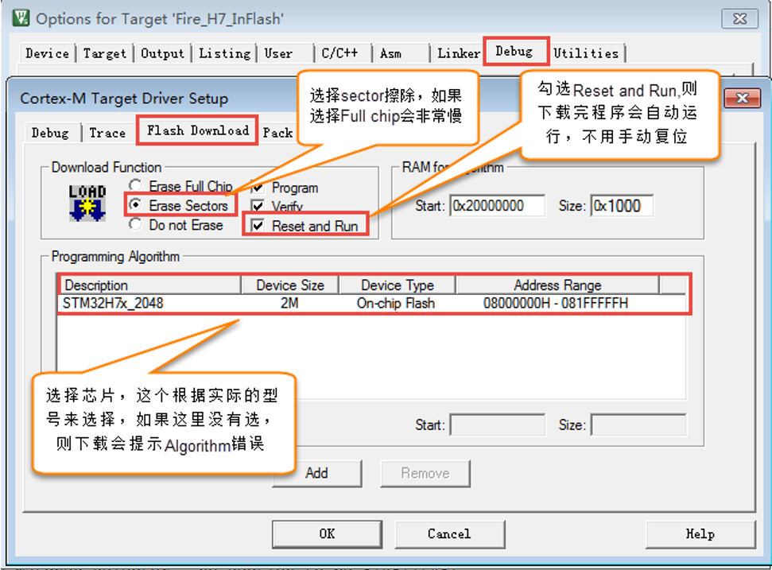

.. vim: syntax=rst

新建工程—寄存器版
====================

本章内容所涉及的软件只供教学使用，不得用于商业用途。个人或公司因商业用途导致的法律责任，后果自负。

版本说明：MDK5.15，如果有更高的版本可使用高版本。

版本号可从MDK软件的“Help-->About uVision”选项中查询到。

新建工程
~~~~~~~~~~~~

新建本地工程文件夹
^^^^^^^^^^^^^^^^^^^^^^^^

为了工程目录更加清晰，我们在本地电脑上新建1个文件夹用于存放整个工程，如命名为“LED”，然后在该目录下新建2个文件夹，具体如下：

在本地新建好文件夹后，在文件夹下新建一些文件：

新建工程
^^^^^^^^^^^

打开KEIL5，新建一个工程，工程名根据喜好命名，我这里取LED-REG，直接保存在LED文件夹下。

选择CPU型号
'''''''''''''''''''

这个根据你开发板使用的CPU具体的型号来选择， “EXK Pro”选STM32H743IIHx型号。
在search框输入“STM32H743XIHx”即可快速搜索到对应的芯片型号。如果这里没有出现你想要的CPU型号，或者一个型号都没有，
那么肯定是你的KEIL5没有添加device库，KEIL5不像KEIL4那样自带了很多MCU的型号，KEIL5需要自己添加，
关于如何添加请参考《如何安装KEIL5》这一章。

在线添加库文件
'''''''''''''''''''

用寄存器控制STM32时我们不需要在线添加库文件，这里我们点击关掉。

.. image:: media/image6.png
    :align: center
    :name:  在线添加库文件
    :alt:  在线添加库文件

添加文件
''''''''''''

在新建的工程中添加文件，文件从本地建好的工程文件夹下获取，双击组文件夹就会出现添加文件的路径，然后选择文件即可。我们对要添加的三个文件说明如下：

**startup_STM32H743xx.s**

启动文件，系统上电后第一个运行的程序，由汇编编写，C编程用的比较少，可暂时不管，这个文件从固件库里面拷贝而来，由官方提供。
文件在这个目录：H7固件库\\STM32Cube_FW_H7_V1.5.0\\Drivers\\CMSIS\\Device\\ST\\STM32H7xx\\Source\\Templates\\arm\\

**stm32h7xx.h**

用户手动新建，用于存放寄存器映射的代码，暂时为空。

**main.c**

用户手动新建，用于存放main函数，暂时为空。

配置魔术棒选项卡
''''''''''''''''''''''''

这一步的配置工作很重要，很多人串口用不了printf函数，编译有问题，下载有问题，都是这个步骤的配置出了错。

a. Target中选中微库“ Use MicroLib”，为的是在日后编写串口驱动的时候可以使用printf函数。而且有些应用中如果用了STM32的浮点运算单元FPU，
一定要同时开微库，不然有时会出现各种奇怪的现象。FPU的开关选项在微库配置选项下方的“Use Double Precision”中，默认是开的。

b. Output选项卡中把输出文件夹定位到我们工程目录下的output文件夹，
如果想在编译的过程中生成hex文件，那么那Create HEX File选项勾上。

c.在Listing选项卡中把输出文件夹定位到我们工程目录下的Listing文件夹。

.. image:: media/image10.png
    :align: center
    :name: 配置Listing选项卡
    :alt: 配置Listing选项卡

下载器配置
'''''''''''''

在仿真器连接好电脑和开发板且开发板供电正常的情况下，打开编译软件KEIL，在魔术棒选项卡里面选择仿真器的型号，具体过程看图示：

**Debug选项配置**

.. image:: media/image11.png
    :align: center
    :name: Debug选择CMSIS-DAP Debugger
    :alt: Debug选择CMSIS-DAP Debugger

**Utilities选项配置**

.. image:: media/image12.png
    :align: center
    :name: Utilities选择 Use Debug Driver
    :alt: Utilities选择 Use Debug Driver

**Debug Settings 选项配置**

**选择目标板**

选择目标板，具体选择多大的FLASH要根据板子上的芯片型号决定。F429-挑战者选1M。这里面有个小技巧就是把Reset and Run也勾选上，
这样程序下载完之后就会自动运行，否则需要手动复位。擦除的FLASH大小选择Sectors即可，不要选择Full Chip，不然下载会比较慢。

下载程序
~~~~~~~~~~~

如果前面步骤都成功了，接下来就可以把编译好的程序下载到开发板上运行。下载程序不需要其他额外的软件，直接点击KEIL中的LOAD按钮即可。

.. image:: media/image15.png
    :align: center
    :name: 下载程序
    :alt: 下载程序

程序下载后，Build Output选项卡如果打印出 Application running…则表示程序下载成功。如果没有出现实验现象，按复位键试试。
当然，这只是一个工程模版，我们还没写程序，开发板不会有任何现象。

至此，一个新的工程模版新建完毕。

