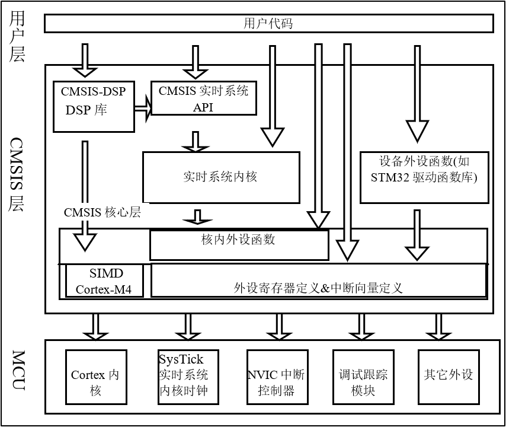
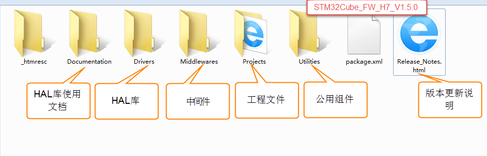
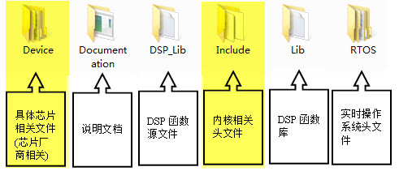
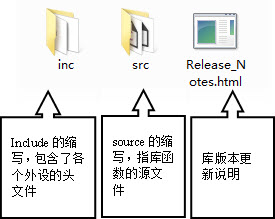
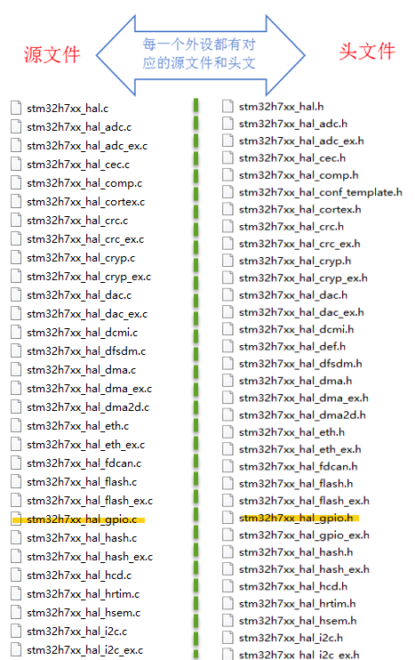
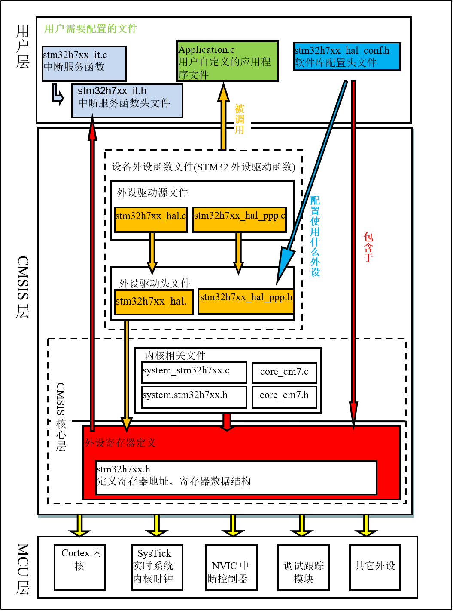
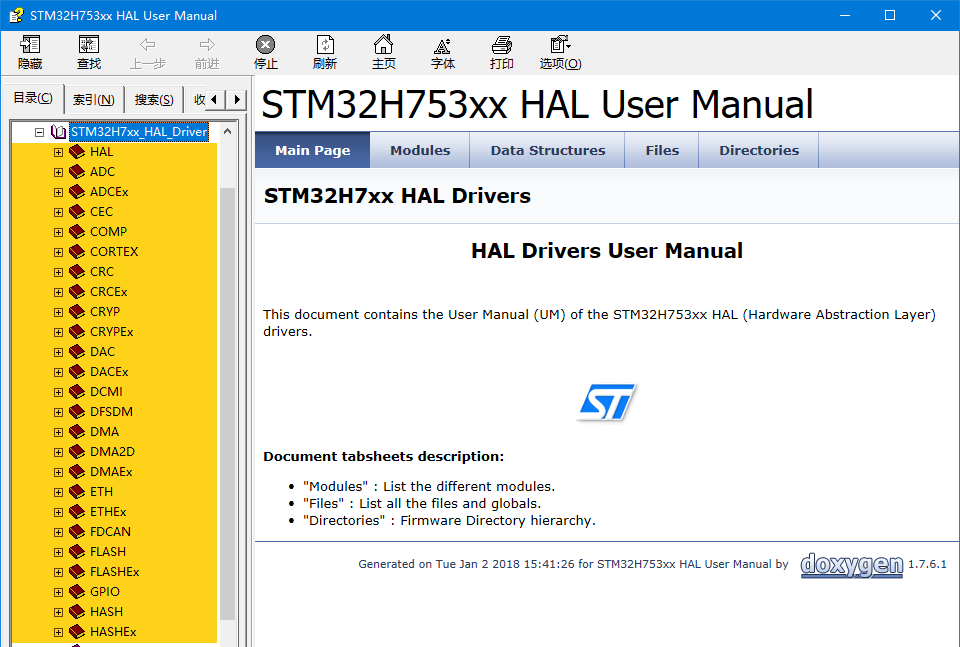
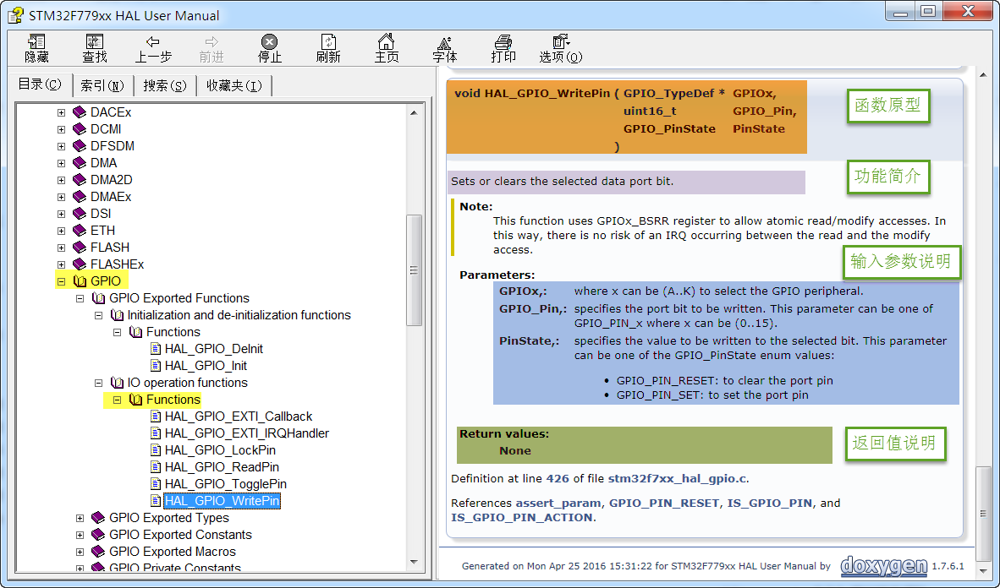

.. vim: syntax=rst

初识HAL固件库
=================

本章参考资料：《STM32H743xx参考手册》、《STM32 H743x规格书》、《Cortex-M3权威指南》, STM32 HAL库帮助文档：《STM32H753xx_User_Manual.chm》。

在上一章中，我们构建了几个控制GPIO外设的函数，算是实现了函数库的雏形，但GPIO还有很多功能函数我们没有实现，而且STM32芯片不仅仅只有GPIO这一个外设。
如果我们想要亲自完成这个函数库，工作量是非常巨大的。ST公司提供的HAL软件库，包含了STM32芯片所有寄存器的控制操作，我们直接学习如何使用ST的HAL库，会极大地方便控制STM32芯片。

CMSIS标准及库层次关系
~~~~~~~~~~~~~~~~~~~~~~~~~~~~~~~~~~~

因为基于Cortex系列芯片采用的内核都是相同的，区别主要为核外的片上外设的差异，这些差异却导致软件在同内核，不同外设的芯片上移植困难。
为了解决不同的芯片厂商生产的Cortex微控制器软件的兼容性问题，ARM与芯片厂商建立了CMSIS标准(Cortex MicroControllerSoftware Interface Standard)。

所谓CMSIS标准，实际是新建了一个软件抽象层。见图 CMSIS架构_ 。

CMSIS标准中最主要的为CMSIS核心层，它包括了：

-  内核函数层：其中包含用于访问内核寄存器的名称、地址定义，主要由ARM公司提供。

-  设备外设访问层：提供了片上的核外外设的地址和中断定义，主要由芯片生产商提供。

可见CMSIS层位于硬件层与操作系统或用户层之间，提供了与芯片生产商无关的硬件抽象层，可以为接口外设、实时操作系统提供简单的处理器软件接口，
屏蔽了硬件差异，这对软件的移植是有极大的好处的。STM32的库，就是按照CMSIS标准建立的。

库目录、文件简介
^^^^^^^^^^^^^^^^^^^^^^^^

STM32 HAL库可以从官网获得，也可以直接从本书的配套资料得到。本书讲解的例程全部采用1.5.0库文件。以下内容请大家打开STM32 HAL库文件配合阅读。

   解压库文件后进入其目录：

   “STM32Cube_FW_H7_V1.5.0\”

   软件库各文件夹的内容说明见图 STM32HAL库_ 。

-  Documentation：文件夹下是HAL库帮助文档，主要讲述如何使用驱动库来编写自己的应用程序。说得形象一点就是告诉我们：ST公司已经为你写好了每个外设的驱动了，
   想知道如何运用这些例子就来向我求救吧。不幸的是，这个帮助文档是英文的，这对很多英文不好的朋友来说是一个很大的障碍。但这里要告诉大家，
   英文仅仅是一种工具，绝对不能让它成为我们学习的障碍。其实这些英文还是很简单的，我们需要的是拿下它的勇气。

-  Drivers：文件夹下是官方的CMSISI库，HAL库，板载外设驱动。

-  Middlewares：中间件，包含ST官方的STemWin、 STM32_Audio、STM32_USB_Device_Library、STM32_USB_Host_Library；也有第三方的fatfs文件系统等等。

-  Project ：文件夹下是用驱动库写的针对官方发行demo板的例子和工程模板。

-  Utilities：实用的公用组件比如LCD_LOG实用液晶打印调试信息。

-  Release_Note.html:：库的版本更新说明。

在使用库开发时，我们需要把Drivers目录下的CMSIS、STM32H7xx_HAL_Driver内核与外设的库文件添加到工程中，并查阅库帮助文档来了解ST提供的库函数，
这个文档说明了每一个库函数的使用方法。

先看看CMSIS文件夹。

STM32Cube_FW_H7_V1.5.0\\Drivers\\CMSIS\\文件夹下内容见图 CMSIS文件夹内容_ 。

其中Device与Include中的文件是我们使用得最多的，先讲解这两个文件夹中的内容。

Include文件夹
''''''''''''''''''''''''''''''

在Include文件夹中包含了 的是位于CMSIS标准的核内设备函数层的Cortex-M核通用的头文件，
它们的作用是为那些采用Cortex-M核设计SOC的芯片商设计的芯片外设提供一个进入内核的接口，定义了一些内核相关的寄存器(类似我们前面写的stm32h7xx.h文件，
但定义的是内核部分的寄存器)。这些文件在其它公司的Cortex-M系列芯片也是相同的。至于这些功能是怎样用源码实现的，可以不用管它，
只需把这些文件加进我们的工程文件即可，有兴趣的朋友可以深究，关于内核的寄存器说明，
需要查阅《cortex_m7_Technical ReferenceManual》及《Cortex®-M7内核编程手册》文档，《STM32H743xx参考手册》只包含片上外设说明，不包含内核寄存器。

我们写STM32H7的工程，必须用到其中的四个文件：core_cm7.h、core_cmFunc.h、corecmInstr.h、core_cmSimd.h，其它的文件是属于其它内核的，还有几个文件是DSP函数库使用的头文件。

core_cm7.c文件有一些与编译器相关条件编译语句，用于屏蔽不同编译器的差异。里面包含了一些跟编译器相关的信息，如：“__CC_ARM ”(本书采用的RVMDK、KEIL)，
“__GNUC_\_ ”(GNU编译器)、“ICC Compiler”(IAR编译器)。这些不同的编译器对于C嵌入汇编或内联函数关键字的语法不一样，这段代码统一使用“__ASM、__INLINE”宏来定义，
而在不同的编译器下，宏自动更改到相应的值，实现了差异屏蔽，见 代码清单:HAL-1_ 。

.. code-block:: c
    :caption: 代码清单:HAL-1：core_cm7.c文件中对编译器差异的屏蔽
    :name: 代码清单:HAL-1
    :linenos:

    #if   defined ( __CC_ARM )
    #define __ASM            __asm     /*!< asm keyword for ARM Compiler */
    #define __INLINE         __inline  /*!< inline keyword for ARM Compiler*/
    #define __STATIC_INLINE  static __inline

    #elif defined ( __GNUC__ )
    #define __ASM            __asm  /*!< asm keyword for GNU Compiler */
    #define __INLINE         inline /*!< inline keyword for GNU Compiler */
    #define __STATIC_INLINE  static inline

    #elif defined ( __ICCARM__ )
    #define __ASM            __asm  /*!< asm keyword for IAR Compiler */
    /*!< inline keyword for IAR Compiler. */
    #define __STATIC_INLINE  static inline
    #define __INLINE         inline

    #elif defined ( __TMS470__ )
    #define __ASM            __asm  /*!< asm keyword for TI CCS Compiler */
    #define __STATIC_INLINE  static inline

    #elif defined ( __TASKING__ )
    #define __ASM            __asm /*!< asm keyword for TASKING Compiler */
    #define __INLINE         inline /*!< inline keyword for TASKING Compiler

    #define __STATIC_INLINE  static inline

    #elif defined ( __CSMC__ )
    #define __packed
    #define __ASM            _asm /*!< asm keyword for COSMIC Compiler */
    /*use -pc99 on compile line !< inline keyword for COSMIC Compiler   */
    #define __INLINE         inline
    #define __STATIC_INLINE  static inline

    #endif

较重要的是在core_cm7.c文件中包含了“stdint.h” 这个头文件，这是一个ANSI C 文件，是独立于处理器之外的，就像我们熟知的C语言头文件 “stdio.h” 文件一样。
位于RVMDK这个软件的安装目录下，主要作用是提供一些类型定义。见 代码清单:HAL-2_ 。

.. code-block:: c
    :caption: 代码清单:HAL-2：stdint.c文件中的类型定义
    :name: 代码清单:HAL-2
    :linenos:

    /* exact-width signed integer types */
    typedef   signed          char int8_t;
    typedef   signed short     int int16_t;
    typedef   signed           int int32_t;
    typedef   signed       __int64 int64_t;

    /* exact-width unsigned integer types */
    typedef unsigned          char uint8_t;
    typedef unsigned short     int uint16_t;
    typedef unsigned           int uint32_t;
    typedef unsigned       __int64 uint64_t;

这些新类型定义屏蔽了在不同芯片平台时，出现的诸如int的大小是16位，还是32位的差异。所以在我们以后的程序中，都将使用新类型如uint8_t 、uint16_t等。

在稍旧版的程序中还经常会出现如u8、u16、u32这样的类型，分别表示的无符号的8位、16位、32位整型。初学者碰到这样的旧类型感觉一头雾水，
它们定义的位置在Stm32h7xx.h文件中。建议在以后的新程序中尽量使用uint8_t 、uint16_t类型的定义。

core_cm7.c跟启动文件一样都是底层文件，都是由ARM公司提供的，遵守CMSIS标准，即所有CM7芯片的库都带有这个文件，这样软件在不同的CM7芯片的移植工作就得以简化。

Device文件夹
'''''''''''''''''''''''''

在Device文件夹下的是具体芯片直接相关的文件，包含启动文件、芯片外设寄存器定义、系统时钟初始化功能的一些文件，这是由ST公司提供的。

-  **system_stm32h7xx.c文件**

文件目录：\\ Drivers \\CMSIS\\Device\\ST\\ STM32H7xx\\Source\\Templates

这个文件包含了STM32芯片上电后初始化系统时钟、扩展外部存储器用的函数，例如我们前两章提到供启动文件调用的“SystemInit”函数，
用于上电后初始化时钟，该函数的定义就存储在system_stm32h7xx.c文件。STM32H743系列的芯片，调用库的这个SystemInit函数后，
会对RCC的部分寄存器值进行初始化，在主函数中调用SystemClock_Config函数可以将系统时钟设置为480M。

-  **启动文件**

文件目录：\\Drivers\\CMSIS\\Device\\ST\\STM32H7xx\\Source\\Templates

在这个目录下，还有很多文件夹，如“ARM”、“gcc”、“iar”等，这些文件夹下包含了对应编译平台的汇编启动文件，在实际使用时要根据编译平台来选择。
我们使用的MDK启动文件在“ARM”文件夹中。其中的“startup_stm32H743xx.s”即为STM32H743芯片的启动文件，前面两章工程中使用的启动文件就是从这里复制过去的。
如果使用其它型号的芯片，要在此处选择对应的启动文件，如STM32H743型号使用“startup_stm32H743xx.s”文件。

-  **stm32h7xx.h文件**

文件目录：\\Drivers\\CMSIS\\Device\\ST\\STM32H7xx\\Include

stm32h7xx.h 这个文件非常重要，是一个STM32芯片底层相关的文件。它是我们前两章自己定义的“stm32h7xx.h”文件的完整版，
包含了STM32中所有的外设寄存器地址和结构体类型定义，在使用到STM32 HAL库的地方都要包含这个头文件。

CMSIS文件夹中的主要内容就是这样，接下来我们看看STM32H7xx_HAL_Driver文件夹。

STM32H7xx_HAL_Driver文件夹
'''''''''''''''''''''''''''''''''''''''''''''''''''''''''''''''''''

文件目录：Drivers\\STM32H7xx_HAL_Driver

进入Drivers目录下的STM32H7xx_HAL_Driver文件夹，见图 外设驱动_ 。

STM32H7xx_HAL_Driver文件夹下有inc（include的缩写）跟src（source的简写）这两个文件夹，这里的文件属于CMSIS之外的的、
芯片片上外设部分。src里面是每个设备外设的驱动源程序，inc则是相对应的外设头文件。src及inc文件夹是ST的HAL库的主要内容，
甚至不少人直接认为ST的HAL库就是指这些文件，可见其重要性。

在src 和inc文件夹里的就是ST公司针对每个STM32外设而编写的库函数文件，每个外设对应一个 \*.c和 \*.h后缀的文件。
我们把这类外设文件统称为：stm32h7xx_hal_ppp.c或stm32h7xx_hal_ppp.h文件，PPP表示外设名称。
如在上一章中我们自建的stm32h7xx_hal_gpio.c及stm32h7xx_hal_gpio.h文件，就属于这一类。

如针对模数转换(ADC)外设，在src文件夹下有一个stm32h7xx_hal_adc.c源文件，在inc文件夹下有一个stm32h7xx_hal_adc.h头文件，
若我们开发的工程中用到了STM32内部的ADC，则至少要把这两个文件包含到工程里。见图 驱动的源文件及头文件_ 。

stm32h7xx_it.c、 stm32h7xx_hal_conf.h文件
''''''''''''''''''''''''''''''''''''''''''''''''''''''''''''''''''''''''''''''''''''''''''''''''''''''''''''''''''''''''''''''''''''''''''''''''''''''''''''

文件目录：STM32Cube_FW_H7_V1.5.0\\Projects\\ NUCLEO-H743ZI\Templates

在这个文件目录下，存放了官方的一个库工程模板，我们在用库建立一个完整的工程时，
还需要添加这个目录下src文件夹中stm32h7xx_it.c和inc文件夹中和inc文件夹中stm32h7xx_it.h、stm32h7xx_hal_conf.h这三个文件。

stm32h7xx_it.c：这个文件是专门用来编写中断服务函数的，在我们修改前，这个文件已经定义了一些系统异常(特殊中断)的接口，
其它普通中断服务函数由我们自己添加。但是我们怎么知道这些中断服务函数的接口如何写？是不是可以自定义呢？答案当然不是的，
这些都有可以在汇编启动文件中找到，在学习中断和启动文件的时候我们会详细介绍

stm32h7xx_hal_conf.h：这个文件被包含进stm32h7xx.h文件。ST标准库支持所有STM32H7型号的芯片，但有的型号芯片外设功能比较多，
所以使用这个配置文件根据芯片型号增减ST库的外设文件。见 代码清单:HAL-3。

.. code-block:: c
    :caption: 代码清单:HAL-3 stm32h7xx_hal_conf.h文件配置软件库
    :name: 代码清单:HAL-3
    :linenos:

    /* #define HAL_ADC_MODULE_ENABLED   */
    /* #define HAL_FDCAN_MODULE_ENABLED   */
    /* #define HAL_CEC_MODULE_ENABLED   */
    /* #define HAL_COMP_MODULE_ENABLED   */
    /* #define HAL_CRC_MODULE_ENABLED   */
    /*省略部分代码*/
    #define HAL_GPIO_MODULE_ENABLED
    #define HAL_DMA_MODULE_ENABLED
    #define HAL_MDMA_MODULE_ENABLED
    #define HAL_RCC_MODULE_ENABLED
    #define HAL_FLASH_MODULE_ENABLED
    #define HAL_PWR_MODULE_ENABLED
    #define HAL_I2C_MODULE_ENABLED
    #define HAL_CORTEX_MODULE_ENABLED
    #define HAL_HSEM_MODULE_ENABLED

stm32h7xx_hal_conf.h这个文件还可配置是否使用“断言”编译选项，见 代码清单:HAL-4_ 。

.. code-block:: c
    :caption: 代码清单:HAL-4 断言配置
    :name: 代码清单:HAL-4
    :linenos:

    #ifdef  USE_FULL_ASSERT

    /**
    * @brief  The assert_param macro is used for  parameters check.
    * @param  expr: If expr is false, it calls assert_failed function
    *   which reports the name of the source file and the source
    *   line number of the call that failed.
    *   If expr is true, it returns no value.
    * @retval None
    */
    #define assert_param(expr) ((expr) ? (void)0 : assert_failed((uint8_t
    *)__FILE__, __LINE__))
    /* Exported functions ---------------------------------- */
    void assert_failed(uint8_t* file, uint32_t line);
    #else
    #define assert_param(expr) ((void)0)
    #endif /* USE_FULL_ASSERT */

在ST的HAL库函数中，一般会包含输入参数检查，即上述代码中的“assert_param”宏，当参数不符合要求时，会调用“assert_failed”函数，这个函数默认是空的。

实际开发中使用断言时，先通过定义USE_FULL_ASSERT宏来使能断言，然后定义“assert_failed”函数，通常我们会让它调用printf函数输出错误说明。
使能断言后，程序运行时会检查函数的输入参数，当软件经过测试，可发布时，会取消USE_FULL_ASSERT宏来去掉断言功能，使程序全速运行。

库各文件间的关系
^^^^^^^^^^^^^^^^^^^^^^^^

前面向大家简单介绍了各个库文件的作用，库文件是直接包含进工程即可，丝毫不用修改，而有的文件就要我们在使用的时候根据具体的需要进行配置。
接下来从整体上把握一下各个文件在库工程中的层次或关系，这些文件对应到CMSIS标准架构上。见图 库各文件关系_ 。

图 库各文件关系_ 描述了STM32库各文件之间的调用关系，这个图省略了DSP核和实时系统层部分的文件关系。在实际的使用库开发工程的过程中，
我们把位于CMSIS层的文件包含进工程，除了特殊系统时钟需要修改system_stm32h7xx.c，其它文件丝毫不用修改，也不建议修改。

对于位于用户层的几个文件，就是我们在使用库的时候，针对不同的应用对库文件进行增删（用条件编译的方法增删）和改动的文件。

使用帮助文档
~~~~~~~~~~~~~~~~~~

我坚信，授之以鱼不如授之以渔。官方资料是所有关于STM32知识的源头，所以在本小节介绍如何使用官方资料。官方的帮助手册，是最好的教程，
几乎包含了所有在开发过程中遇到的问题。这些资料已整理到了本书附录资料中。

常用官方资料
^^^^^^^^^^^^^^^^^^

-  《STM32H743参考手册》

这个文件全方位介绍了STM32芯片的各种片上外设，它把STM32的时钟、存储器架构、及各种外设、寄存器都描述得清清楚楚。当我们对STM32的外设感到困惑时，
可查阅这个文档。以直接配置寄存器方式开发的话，查阅这个文档寄存器部分的频率会相当高，但这样效率太低了。

-  《stm32h743xI规格书》

本文档相当于STM32的datasheet，包含了STM32芯片所有的引脚功能说明及存储器架构、芯片外设架构说明。后面我们使用STM32其它外设时，
常常需要查找这个手册，了解外设对应到STM32的哪个GPIO引脚。

-  《Cortex®-M7内核编程手册》

本文档由ST公司提供，主要讲解STM32内核寄存器相关的说明，例如系统定时器、中断等寄存器。这部分的内容是《STM32H7xxx参考手册》没涉及到的内核部分的补充。
相对来说，本文档虽然介绍了内核寄存器，但不如以下两个文档详细，要了解内核时，可作为以下两个手册的配合资料使用。

-  《Cortex-M3权威指南》、《cortex_m7_Technical Reference Manual》。

这两个手册是由ARM公司提供的，它详细讲解了Cortex内核的架构和特性，要深入了解Cortex-M内核，这是首选，经典中的经典，
其中Cortex-M3版本有中文版，方便学习。因为Cortex-M7内核与Cortex-M3内核大部分相同，可用它来学习，而Cortex-M7新增的特性，
则必须参考《cortex_m7_Technical Reference Manual》文档了，目前只有英文版。

-  《STM32H753xx_User_Manual.chm》

这个就是本章提到的库的帮助文档，在使用库函数时，我们最好通过查阅此文件来了解HAL库提供了哪些外设、
函数原型或库函数的调用的方法。也可以直接阅读源码里面的函数的函数说明。

初识库函数
^^^^^^^^^^^^^

所谓库函数，就是STM32的库文件中为我们编写好的函数接口，我们只要调用这些库函数，就可以对STM32进行配置，达到控制目的。
我们可以不知道库函数是如何实现的，但我们调用函数必须要知道函数的功能、可传入的参数及其意义、和函数的返回值。

于是，有读者就问那么多函数我怎么记呀？我的回答是：会查就行了，哪个人记得了那么多。所以我们学会查阅库帮助文档是很有必要的。

打开库帮助文档《STM32H753xx_User_Manual.chm》见图 库帮助文档_

层层打开文档的目录标签：

标签目录：Modules\\STM32H7xx_HAL_Driver

可看到STM32H7xx_HAL_Driver标签下有很多外设驱动文件的名字HAL、ADC、BKP、CAN等标签。

我们试着查看GPIO的“位设置函数GPIO_SetBits”看看，打开标签：

标签目录：Modules\\STM32H4xx_StdPeriph_Driver\\GPIO\\GPIO Exported Functions\\IO operation functions\\HAL_GPIO_WritePin，
见图 库帮助文档的函数说明_ 。

利用这个文档，我们即使没有去看它的具体源代码，也知道要怎么利用它了。

如HAL_GPIO_WritePin，函数的原型为void HAL_GPIO_WritePin(GPIO_TypeDef\* GPIOx, uint16_t GPIO_Pin, GPIO_PinState PinState)。
它的功能是：输入一个类型为GPIO_TypeDef的指针GPIOx参数，选定要控制的GPIO端口；输入GPIO_PIN_x宏，其中x指端口的引脚号，
指定要控制的引脚；输入GPIO_PIN_RESET或者GPIO_PIN_SET设置IO口的电平高低。

其中输入的参数 GPIOx为ST的HAL库中定义的自定义数据类型，这两个传入参数均为结构体指针。初学时，我们并不知道如GPIO_TypeDef这样的类型是什么意思，
可以点击函数原型中带下划线的 GPIO_TypeDef 就可以查看这个类型的声明了。

就这样初步了解了一下库函数，读者就可以发现STM32的库是写得很优美的。每个函数和数据类型都符合见名知义的原则，当然，这样的名称写起来特别长，
而且对于我们来说要输入这么长的英文，很容易出错，所以在开发软件的时候，在用到库函数的地方，直接把库帮助文档中的函数名称复制粘贴到工程文件就可以了。
而且，配合MDK软件的代码自动补全功能，可以减少输入量。

有的用户觉得使用库文档麻烦，也可以直接查阅STM32 HAL库的源码，库帮助文档的说明都是根据源码生成的，所以直接看源码也可以了解函数功能。

下面我们以USART为例，介绍一下HAL的外设结构体。请读者注意，由于我们使用USART/UART这个外设，
需要把包含串口外设的宏定义打开，见 代码清单:HAL-5_ 串口外设头文件宏定义。

.. code-block:: c
    :caption: 代码清单:HAL-5 串口外设头文件宏定义（stm32h7xx_hal_conf.h文件）
    :name: 代码清单:HAL-5
    :linenos:

    #define HAL_UART_MODULE_ENABLED
    #define HAL_USART_MODULE_ENABLED

关于外设的初始化结构体有两个，一个是xxx_HandleTypeDef（xxx为某一个外设，例如USART_HandleTypeDef），称为外设管理结构体，其结构体成员如下：

(1) Instance：外设寄存器基地址指针，所有参数都是指定基地址后才能正确写入寄存器。所有外设的地址，STM32都已经为我们封装好了，
如 代码清单:HAL-6_  外设寄存器基地址（以USART为例见文件stm32h743xx.h）。这是USART2、USART3、USART6的外设基地址。

.. code-block:: c
    :caption: 代码清单:HAL-2 外设寄存器基地址（以USART为例见文件stm32h743xx.h）
    :name: 代码清单:HAL-6
    :linenos:

    #define USART2              ((USART_TypeDef *) USART2_BASE)
    #define USART3              ((USART_TypeDef *) USART3_BASE)
    #define USART6              ((USART_TypeDef *) USART6_BASE)

(2) Init：外设的初始化结构体，一般都是用来配置外设的工作方式。
如串口的波特率，起始位、数据位、停止位的长度。

..

   以上的两个结构体成员，是我们在初始化时，必须要进行配置的。

(3) pTxBuffPtr、TxXferSize、TxXferCount、pRxBuffPtr、RxXferSize、RxXferCount、Mask、State、ErrorCode：这些参数则不需要用户关心。
在调用HAL库函数的时候，会根据实际情况，进行赋值，如 代码清单:HAL-3_ HAL库函数调用。

.. code-block:: c
    :caption: 代码清单:HAL-7 HAL库函数调用（文件stm32h7xx_hal_usart.c）
    :name: 代码清单:HAL-7
    :linenos:

    HAL_StatusTypeDef HAL_USART_Init(USART_HandleTypeDef *husart)
    {
        if (husart == NULL) {
            return HAL_ERROR;
        }
        assert_param(IS_USART_INSTANCE(husart->Instance));
        if (husart->State == HAL_USART_STATE_RESET) {
            husart->Lock = HAL_UNLOCKED;
            HAL_USART_MspInit(husart);
        }
        husart->State = HAL_USART_STATE_BUSY;
        __HAL_USART_DISABLE(husart);
        if (USART_SetConfig(husart) == HAL_ERROR) {
            return HAL_ERROR;
        }
        CLEAR_BIT(husart->Instance->CR2, USART_CR2_LINEN);
        CLEAR_BIT(husart->Instance->CR3, (USART_CR3_SCEN | USART_CR3_HDSEL | USART_CR3_IREN));
        if (husart->Init.SlaveMode) {
            CLEAR_BIT(husart->Instance->CR2, USART_CR2_CLKEN);
        }
        __HAL_USART_ENABLE(husart);
        return (USART_CheckIdleState(husart));
    }

上述代码的第11行，当外设处于工作状态时，则HAL库会将HAL_USART_STATE_BUSY赋给State。还有其他的状态值，如HAL_USART_STATE_RESET、
HAL_USART_STATE_READY、HAL_USART_STATE_ERROR等等。

(4) Lock：外设的锁资源。通常都在对外设配置前锁上进程锁，设置完毕后释放进程锁。
如 代码清单:HAL-7_ HAL库函数调用的第8行代码。

(5) Hdmatx、hdmarx：负责与外设相关的DMA配置，如使用哪一个DMA，DMA的工作模式等等。用户可以通过该方式来配置相应的DMA传输。下面我们介绍另一种方式。

.. code-block:: c
    :caption: 代码清单:HAL-8 DMA的相应配置
    :name: 代码清单:HAL-8
    :linenos:

    void USART_DMA_Config(void)
    {
        /*开启DMA时钟*/
        DEBUG_USART_DMA_CLK_ENABLE();

        DMA_Handle.Instance = DEBUG_USART_DMA_STREAM;
        /*配置usart1 tx对应dma*/
        DMA_Handle.Init.Request = DMA_REQUEST_USART1_TX;
        /*方向：从内存到外设*/
        DMA_Handle.Init.Direction= DMA_MEMORY_TO_PERIPH;
        /*外设地址不增*/
        DMA_Handle.Init.PeriphInc = DMA_PINC_DISABLE;
        /*内存地址自增*/
        DMA_Handle.Init.MemInc = DMA_MINC_ENABLE;
        /*外设数据单位*/
        DMA_Handle.Init.PeriphDataAlignment = DMA_PDATAALIGN_BYTE;
        /*内存数据单位 8bit*/
        DMA_Handle.Init.MemDataAlignment = DMA_MDATAALIGN_BYTE;
        /*DMA模式：不断循环*/
        DMA_Handle.Init.Mode = DMA_CIRCULAR;
        /*优先级：中*/
        DMA_Handle.Init.Priority = DMA_PRIORITY_MEDIUM;
        /*禁用FIFO*/
        DMA_Handle.Init.FIFOMode = DMA_FIFOMODE_DISABLE;
        DMA_Handle.Init.FIFOThreshold = DMA_FIFO_THRESHOLD_FULL;
        /*存储器突发传输 16个节拍*/
        DMA_Handle.Init.MemBurst = DMA_MBURST_SINGLE;
        /*外设突发传输 1个节拍*/
        DMA_Handle.Init.PeriphBurst = DMA_PBURST_SINGLE;
        /*配置DMA2的数据流7*/
    //  /* Deinitialize the stream for new transfer */
        HAL_DMA_DeInit(&DMA_Handle);
        /* Configure the DMA stream */
        HAL_DMA_Init(&DMA_Handle);

        /* Associate the DMA handle */
        __HAL_LINKDMA(&UartHandle, hdmatx, DMA_Handle);

    }

代码清单:HAL-8_ DMA的相应配置中的第4~34行，都是有关于DMA的配置，具体结构体的变量可以参考DMA的章节。最后调用__HAL_LINKDMA函数，
实际上就是将DMA_Handle的配置，赋值给UartHandle的结构体成员hdmatx。

具体的内容，见 代码清单:HAL-9 外设管理结构体的结构体成员。

.. code-block:: c
    :caption: 代码清单:HAL-9 外设管理结构体的结构体成员
    :name: 代码清单:HAL-9
    :linenos:

    typedef struct {
        USART_TypeDef                 *Instance;
        USART_InitTypeDef             Init;
        uint8_t                       *pTxBuffPtr;
        uint16_t                      TxXferSize;
        __IO uint16_t                 TxXferCount;
        uint8_t                       *pRxBuffPtr;
        uint16_t                      RxXferSize;
        __IO uint16_t                 RxXferCount;
        uint16_t                      Mask;
        DMA_HandleTypeDef             *hdmatx;
        DMA_HandleTypeDef             *hdmarx;
        HAL_LockTypeDef               Lock;
        __IO HAL_USART_StateTypeDef   State;
        __IO uint32_t                 ErrorCode;
    } USART_HandleTypeDef;

串口外设的中断服务函数，见 代码清单:HAL-10_ HAL的串口中断服务函数。

.. code-block:: c
    :caption: 代码清单:HAL-10 HAL的串口中断服务函数
    :name: 代码清单:HAL-10
    :linenos:

    void HAL_USART_IRQHandler(USART_HandleTypeDef *husart);
    void HAL_USART_TxHalfCpltCallback(USART_HandleTypeDef *husart);
    void HAL_USART_TxCpltCallback(USART_HandleTypeDef *husart);
    void HAL_USART_RxCpltCallback(USART_HandleTypeDef *husart);
    void HAL_USART_RxHalfCpltCallback(USART_HandleTypeDef *husart);
    void HAL_USART_TxRxCpltCallback(USART_HandleTypeDef *husart);
    void HAL_USART_ErrorCallback(USART_HandleTypeDef *husart);
    void HAL_USART_AbortCpltCallback (USART_HandleTypeDef *husart);

代码清单:HAL-10_  HAL的串口中断服务函数中的第1行，是HAL库封装的外设中断服务函数，当用户使用该外设的中断时，需要在stm32h7xx_it.c文件中调用该函数。
具体内容见 代码清单:HAL-11_ HAL_USART_IRQHandler函数（文件stm32h7xx_hal_usart.c）。该函数主要检测不同的外设标志位，根据不同的标志位，
调用不同的回调函数。例如当USART_FLAG_TXE为1时，则会调用HAL_USART_TxCpltCallback这个函数。HAL_USART_TxCpltCallback函数默认是一个空函数，
见 代码清单:HAL-11_ HAL_USART_IRQHandler函数（文件stm32h7xx_hal_usart.c）。

.. code-block:: c
    :caption: 代码清单:HAL-11 HAL_USART_IRQHandler函数（文件stm32h7xx_hal_usart.c）
    :name: 代码清单:HAL-11
    :linenos:

    void HAL_USART_IRQHandler(USART_HandleTypeDef *husart)
    {
        uint32_t isrflags   = READ_REG(husart->Instance->ISR);
        uint32_t cr1its     = READ_REG(husart->Instance->CR1);
        uint32_t cr3its     = READ_REG(husart->Instance->CR3);
        uint32_t errorflags;

        /* If no error occurs */
        errorflags = (isrflags & (uint32_t)(USART_ISR_PE | USART_ISR_FE | USART_ISR_ORE | USART_ISR_NE | USART_ISR_UDR));
        if (errorflags == RESET) {
            /* USART in mode Receiver ---------------------------------------------------*/
            if (((isrflags & USART_ISR_RXNE) != RESET)
                && (((cr1its & USART_CR1_RXNEIE) != RESET) || ((cr3its & USART_CR3_RXFTIE) != RESET))) {
                if (husart->State == HAL_USART_STATE_BUSY_RX) {
                    USART_Receive_IT(husart);
                } else {
                    USART_TransmitReceive_IT(husart);
                }
                return;
            }
        }
        /* 省略部分代码*/

        /* USART TX FIFO Empty  -----------------------------------------------------*/
        if (((isrflags & USART_ISR_TXFE) != RESET) && ((cr1its & USART_CR1_TXFEIE) != RESET)) {
            CLEAR_BIT(husart->Instance->CR1, USART_CR1_TXFEIE);
        }

.. code-block:: c
    :caption: 代码清单:HAL-12 HAL_USART_TxCpltCallback函数
    :name: 代码清单:HAL-12
    :linenos:

    /**
    * @brief Tx Transfer completed callback.
    * @param husart: USART handle.
    * @retval None
    */
    __weak void HAL_USART_TxCpltCallback(USART_HandleTypeDef *husart)
    {
        /* Prevent unused argument(s) compilation warning */
        UNUSED(husart);

        /* NOTE : This function should not be modified, when the callback is needed,
                the HAL_USART_TxCpltCallback can be implemented in the user file.
        */
    }

该函数是弱定义函数，用户可以自己重新定义一个回调函数HAL_USART_TxCpltCallback，来实现相应的操作。

